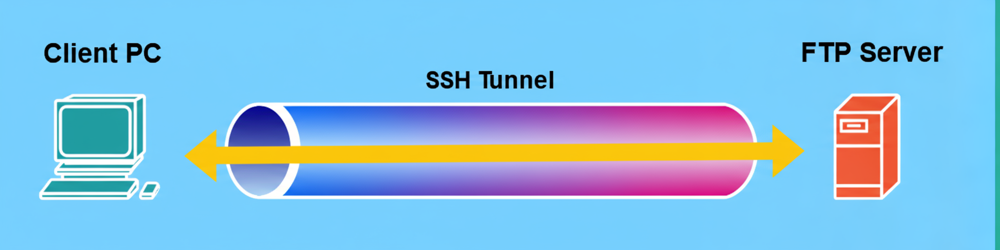

# 🌐 **Understanding Network Protocols**

<details>
<summary>📑 <strong>Table of Contents</strong></summary>

- [🌐 **Understanding Network Protocols**](#-understanding-network-protocols)
  - [💻 End Devices and Servers: The Core Components](#-end-devices-and-servers-the-core-components)
  - [📜 What Are Network Protocols?](#-what-are-network-protocols)
  - [🚀 Application Layer Protocols in Action](#-application-layer-protocols-in-action)
  - [🚦 The Crucial Role of the Transport Layer](#-the-crucial-role-of-the-transport-layer)
  - [🚪 Service Ports: The Gateways of Communication](#-service-ports-the-gateways-of-communication)
    - [Port Number Categories](#port-number-categories)
    - [A Closer Look at Port Functionality](#a-closer-look-at-port-functionality)
- [📜 **File Transfer Protocol (FTP)**](#-file-transfer-protocol-ftp)
    - [The Three Phases of an FTP Connection](#the-three-phases-of-an-ftp-connection)
      - [Phase 1: Control Connection](#phase-1-control-connection)
      - [Phase 2: Data Connection](#phase-2-data-connection)
      - [Phase 3: Data Transfer](#phase-3-data-transfer)
    - [Why is FTP Important?](#why-is-ftp-important)
    - [⚠️ The Security Risk of FTP](#️-the-security-risk-of-ftp)
  - [🔒 SSH File Transfer Protocol (SFTP)](#-ssh-file-transfer-protocol-sftp)
    - [How SFTP Works](#how-sftp-works)
  - [🔑 File Transfer Protocol Secure (FTPS)](#-file-transfer-protocol-secure-ftps)
    - [How FTPS Works](#how-ftps-works)
    - [Implicit vs. Explicit FTPS](#implicit-vs-explicit-ftps)
- [⚙️ Understanding Trivial File Transfer Protocol (TFTP)](#️-understanding-trivial-file-transfer-protocol-tftp)
  - [🏢 How TFTP is Used in Large Organizations](#-how-tftp-is-used-in-large-organizations)
    - [A Practical Example: Booting Cisco Devices](#a-practical-example-booting-cisco-devices)
  - [🔧 Technical Breakdown of TFTP](#-technical-breakdown-of-tftp)
- [🖥️ **Understanding Server Message Block (SMB)**](#️-understanding-server-message-block-smb)
  - [🎯 Core Functions of SMB](#-core-functions-of-smb)
  - [🔄 The SMB Client-Server Model](#-the-smb-client-server-model)
  - [🔧 Technical Details](#-technical-details)
  - [🌐 SMB Beyond Windows](#-smb-beyond-windows)
  - [🌐 **Understanding Remote Access Protocols**](#-understanding-remote-access-protocols)
    - [⚠️ The Security Downside](#️-the-security-downside)
  - [A Closer Look at Telnet](#a-closer-look-at-telnet)
    - [Analyzing a Captured Telnet Session](#analyzing-a-captured-telnet-session)
  - [🔒 **Understanding Secure Shell (SSH)**](#-understanding-secure-shell-ssh)
    - [Why SSH is Crucial for Security](#why-ssh-is-crucial-for-security)
    - [Analyzing an SSH Packet Capture](#analyzing-an-ssh-packet-capture)
- [🖥️ Understanding Remote Desktop Protocol (RDP)](#️-understanding-remote-desktop-protocol-rdp)
    - [🔧 Technical Details](#-technical-details-1)
    - [Analyzing an RDP Packet Capture](#analyzing-an-rdp-packet-capture)
- [📧 **Email Protocols**](#-email-protocols)
  - [The Sending Protocol: Simple Mail Transfer Protocol (SMTP)](#the-sending-protocol-simple-mail-transfer-protocol-smtp)
    - [Figure 6.12 - SMTP Process Explained](#figure-612---smtp-process-explained)
  - [The Receiving Protocols: POP3 vs. IMAP4](#the-receiving-protocols-pop3-vs-imap4)
    - [Post Office Protocol version 3 (POP3)](#post-office-protocol-version-3-pop3)
      - [Figure 6.13 - POP Operations Explained](#figure-613---pop-operations-explained)
    - [Internet Message Access Protocol version 4 (IMAP4)](#internet-message-access-protocol-version-4-imap4)
      - [Figure 6.14 - IMAP Operations Explained](#figure-614---imap-operations-explained)
  - [⚠️ The Security Risk of Standard Email Protocols](#️-the-security-risk-of-standard-email-protocols)
    - [Figure 6.15 - Email Message Packet Capture Explained](#figure-615---email-message-packet-capture-explained)
    - [Figure 6.16 - Reassembled Conversation Explained](#figure-616---reassembled-conversation-explained)
  - [🔒 The Solution: Secure Email Protocols](#-the-solution-secure-email-protocols)
- [🌐 **HTTP and HTTPS**](#-http-and-https)
    - [Hypertext Transfer Protocol (HTTP)](#hypertext-transfer-protocol-http)
      - [Figure 6.17 \& 6.18 - An HTTP GET Message Explained](#figure-617--618---an-http-get-message-explained)
    - [The Secure Solution: HTTPS (HTTP over SSL/TLS)](#the-secure-solution-https-http-over-ssltls)
      - [Figure 6.19 - An HTTPS Message Explained](#figure-619---an-https-message-explained)
- [🗃️ **SQL Database Protocols**](#️-sql-database-protocols)
    - [How Databases Work: The Client-Server Model](#how-databases-work-the-client-server-model)
    - [Common Database Protocols and Ports](#common-database-protocols-and-ports)
    - [Analyzing a MySQL Packet](#analyzing-a-mysql-packet)
      - [Figure 6.20 - MySQL Packet Explained](#figure-620---mysql-packet-explained)
- [🗂️ **Lightweight Directory Access Protocol (LDAP)**](#️-lightweight-directory-access-protocol-ldap)
    - [How LDAP Works: The Windows Login Process](#how-ldap-works-the-windows-login-process)
    - [⚠️ The Security Risk of Standard LDAP](#️-the-security-risk-of-standard-ldap)
      - [Figure 6.21 - Captured LDAP Message Explained](#figure-621---captured-ldap-message-explained)
    - [🔒 The Solution: LDAPS and Other Details](#-the-solution-ldaps-and-other-details)
  - [🪵 **Syslog Protocol**](#-syslog-protocol)
    - [Anatomy of a Syslog Message](#anatomy-of-a-syslog-message)
      - [Putting it Together: A Real Example](#putting-it-together-a-real-example)
    - [Understanding Syslog Severity Levels](#understanding-syslog-severity-levels)
      - [Figure 6.22 - Syslog Severity Levels Explained](#figure-622---syslog-severity-levels-explained)
    - [Technical Details and Purpose](#technical-details-and-purpose)
- [📞**Session Initiation Protocol (SIP)**](#session-initiation-protocol-sip)
    - [The Foundation: Voice over IP (VoIP)](#the-foundation-voice-over-ip-voip)
    - [🔧 Technical Details of SIP](#-technical-details-of-sip)
    - [Why SIP Prefers UDP](#why-sip-prefers-udp)
    - [Ensuring Call Quality with QoS](#ensuring-call-quality-with-qos)
- [🌐 **Internet Control Message Protocol (ICMP)**](#-internet-control-message-protocol-icmp)
    - [ICMP Message Structure: Types and Codes](#icmp-message-structure-types-and-codes)
      - [Figure 6.23 - ICMP Codes and Types Explained](#figure-623---icmp-codes-and-types-explained)
    - [ICMP in Action: The Ping Command](#icmp-in-action-the-ping-command)
      - [Figure 6.24 - Using Ping to Test Connectivity Explained](#figure-624---using-ping-to-test-connectivity-explained)
    - [A Deeper Look at Ping Packets](#a-deeper-look-at-ping-packets)
      - [Figure 6.25 - The ICMP Echo Request Message Explained](#figure-625---the-icmp-echo-request-message-explained)
      - [Figure 6.26 - The ICMP Echo Reply Message Explained](#figure-626---the-icmp-echo-reply-message-explained)
- [⚖️ **TCP vs UDP**](#️-tcp-vs-udp)
    - [🤝 TCP (Transmission Control Protocol): The Reliable Choice](#-tcp-transmission-control-protocol-the-reliable-choice)
    - [🚀 UDP (User Datagram Protocol): The Fast Choice](#-udp-user-datagram-protocol-the-fast-choice)
- [⏱️ **Network Time Protocol (NTP)**](#️-network-time-protocol-ntp)
    - [Why Time Synchronization is Critical](#why-time-synchronization-is-critical)
    - [The NTP Hierarchical Structure](#the-ntp-hierarchical-structure)
      - [Figure 6.27 - NTP Hierarchical Structure Explained](#figure-627---ntp-hierarchical-structure-explained)
    - [Security Considerations](#security-considerations)
  - [🌐 **Dynamic Host Configuration Protocol (DHCP)**](#-dynamic-host-configuration-protocol-dhcp)
  - [The DHCP 4-Way Handshake (DORA)](#the-dhcp-4-way-handshake-dora)
    - [Step 1: DHCP Discover](#step-1-dhcp-discover)
      - [Figure 6.28 - DHCP Discover Message Explained](#figure-628---dhcp-discover-message-explained)
    - [Step 2: DHCP Offer](#step-2-dhcp-offer)
      - [Figure 6.29 - DHCP Offer Message Explained](#figure-629---dhcp-offer-message-explained)
    - [Step 3: DHCP Request](#step-3-dhcp-request)
      - [Figure 6.30 - DHCP Request Message Explained](#figure-630---dhcp-request-message-explained)
    - [Step 4: DHCP Acknowledgment (ACK)](#step-4-dhcp-acknowledgment-ack)
      - [Figure 6.31 - DHCP Acknowledgment Message Explained](#figure-631---dhcp-acknowledgment-message-explained)
  - [DHCP Across Different Networks: The Relay Agent](#dhcp-across-different-networks-the-relay-agent)
    - [The Problem: Routers Block Broadcasts](#the-problem-routers-block-broadcasts)
      - [Figure 6.32 - Router Blocks Broadcast Explained](#figure-632---router-blocks-broadcast-explained)
    - [The Solution: DHCP Relay Agent](#the-solution-dhcp-relay-agent)
      - [Figure 6.33 - DHCP Relay Agent Explained](#figure-633---dhcp-relay-agent-explained)
    - [Configuration Example (Cisco)](#configuration-example-cisco)
- [🌐 **Domain Name System (DNS)**](#-domain-name-system-dns)
    - [How DNS Works: The Query and Reply Process](#how-dns-works-the-query-and-reply-process)
      - [Figure 6.34 - DNS Operations Explained](#figure-634---dns-operations-explained)
    - [The Building Blocks: DNS Record Types](#the-building-blocks-dns-record-types)
    - [Troubleshooting with `nslookup`](#troubleshooting-with-nslookup)
      - [Figure 6.35 - Using `nslookup` Explained](#figure-635---using-nslookup-explained)
    - [The DNS Hierarchy](#the-dns-hierarchy)
      - [Figure 6.36 - Root DNS Hierarchy Explained](#figure-636---root-dns-hierarchy-explained)
    - [Using Trusted Public DNS Servers](#using-trusted-public-dns-servers)
- [📡 **Simple Network Management Protocol (SNMP)**](#-simple-network-management-protocol-snmp)
    - [The Three Components of SNMP](#the-three-components-of-snmp)
    - [How SNMP Communicates: The Messages](#how-snmp-communicates-the-messages)
      - [Figure 6.37 - SNMP Messages Explained](#figure-637---snmp-messages-explained)
    - [🔧 Technical Details and Versions](#-technical-details-and-versions)

</details>

---

To grasp the fundamentals of network communication, it's essential to understand the distinct roles played by the devices on a network, specifically **end devices** and **servers**.


## 💻 End Devices and Servers: The Core Components

On any network, you will find two primary types of participants: end devices and servers.

* **End Devices** 📱
    These are the devices we interact with daily. Think of your computer, laptop, or any Internet of Things (IoT) device in your home or office. Their main purpose is to connect to a network to access a service or a resource.

* **Servers** 🖥️
    A server is any device that provides services and resources to end devices. When a client, such as your computer, needs to access a resource on a server, both devices must use a pre-agreed network protocol to exchange messages.

---

## 📜 What Are Network Protocols?

**Network protocols** are the foundational rules and procedures that govern how communication happens over a network. Think of them as a common language that all devices agree to speak.

* **Defining the Rules**: These protocols precisely define how a sending device must package and format a message before it is sent to a destination device.
* **The Importance of Structure**: Without these rules, devices would not format or address messages correctly. When a receiving device gets a message without proper formatting or addressing, it might completely misinterpret it. Therefore, a wide variety of network protocols exist, each with a specific role and function to ensure clear communication.

---

## 🚀 Application Layer Protocols in Action

Many of the protocols you encounter daily are **application layer protocols**. These operate at the application layer of both the **Open Systems Interconnection (OSI)** and the **Transmission Control Protocol/Internet Protocol (TCP/IP)** networking models.

These protocols are what allow you, the user, to interface directly with the network through applications.

* **Example 1: Web Browsing** 🌐
    When you use a web browser to visit a website, you are using the **Hypertext Transfer Protocol Secure (HTTPS)** to interact with web applications and web servers.

* **Example 2: Sending Emails** 📧
    When you use an application like Microsoft Outlook to send an email, you are using the **Simple Mail Transfer Protocol (SMTP)**.

---

## 🚦 The Crucial Role of the Transport Layer

As discussed in the context of the OSI and TCP/IP models, the **Transport Layer** has a vital responsibility. It assigns the **source** and **destination service port numbers** based on the specific application layer protocol being used.

* **Unique Port Numbers**: Every application layer protocol is linked to a unique service port number. This system helps devices deliver each message to the correct application.
* **Ensuring Delivery**: The Transport Layer's primary role is to ensure that messages are delivered accurately to their intended destinations within a device.

---

## 🚪 Service Ports: The Gateways of Communication

**Service ports** can be thought of as the virtual doorways used by a device's operating system to send and receive messages over the network.

### Port Number Categories

The **Internet Assigned Numbers Authority (IANA)** categorizes all service port numbers into three major groups. In total, there are **65,535** service ports available on an operating system, which can be used with either the **Transmission Control Protocol (TCP)** or the **User Datagram Protocol (UDP)**.


<div align="center">
  
</div>


| Port Groups | Range | Description |
| :--- | :--- | :--- |
| **Well-known Ports** | `0 - 1,023` | Used by common and popular services and applications. |
| **Registered Ports** | `1,024 - 49,151` | These ports are assigned to specific entities for use with specific processes and applications. |
| **Private/Dynamic Ports** | `49,152 - 65,535` | These are ephemeral ports which are used when a client application is communicating with a server. |

---

### A Closer Look at Port Functionality

* **Client-Side Communication**: When a client device needs to send a message, its operating system will temporarily open a **dynamic/ephemeral service port** (from the 49,152 - 65,535 range) specifically for that outgoing communication.

* **Server-Side Communication**: A server that is providing a service (like a web server) will open a **well-known service port number** (from the 0 - 1,023 range) to allow clients to send inbound connection requests to it.

Ultimately, without an open service port, a device cannot send or receive messages. As a result, it would be completely unable to communicate with any other device on the network.

---

# 📜 **File Transfer Protocol (FTP)**

The **File Transfer Protocol (FTP)** is a very common protocol for sharing files. It operates on a **client-server model**, which allows users (clients) to connect to a central file server to upload and download files over a network.

FTP uses two distinct service ports for its operation:

  * **Port 21 (Control)**: This port is dedicated to managing the connection. It handles commands and control functions sent between the FTP client and the FTP server.
  * **Port 20 (Data)**: This port is used for the actual transfer of data (the files) between the client and the server.

### The Three Phases of an FTP Connection

An FTP connection is established in three distinct phases, as illustrated in the following diagrams.

<div align="center">
  
</div>

#### Phase 1: Control Connection

As shown in the diagram above, the process begins when the computer running the FTP client application initiates a connection to the FTP server.

  * **Step 1️⃣**: The **Client PC** establishes the initial communication link, known as the **Control Connection**. This connection is made specifically to the FTP server's **service port 21**. This channel will be used for sending commands (like login credentials, file requests, etc.).

<div align="center">
  
</div>


#### Phase 2: Data Connection

After the control connection is established, the client opens a second, separate connection to the server.

  * **Step 2️⃣**: This new connection is the **Data Connection**. As the diagram shows, it is established over the FTP server's **service port 20**. This channel is exclusively for transmitting the actual file data.

<div align="center">
  
</div>


#### Phase 3: Data Transfer

With both connections established, the file transfer can now occur.

  * **Step 3️⃣**: The requested data is transferred from the FTP server to the client. This **Data Transfer** happens over the dedicated data connection on **service port 20**.

### Why is FTP Important?

Imagine an organization where every employee stores files only on their local computer. If a computer's storage drive fails or gets infected with malware, there's a very high risk that all the data will be permanently lost or corrupted.

By using a centralized file server, employees can upload, download, and share files with each other, which enables collaboration. This principle also applies to network devices. When a network professional needs to update the firmware on a router or modem, FTP is often a supported method to transfer the new firmware file from a computer to the device.

> **Important Note** 📝
> FTP uses service ports **20 (data)** and **21 (control)** by default.

### ⚠️ The Security Risk of FTP

When implementing network services, security must be a top priority. While FTP is often used within an organization's internal network, it is crucial to understand its limitations.

  * **No Encryption**: FTP is an old protocol that **does not provide any data encryption**. All traffic, including usernames, passwords, and the files themselves, is sent in **plaintext**.
  * **Vulnerability**: If a threat actor (like a hacker) can intercept the traffic between an FTP client and server, they can easily read all the data. This makes FTP highly vulnerable to **Man-in-the-Middle (MiTM) attacks**.

---

## 🔒 SSH File Transfer Protocol (SFTP)

The **SSH File Transfer Protocol (SFTP)** is a secure alternative to FTP. It allows a client to establish a fully encrypted tunnel to a file server using the **Secure Shell (SSH)** protocol.

<div align="center">
  
</div>

### How SFTP Works

Once the SSH connection is established between the client and the server, both devices encapsulate the FTP packets within this secure SSH tunnel for file transfer.

As the diagram above illustrates:

1.  The **Client PC** establishes an **SSH Tunnel** to the server over **port 22**.
2.  FTP is then used to transfer files, but all communication happens *inside* this encrypted SSH tunnel.

Using SFTP prevents a hacker from identifying any confidential data. Even if the hacker intercepts the traffic, all the packets will be encrypted, and the data will be completely unreadable.

> **Important Note** 📝
> SFTP uses service **port 22** by default.

Network professionals should always opt for secure protocols like SFTP whenever possible. Without secure communication, our digital messages and confidential data are exposed to malicious users. SFTP is one of many secure protocols available within the TCP/IP networking model.

-----

## 🔑 File Transfer Protocol Secure (FTPS)

**File Transfer Protocol Secure (FTPS)**, sometimes called **FTP over SSL (FTP/S)**, is another secure file transfer protocol. It uses **Secure Sockets Layer (SSL)** or its modern successor, **Transport Layer Security (TLS)**, to encrypt FTP messages.

### How FTPS Works

Unlike SFTP, which creates a single secure tunnel, FTPS encrypts the FTP messages themselves before they are sent over the network.

  * The client encrypts the FTP messages using SSL/TLS.
  * These individually encrypted packets are sent across the network. There is no overarching secure tunnel.
  * The FTP server receives and decrypts each FTPS message individually and then reassembles the data.

### Implicit vs. Explicit FTPS

FTPS can operate in two different modes, depending on the port used.

  * **Implicit FTPS (Port 990)**
    If a client connects to a server on **service port 990**, it is considered an **implicit** connection. This means the client's intention to use SSL is assumed from the start, and the SSL handshake process begins immediately to secure the entire session.

  * **Explicit FTPS (Port 21)**
    If a client connects to the server on the standard FTP **service port 21**, it is known as an **explicit** connection. In this mode:

    1.  The client first connects insecurely to port 21.
    2.  The client then sends a specific command, either `AUTH SSL` or `AUTH TLS`, to the server.
    3.  Upon receiving this command, the server and client begin the SSL handshake to establish a secure connection.

This "explicit" method is flexible, as it gives the client the option to enable enhanced security only when needed, such as for transferring sensitive files.


---

Of course\! Here is a detailed, line-by-line explanation of the provided text about the Trivial File Transfer Protocol (TFTP), presented in a professional and easy-to-understand README format.

-----

# ⚙️ Understanding Trivial File Transfer Protocol (TFTP)

The **Trivial File Transfer Protocol (TFTP)** is a simplified and lightweight version of the more complex File Transfer Protocol (FTP). It is a **connectionless** protocol designed to allow network professionals to quickly upload and download files between a client and a networking device.

-----

## 🏢 How TFTP is Used in Large Organizations

In large organizations that manage numerous networking devices like routers and switches, it is essential to keep them updated. Network professionals use TFTP to update the operating systems and firmware of these devices. This process is crucial for:

  * Fixing software bugs.
  * Addressing security vulnerabilities.
  * Improving the overall stability and performance of the device.

Enterprise-grade networking devices, such as those from Cisco, allow network professionals to configure them to load their operating systems directly from a remote TFTP server at boot time.

### A Practical Example: Booting Cisco Devices

While networking devices typically have their operating systems stored on their internal memory, Cisco routers and switches can be configured to retrieve their OS from a TFTP server when they power on. This method offers a centralized and efficient way to manage device software.

1.  **Centralized Storage**: A network professional downloads the latest version of a device's operating system and stores it on a single, centralized TFTP server.
2.  **Boot Process**: When a networking device, like a Cisco router, is powered on, it is configured to check the network for a remote TFTP server.
3.  **Downloading the OS**: The router then downloads the operating system file from the TFTP server over the network and loads it directly into its memory (RAM) to run.

This approach simplifies future updates. Whenever a newer version of the operating system or firmware becomes available, the network professional only needs to download the new version and replace the older one on the central TFTP server.

-----

## 🔧 Technical Breakdown of TFTP

> **Important Note** 📝
> TFTP uses **service port 69** by default.

<div align="center">
  
</div>

The following diagram provides a visual representation of how the TFTP service operates on a network.

As shown in the diagram, a **Client** device connects to a **TFTP Server** across the **Network**. This connection is made to the server's default service **port 69** to either upload or download files.

  * **Connectionless Protocol**: A key feature of TFTP is that it is **connectionless**. This means it uses **UDP (User Datagram Protocol)** as its preferred Transport Layer protocol.
  * **Lightweight and Fast**: By using UDP, TFTP is very lightweight because it does not require acknowledgment messages to be sent back for every packet. This eliminates the overhead of establishing and maintaining a formal connection, making file transfers faster and less resource-intensive than traditional FTP.

---

# 🖥️ **Understanding Server Message Block (SMB)**

The **Service Message Block (SMB)** is a common network protocol that operates on a **client-server model**. Its primary purpose is to enable the sharing of network resources, such as printers 🖨️, files 📂, and directories, especially within a **Microsoft Windows** environment.

-----

## 🎯 Core Functions of SMB

SMB is responsible for three core functions that facilitate network resource sharing:

  * **Session Management**: It handles the process of starting, authenticating, and properly terminating communication sessions between a client and a server.
  * **Access Control**: It manages and controls access to shared files and printers, ensuring that only authorized users can use them.
  * **Application Communication**: It provides a pathway for applications on different devices to exchange information across a network.

---

<div align="center">
  
</div>

## 🔄 The SMB Client-Server Model

The interaction between a client and a server using SMB is straightforward, as illustrated in the diagram below.

This model can be broken down into two main steps:

1.  **SMB Request**
    The process begins when a **Client** device sends an **SMB Request** to the **Server**. This request is an action to access a shared network resource hosted on that server (for example, asking to read a file or use a shared printer).

2.  **SMB Response**
    The **Server** then processes the request and sends back an **SMB Response** to the client. This response can serve multiple purposes, such as asking for additional information for authentication (like a username and password) or directly providing the client with access to the requested resource.

-----

## 🔧 Technical Details

> **Important Note** 📝
> The SMB protocol operates on the following service ports:
>
>   * **Port 137 (UDP)**
>   * **Port 138 (UDP)**
>   * **Port 445 (TCP)**

-----

## 🌐 SMB Beyond Windows

While SMB is most commonly associated with Microsoft Windows, its usefulness has led to its adoption by other operating systems as well.

  * **Linux**: Linux-based operating systems use a popular variation of SMB known as **SAMBA** to interact with Windows networks and share resources.
  * **Apple macOS**: Apple's macOS also uses the SMB protocol to share network resources between devices, making it a versatile protocol for cross-platform environments.

---

## 🌐 **Understanding Remote Access Protocols**

**Remote access protocols** are specialized tools that let IT professionals remotely access and manage devices over a network. Think about a large organization with hundreds of servers and networking devices spread across different offices, cities, or even countries. IT professionals use remote management on these devices to connect to them from a central location to apply new configurations or troubleshoot problems. Without these protocols, an IT professional would need to physically travel to each device to perform any changes.

To give a real-world example, a network engineer at an Internet Service Provider (ISP) is often responsible for monitoring and fixing issues across a vast network infrastructure that spans multiple countries. When an issue occurs, an engineer assigned to the problem will remotely connect to various networking devices to perform troubleshooting and resolve the issue. Similarly, if any configuration changes are needed on the network, the same method applies—they remotely connect to the devices to administer the changes.

Using remote access protocols offers the **convenience** of centrally managing all types of devices over a network and saves a tremendous amount of time.

-----

### ⚠️ The Security Downside

While remote access protocols are incredibly convenient, they can also introduce a significant security risk if an IT professional uses an **unsecure protocol**. Unsecure protocols lack critical security features like **data encryption**. This means they send all messages, including sensitive information like usernames and passwords, in **plaintext**, allowing hackers to easily capture them.

-----

## A Closer Look at Telnet

**Telnet** is an example of an unsecure remote access protocol. It allows IT professionals to remotely connect to a wide range of devices, including computers, servers, networking devices, security appliances, and IoT devices.

Although Telnet is a **legacy protocol** that shouldn't be used today due to its major security flaws, many organizations unfortunately still implement it on their corporate networks. Online services like **Shodan**, used by cybersecurity professionals to scan for internet-exposed devices, show that a vast number of devices around the world still have Telnet enabled for remote access. This exposure is a critical vulnerability. If a hacker retrieves or guesses the correct user credentials for any of these devices, they can gain full access to the target device over the internet.

> **Important Note** 📝
> Telnet uses **service port 23** by default.

-----

<div align="center">
  
</div>

### Analyzing a Captured Telnet Session

The screenshot below shows a reconstruction of network packets that were exchanged between a client and a server using the Telnet protocol. A packet analyzer tool like **Wireshark** was used to capture and reassemble the conversation.

Here's a breakdown of what we see in the captured session:

  * **Plaintext Credentials**: The most critical vulnerability is immediately visible. The login credentials are sent in clear, readable text:
      * `login: fake`
      * `Password: user`
  * **Server Interaction**: After the successful login, you can see the entire interaction between the user and the server's command line, including the welcome message from the **OpenBSD** operating system.
  * **Executed Commands**: You can see the exact commands the user typed, such as `/sbin/ping www.yahoo.com` to test network connectivity and `ls` to list files in the directory.
  * **Server Output**: The server's full response to these commands, like the ping statistics and the list of files, is also completely visible.

As the screenshot clearly demonstrates, the messages are displayed in **plaintext** because Telnet provides absolutely **no data encryption**. This makes it an insecure remote access protocol that is not recommended for use on any modern network.


---

## 🔒 **Understanding Secure Shell (SSH)**

The **Secure Shell (SSH)** is a secure remote access protocol that's essential for IT professionals. It allows them to securely connect to devices over a network to perform configuration changes and troubleshooting. Unlike Telnet, SSH's most important feature is that it **encrypts all messages** exchanged between the client and the server.

-----

### Why SSH is Crucial for Security

Without a secure protocol like SSH, using unsecure remote access tools on a network is extremely risky. A threat actor, such as a hacker, could intercept the communication and capture confidential data like the username and password needed to access a device.

SSH prevents this by encrypting everything. A hacker can still intercept the communication between a source and destination, but they won't be able to decrypt the messages to view the secret data inside. Because of this, one of the most common and critical procedures when configuring a new networking device, like a router or switch, is to implement a secure remote access protocol like SSH. This allows network professionals to manage the device securely over a network.

> **Important Note** 📝
> SSH uses **service port 22** by default.

---

<div align="center">
  
</div>

### Analyzing an SSH Packet Capture

The screenshot below shows a sample of what SSH traffic looks like when captured by a network analysis tool like Wireshark.

Let's break down what this capture tells us:

  * **The Connection**: The capture shows a client with the IP address `10.0.0.1` using SSH to send messages to a server at `10.0.0.2`. The top pane lists this as an "Encrypted packet."

  * **Visible Metadata**: Wireshark can see the outer layers of the communication and can identify key details about the SSH session itself, including:

      * **SSH Version**: The protocol in use is `SSH Version 2`.
      * **Encryption Algorithm**: The specific algorithm used to scramble the data is `aes128-cbc`.
      * **Hashing Algorithm**: The algorithm used for validating the message's integrity is `hmac-sha1`.
      * **Message Authentication Code (MAC)**: A value used to ensure the data has not been tampered with in transit.

  * **The Encrypted Data**: The most important part is highlighted by the red arrow. The field labeled **Encrypted Packet** contains a long string of hexadecimal characters. This is the actual data of the conversation (commands, passwords, etc.), but it has been rendered unreadable by encryption.

This screenshot shows exactly what a hacker would be able to see if they intercepted your traffic. They can identify that an SSH connection is happening, but the actual data remains completely encrypted, confidential, and safe.

---

# 🖥️ Understanding Remote Desktop Protocol (RDP)

Within a Microsoft Windows environment, IT professionals often use the **Remote Desktop Protocol (RDP)**. It's a **native** (built-in) and **secure** remote access protocol that comes with Microsoft Windows operating systems.

The main purpose of RDP is to allow IT professionals to remotely manage Windows servers and desktop devices using a full **Graphical User Interface (GUI)**. This is a major difference from protocols like SSH and Telnet, which only provide a text-based **Command-Line Interface (CLI)**. With RDP, you see and interact with the remote computer's desktop as if you were sitting right in front of it.

### 🔧 Technical Details

> **Important Note** 📝
> RDP operates on **service port 3389**.

---

<div align="center">
  
</div>

### Analyzing an RDP Packet Capture

The screenshot below shows a packet capture of RDP messages that were exchanged between two Microsoft Windows devices over a network.

Let's break down what this capture reveals:

  * **The Connection**: The capture shows a client device with the IP address `172.16.17.8` sending messages to another host at `172.16.17.21`. The destination port for the traffic is **3389**, confirming it's an RDP session.

  * **The Encryption Layer**: In the capture, you'll notice the protocol is identified as **TLSv1.2**. This is because RDP messages don't travel in the open; they are securely encapsulated using **Transport Layer Security (TLS)**, a strong protocol that provides data security and privacy over a network.

  * **The Encrypted Data**: The section labeled **Encrypted Application Data** (highlighted by the red arrow) contains the actual RDP data. This long string of characters is the encrypted information representing the screen, mouse movements, and keyboard inputs of the remote session.

This packet capture clearly shows that RDP messages are encrypted. This security measure prevents anyone from snooping on the network and viewing the confidential data that's being exchanged between the two hosts.


---

# 📧 **Email Protocols**

The way we communicate has transformed dramatically over the years. We've moved from writing physical letters with pen and paper to the instant world of **electronic mail (email)**. Unlike traditional mail, which can take days, an email can be written on a computer or smartphone and delivered across the world in just a few minutes.

Emails are commonly used for sending letters, notices, and sharing files as attachments. To make this all work, a set of **email protocols** act as the rules of the road, ensuring messages are correctly formatted, transported, and delivered between a sender and a recipient.

-----

## The Sending Protocol: Simple Mail Transfer Protocol (SMTP)

**Simple Mail Transfer Protocol (SMTP)** is the primary protocol used for **sending** emails. It's responsible for pushing your email from your device to your server, and then from your server to the recipient's server.

Here’s an overview of the process:

1.  A user writes a message in an email application like Microsoft Outlook and hits "send."
2.  The user's email application uses SMTP to connect to their own email server (e.g., Gmail, Outlook). It then forwards the message to this server. This typically happens on **service port 25**.
3.  The sender's email server receives the message and uses SMTP again to forward it to the recipient's email server.
4.  The email arrives at the recipient's email server, where it's stored in their mailbox, ready to be retrieved.

<div align="center">
  
</div>

### Figure 6.12 - SMTP Process Explained

As **Figure 6.12** visually represents, the entire sending process relies on SMTP. The **Sender's** computer uses SMTP to push the email (represented by the envelope icon 📩) to their **Email Server**. That server then also uses SMTP to forward the message across the network to the **Receiver's Email Server**.

-----

## The Receiving Protocols: POP3 vs. IMAP4

Once an email arrives at the recipient's server, they need a way to retrieve it. This is handled by one of two common protocols: POP3 or IMAP4.

### Post Office Protocol version 3 (POP3)

**Post Office Protocol (POP)** is an email protocol that allows email clients like Microsoft Outlook to **download** messages from an email server.

<div align="center">
  
</div>

#### Figure 6.13 - POP Operations Explained

**Figure 6.13** illustrates this operation. The initial sending process from the **Sender** to the **Receiver's Email Server** is handled by **SMTP**, as before. Then, the diagram shows the **Receiver** using the **POP3** protocol to connect to their server and pull the email down to their local computer.

Here’s how it works:

  * The email server listens for requests on TCP **service port 110**.
  * When your email client connects, it downloads all the email messages from the mailbox to your device.
  * After the emails have been successfully downloaded, they are **deleted from the email server**.

This process is simple, but it has a major drawback: since the messages are removed from the server, there's no centralized location for storing them. This is why POP isn't recommended for organizations that need a centralized backup solution.

### Internet Message Access Protocol version 4 (IMAP4)

**Internet Message Access Protocol (IMAP)** is another common email protocol that allows email clients to access messages on an email server.

<div align="center">
  
</div>

#### Figure 6.14 - IMAP Operations Explained

**Figure 6.14** shows the IMAP process. Just like the others, sending is handled by **SMTP**. However, the **Receiver** uses **IMAP4** to access their mail. The arrow indicates a connection where messages are managed on the server, implying a two-way synchronization, not just a one-way download.

Unlike POP3, IMAP **synchronizes** the email messages between your client application and the email server, typically over **service port 143**.

  * When using IMAP, the email messages are **kept on the email server** until you manually delete them.
  * This means you can access your email from multiple devices (phone, laptop, tablet) and see the exact same set of messages and folders everywhere. It provides a consistent, synchronized view of your mailbox.

> **Important Note** 📝
> The versions most commonly used on networks today are **POP version 3 (POP3)** and **IMAP version 4 (IMAP4)**.

-----

## ⚠️ The Security Risk of Standard Email Protocols

A major problem with the standard versions of SMTP, POP, and IMAP is that they **do not encrypt messages**. They send everything, including your username, password, and email content, in **plaintext**. This means a hacker who is monitoring the network can intercept and read everything.

<div align="center">
  
</div>

### Figure 6.15 - Email Message Packet Capture Explained

The screenshot below from Wireshark shows a list of captured SMTP packets during a login attempt.

As you can see in the **Info** column of **Figure 6.15**, sensitive information is completely exposed. You can clearly read the plaintext commands being sent to the server, including `AUTH LOGIN`, and the lines for `User:` and `Pass:`, which contain the user's credentials (though they are Base64 encoded, this is not encryption and is easily decoded).


<div align="center">
  
</div>

### Figure 6.16 - Reassembled Conversation Explained

Wireshark can take all the individual packets and reassemble them to show the entire conversation exactly as it happened.

**Figure 6.16** shows this reassembled TCP stream in a simple dialogue format.

  * Messages in **red** are sent from the client to the server.
  * Messages in **blue** are sent from the server back to the client.

As the image clearly shows, the entire email—including the headers (`From:`, `To:`, `Subject:`) and the body (`Hello`, `I send u smtp pcap file`)—is perfectly readable in plain text.

-----

## 🔒 The Solution: Secure Email Protocols

Using unsecure protocols is not recommended due to the lack of confidentiality and privacy. To solve this security issue, secure versions of these protocols were created.

  * **SMTPS (Simple Mail Transfer Protocol Secure)**
    This protocol uses **TLS (Transport Layer Security)** to encrypt outbound emails. It operates on **service port 587** by default.

  * **POPS (Post Office Protocol Secure)**
    This protocol uses **SSL (Secure Sockets Layer)** to encrypt emails being downloaded from a server. It uses **port 995** by default.

  * **IMAPS (Internet Message Access Protocol Secure)**
    This protocol also uses **SSL** to encrypt the synchronization of emails between a client and a server. It operates on **service port 993**.


---

# 🌐 **HTTP and HTTPS**

When you communicate with a website, your web browser uses a protocol to create a message that the web server can understand. The two primary protocols for this are HTTP and its secure counterpart, HTTPS.

-----

### Hypertext Transfer Protocol (HTTP)

**Hypertext Transfer Protocol (HTTP)** is the foundational protocol for the World Wide Web. However, it's considered **unsecure** because it provides no confidentiality or data privacy. All messages are sent in **plaintext**, meaning anyone monitoring the network can read them. HTTP uses **service port 80** by default.

<div align="center">
  
</div>


<div align="center">
  
</div>

#### Figure 6.17 & 6.18 - An HTTP GET Message Explained

The screenshot below shows a captured HTTP `GET` message that was sent from a client to a web server.

As this Wireshark capture in **Figure 6.17/6.18** shows, the contents of the HTTP request are completely visible:

  * **The Request**: You can see the exact command `GET /download.html HTTP/1.1`. This tells you the client is requesting the `download.html` file from the server.
  * **Plaintext Headers**: All the details, or headers, are readable. This includes the `Host` (the website being visited), the `User-Agent` (the user's browser and operating system), and the `Referer` (the page the user came from).
  * **Destination Port**: The capture details confirm the message is being sent to **port 80** (http).

Because HTTP sends messages in plaintext, anyone from network professionals to hackers can see the exact resource a client is requesting. This lack of data privacy is why using unsecure protocols on a network is not recommended.

-----

### The Secure Solution: HTTPS (HTTP over SSL/TLS)

To resolve the security concerns of HTTP, the standard practice is to use **HTTPS (HTTP over SSL/TLS)**. This is the secure version of HTTP that establishes an encrypted connection between your web browser and the web server. HTTPS uses **service port 443** by default.

> **Important Note** 📝
> HTTPS can use either **SSL (Secure Sockets Layer)** or its modern successor, **TLS (Transport Layer Security)**, to encrypt the connection.

<div align="center">
  
</div>

#### Figure 6.19 - An HTTPS Message Explained

The following screenshot shows the contents of an HTTPS packet that was captured while it was sent from a client to a web server.

As shown in **Figure 6.19**, the contents of the HTTPS message are unreadable because they are encrypted:

  * **Encapsulation**: The actual application data is wrapped inside a **Transport Layer Security (TLS)** layer.
  * **Encrypted Data**: Unlike the HTTP packet, you can't see the `GET` request. Instead, you see a field named **Encrypted Application Data** followed by a long string of unreadable characters. This is the encrypted request.
  * **Destination Port**: The traffic is being sent to **port 443** (https), signaling a secure connection.

Using HTTPS allows users to securely connect to web servers and exchange messages. You should always try to use secure protocols such as HTTPS whenever possible to ensure your data security and privacy.

With that, you’ve discovered common networking protocols that are used to send and retrieve information between web applications and clients on a network. Next, you will explore various database protocols.


---

# 🗃️ **SQL Database Protocols**

In many medium to large organizations, you'll find dedicated **database servers**. These are powerful computers that host database applications, providing services to clients and users across the network.

A **database** is simply an application designed to store large amounts of data in a structured format. For example, a university needs a way to store student enrollment information. If each student's information was stored in separate, unstructured documents, finding a specific file would be incredibly difficult. A database solves this by allowing an administrator to create tables with specific fields (like "Name," "ID Number," "Major") to hold information in an organized way.

-----

### How Databases Work: The Client-Server Model

Clients on a network send **queries**—which are essentially structured questions—to the database server to retrieve specific information. An employee at a bank, for instance, could send a query to find the records of all customers who opened an account within a certain time frame. These queries can be very specific, filtering results by age, gender, date, and more.
Database applications operate in a **client-server model**. The user has a database client application installed on their computer, which connects over the network to the main database application running on the server.

### Common Database Protocols and Ports

Here are some common database application protocols and their default operating port numbers:

  * **SQL Server**: Operates on service **port 1433**
  * **SQLNet** (for Oracle): Operates on service **port 1521**
  * **MySQL**: Operates on service **port 3306**

-----

### Analyzing a MySQL Packet

The screenshot below shows a packet that was sent to a MySQL server during a login attempt.

<div align="center">
  
</div>

#### Figure 6.20 - MySQL Packet Explained

As shown in **Figure 6.20**, this Wireshark capture reveals several important details about the connection:

  * **The Connection**: The packet is being sent to **port 3306**, which is the default port for the **MySQL** protocol.
  * **The Login Request**: The expanded "MySQL Protocol" section clearly shows that this packet is a `Login Request`.
  * **The Security Flaw**: The most critical information here is that the user's credentials are sent without proper encryption. You can see the **`Username: tfoerste`** in clear, readable plaintext. While the password appears as a long string of characters (a hash), the entire login message is sent unencrypted.

This demonstrates that the standard MySQL database protocol does not encrypt messages by default, posing a security risk as sensitive login credentials can be exposed on the network.


---


# 🗂️ **Lightweight Directory Access Protocol (LDAP)**

The **Lightweight Directory Access Protocol (LDAP)** is a common network protocol used to perform operations—such as reading, writing, and querying—on a directory server.

A very common directory service is **Active Directory Domain Services (AD DS)**, which is a core feature of Microsoft Windows Server. Active Directory allows IT professionals to centrally manage all users and connected devices within an organization's Windows domain. In simple terms, IT professionals "join" all computers to the domain and create user accounts in Active Directory. This also allows them to apply specific security policies to users, groups, and computer accounts.

> **Important Note** 📝
> The Windows server that is running the AD DS role is commonly referred to as the **Domain Controller (DC)**.

-----

### How LDAP Works: The Windows Login Process

To understand how LDAP works in a real-world scenario, here are the steps that occur when a user logs in to a Windows domain using Active Directory:

1.  The user powers on their computer and is prompted to log in with their domain account.
2.  The user enters their username and password.
3.  The Windows client computer converts the user’s password into a **New Technology LAN Manager (NTLM) hash**. Microsoft Windows operating systems do not store user passwords in plaintext; they store these hashed versions instead.
4.  The user’s username and the NTLM password hash are sent to the Domain Controller (DC) using LDAP.
5.  The DC checks its Active Directory database to verify the authenticity of the user's credentials and determines which policies to apply.
6.  The DC then informs the Windows client device whether to allow the user to log in and which policies to enforce.

-----

### ⚠️ The Security Risk of Standard LDAP

The communication that occurs between the Windows client and the DC uses LDAP by default. However, standard LDAP is an **unsecure** network protocol. It operates on **service port 389** by default on directory servers.

<div align="center">
  
</div>

#### Figure 6.21 - Captured LDAP Message Explained

The screenshot below shows sensitive information that was captured from an authentication message on a network.

As shown in **Figure 6.21**, the contents of the message from a client to a DC can be captured and read. Because the data is sent in plaintext (without encryption), a hacker who is monitoring the network can easily capture the following sensitive information:

  * **Client IP Address**: `192.168.42.23`
  * **Username**: The full username, including the domain: `REDTEAMLAB\bob`
  * **Password Hash**: The complete `NTLMv2-SSP` hash of the user's password.

While the password itself is a hash, a hacker can use this captured hash in "pass-the-hash" attacks to impersonate the user without ever needing to know the actual password.

-----

### 🔒 The Solution: LDAPS and Other Details

Since standard LDAP is an unsecure protocol that doesn't provide confidentiality, it’s highly recommended to use **LDAP Secure (LDAPS)**.

  * **LDAPS** uses **SSL/TLS** for data encryption to ensure privacy on a network.
  * It operates on **service port 636** by default.

> **Important Note** 📝
> LDAP uses the **X.500 standard**, which defines how information is stored and organized within a directory server.

---

## 🪵 **Syslog Protocol**

All networking devices, servers, and even end-user computers generate **log messages** that contain critical details about events as they happen. Network professionals rely on these logs to identify if a problem has occurred and to understand its cause.

However, if each device stores its logs locally, a network professional would need to manually log into every single device just to view its specific logs. In a large network, this process is incredibly time-consuming and inefficient.

To solve this, many devices support a common network protocol that allows them to forward their log messages to a **centralized logging server**. This protocol is known as **Syslog**. For example, if an interface on a router is enabled or disabled, the router creates a Syslog message with all the necessary details and sends it to the central server.

### Anatomy of a Syslog Message

The Syslog protocol allows devices to generate logs for events in a standardized format. The default format for a Syslog message on Cisco devices is:

`seq no: timestamp: %facility-severity-MNEMONIC: description`

Here's a breakdown of each component:

  * **`seq no`**: Represents the sequence number assigned to the log message.
  * **`timestamp`**: Includes the exact date and time the message was generated by the device's system clock.
  * **`facility`**: Represents what the log message is about, such as the source of the problem or a specific protocol (e.g., a line protocol).
  * **`severity`**: Includes a severity code (a number from 0 to 7) that helps network professionals quickly determine the importance of the event.
  * **`MNEMONIC`**: A short, unique text code that is used to describe the event.
  * **`description`**: Contains a brief, human-readable description of the event.

#### Putting it Together: A Real Example

Here is an example of a real Syslog message generated by a Cisco device:

`*Apr 28, 15:53:58.5353: %LINEPROTO-5-UPDOWN: Line protocol on Interface GigabitEthernet0/1, changed state to up`

Let's break this down using the format above:

  * **Timestamp**: `*Apr 28, 15:53:58.5353:`
  * **Facility**: `%LINEPROTO...` (referring to the line protocol)
  * **Severity**: `...-5-...` (a severity level of 5)
  * **MNEMONIC**: `...UPDOWN:` (indicating a state change)
  * **Description**: `Line protocol on Interface GigabitEthernet0/1, changed state to up`

-----

### Understanding Syslog Severity Levels

The severity level is a crucial part of the Syslog message because it helps network professionals prioritize issues at a glance.

<div align="center">
  
</div>

#### Figure 6.22 - Syslog Severity Levels Explained

The table below contains the standard Syslog severity levels, their names, and descriptions.

As shown in **Figure 6.22**, the levels are ranked from `0` (most critical) to `7` (least critical):

  * **Level 0 (Emergency)**: The system is completely unusable.
  * **Level 1 (Alert)**: A problem that requires immediate action.
  * **Level 2 (Critical)**: A critical condition has occurred.
  * **Level 3 (Error)**: An error condition has occurred.
  * **Level 4 (Warning)**: A warning that something might be wrong.
  * **Level 5 (Notification)**: A normal but significant event (like the example above, where an interface came up).
  * **Level 6 (Informational)**: A standard informational message.
  * **Level 7 (Debugging)**: Detailed messages used for troubleshooting.

-----

### Technical Details and Purpose

Syslog's main purpose is to gather logging information that helps network professionals monitor and troubleshoot issues within an organization. It allows them to configure all their devices to send log messages to a specific destination, such as a centralized logging server, for easy analysis.

> Syslog uses **UDP service port 514** by default over a network.

---

# 📞**Session Initiation Protocol (SIP)**

**Session Initiation Protocol (SIP)** is a common network protocol used to enable real-time communication, like voice and video calls, over a network. It is the technology that powers most modern telephone systems.

---

### The Foundation: Voice over IP (VoIP)

To understand SIP, you first need to know about **Voice over IP (VoIP)**. VoIP is a technology that lets organizations run a complete telephone system on their existing computer (TCP/IP) network. 

Here’s how it works:
* **IP Phones**: Each telephone is assigned an IP address on the network. When a person speaks into the phone, it converts their voice into a digital signal, packages it into data packets, and transmits it over the network.
* **Unified Communication Server (UCS)**: The IP phones communicate with a central server, known as a UCS. This server is the "brain" of the phone system, containing all the call routing features, voicemail settings, hunt groups, and other calling functions.

A major benefit of using a VoIP system is **cost efficiency**. An employee can simply dial the extension number of another employee in the same organization, and the call won't be billed because the communication happens entirely on the company's internal network. When an employee makes such a call, their IP phone uses SIP to set it up.

---

### 🔧 Technical Details of SIP

> **Important Note** 📝
> * Standard SIP operates on **service port 5060** by default and does not encrypt messages.
> * A secure version of SIP exists that operates on **service port 5051**.

---

### Why SIP Prefers UDP

Real-time protocols like SIP prefer to use **UDP (User Datagram Protocol)** as their Transport Layer protocol. The reason for this is that UDP provides faster transmission and has a very low overhead compared to TCP. For a real-time voice or video call, this speed is essential to avoid lag and jitter.

---

### Ensuring Call Quality with QoS

However, UDP has a downside. On a congested (busy) network, UDP messages have a high priority to be discarded or dropped. This would result in choppy audio or poor video quality.

To prevent this, network professionals implement **Quality of Service (QoS)** technologies on their network. QoS allows them to guarantee a specific amount of network bandwidth for certain types of traffic, such as VoIP and Video over IP. This ensures that even when the network is busy, call quality remains clear and stable.


---

# 🌐 **Internet Control Message Protocol (ICMP)**

**Internet Control Message Protocol (ICMP)**, defined by **RFC 792**, is a network protocol that's typically used to provide **error reporting**. It's the technology behind common networking tools like **Ping** and **Traceroute**, which are built into most operating systems.

These tools allow network professionals to use ICMP to perform critical troubleshooting tasks, such as:

  * Checking end-to-end connectivity between two devices.
  * Identifying the exact path a packet is traveling between a source and destination.
  * Measuring the latency (delay) between hops on a network.

-----

### ICMP Message Structure: Types and Codes

ICMP packets contain various codes and types that define the specific message being sent.

<div align="center">
  
</div>

#### Figure 6.23 - ICMP Codes and Types Explained

The table below provides a breakdown of some common ICMP message types by their name, type number, and code.

As shown in **Figure 6.23**, each ICMP message has a specific purpose defined by its **Type** and **Code**. For example:

  * **Type 8 / Code 0**: This is an **Echo Request**, the message sent by the `ping` command.
  * **Type 0 / Code 0**: This is an **Echo Reply**, the response to a successful `ping`.
  * **Type 3**: This indicates a **Destination Unreachable** error. The code then specifies *why* it was unreachable (e.g., Code 1 for "Host Unreachable" or Code 3 for "Port Unreachable").
  * **Type 11**: This is a **Time Exceeded** message, which is used by the `traceroute` command to map the path a packet takes.

-----

### ICMP in Action: The Ping Command

The most common use of ICMP is the `ping` command, which tests connectivity.

#### Figure 6.24 - Using Ping to Test Connectivity Explained

The screenshot below shows a connectivity test between a user's computer and Google’s public DNS server.

<div align="center">
  
</div>


In **Figure 6.24**, the user runs the command `ping 8.8.8.8`. The output shows that the local host sent four **ICMP Echo Request** messages to Google’s DNS server and, in return, received four **ICMP Echo Reply** messages. The "0% loss" indicates a successful test.

-----

### A Deeper Look at Ping Packets

Let's look at what those `ping` packets look like on the network using Wireshark.

<div align="center">
  
</div>


#### Figure 6.25 - The ICMP Echo Request Message Explained

This screenshot shows the ICMP type and code for the outgoing Echo Request message.

As shown in **Figure 6.25**, this is the packet sent *from* the user's computer (`172.16.17.8`) *to* the destination (`8.8.8.8`). Inside the "Internet Control Message Protocol" section, you can see the key values that define it as a ping request:

  * **Type: 8 (Echo (ping) request)**
  * **Code: 0**

<div align="center">
  
</div>

#### Figure 6.26 - The ICMP Echo Reply Message Explained

For each Echo Request that a host receives and processes, it returns an ICMP Echo Reply.

**Figure 6.26** shows the reply packet sent *from* the destination (`8.8.8.8`) back *to* the user's computer (`172.16.17.8`). The ICMP values confirm it's a ping reply:

  * **Type: 0 (Echo (ping) reply)**
  * **Code: 0**

Network professionals use various free and commercial tools that rely on ICMP to help them identify and resolve potential issues on a network.

---

# ⚖️ **TCP vs UDP**

Both **TCP (Transmission Control Protocol)** and **UDP (User Datagram Protocol)** operate at the Transport layer of the OSI and TCP/IP networking models, but they handle data transmission in fundamentally different ways. The choice between them depends on whether an application needs reliability or speed.

---

### 🤝 TCP (Transmission Control Protocol): The Reliable Choice

TCP, defined by **RFC 793**, is a **connection-oriented** protocol. Its main goal is to provide **reliable transportation** of data packets (datagrams) over a network.

Think of TCP like a registered mail service 📮. It takes extra steps to ensure every package is tracked and its delivery is confirmed. It achieves this reliability through a few key mechanisms:

1.  **The 3-Way Handshake**: Before any actual data is exchanged, TCP establishes a formal connection between the source and destination devices. This process, known as the "3-way handshake," ensures both ends are ready to communicate. It's like making a phone call and waiting for the other person to say "hello" before you start talking.

2.  **Acknowledgments (ACKs)**: For each message sent between devices, the receiver responds with a TCP **acknowledgment (ACK)** message. This ACK confirms that the message was successfully received.

3.  **Retransmission**: If the sender doesn't receive an ACK message from the destination after a certain amount of time, it assumes the original message was lost in transit. The sender will then **retransmit** the message to ensure it gets there.

---

### 🚀 UDP (User Datagram Protocol): The Fast Choice

UDP, defined by **RFC 768**, is a **connectionless** protocol. Unlike TCP, UDP provides **no guarantee** or reassurance that a data packet will be delivered across a network.

Think of UDP like sending a standard postcard 📬. You drop it in the mailbox and hope it gets there, but there's no tracking number or delivery confirmation.

* **"Best-Effort" Delivery**: UDP takes data from the application layer and forwards it down the networking model and onto the network as quickly as possible. It's not concerned about whether the messages are delivered to the intended destination.
* **No Retransmission (by UDP)**: If a packet is discarded on the network, UDP itself will not retransmit it. Any retransmission logic must be handled by the application layer protocol that's using UDP.
* **Key Advantages**: This simple, no-frills approach gives UDP two main benefits over TCP: **faster data transmission** and **less overhead** on the network, as it doesn't need to manage connections or acknowledgments.

---

# ⏱️ **Network Time Protocol (NTP)**

**Network Time Protocol (NTP)** is a network protocol that allows IT professionals to configure devices to synchronize their system clocks to the exact same time. It operates on a **client-server model** and uses **UDP service port 123** by default.

-----

### Why Time Synchronization is Critical

Without a protocol like NTP, IT professionals would have to manually set the time on every single device in an organization—computers, servers, routers, and security appliances. This manual process is not only time-consuming but can easily lead to misconfigurations and time mismatches across the network.

Keeping all device clocks synchronized is crucial for several reasons:

  * **Reliable Automated Tasks** ⚙️
    Many servers and systems are configured to run automated tasks at specific times. If the time on these devices is not accurate, the tasks won't be performed when needed, potentially disrupting operations.

  * **Accurate Log Correlation** 🪵
    When devices generate log messages (like with **Syslog**), it's essential that the timestamp in each message is accurate. Without time synchronization, the timestamps in logs from different devices won't align. This makes it a major challenge for network professionals to determine the actual sequence of events when troubleshooting a network incident.

-----

### The NTP Hierarchical Structure

NTP's architecture is a hierarchical structure made up of clients, servers, and **stratum levels**. NTP servers are the devices that provide the time, and NTP clients are the devices that receive it.

<div align="center">
  
</div>


#### Figure 6.27 - NTP Hierarchical Structure Explained

The diagram below shows this hierarchical structure.

As shown in **Figure 6.27**, the NTP hierarchy is organized into layers called **stratum levels**.

  * **Stratum 0**: At the very top, these are the **authoritative sources** of time. They are highly precise timekeeping devices like atomic clocks or GPS clocks.  They are considered the most accurate sources.

  * **Stratum 1**: These are the primary time servers. They synchronize their system clocks by connecting directly to Stratum 0 devices.

  * **Stratum 2**: These devices get their time by synchronizing with Stratum 1 servers. As the diagram shows, they can also communicate with other Stratum 2 devices (known as peering) to verify and stabilize their time.

  * **Stratum 3 (and lower)**: The hierarchy continues down, with each stratum level synchronizing its time with the level directly above it.

> **Important Note** 📝
> The NTP stratum levels range from **0 to 15**, where level 0 contains the authoritative sources.

-----

### Security Considerations

> **Important Note** 📝
> NTP is an **unsecure** protocol by default, which means hackers can exploit its security vulnerabilities. However, NTP does support **authentication** between an NTP server and its clients to provide a layer of security.

---

## 🌐 **Dynamic Host Configuration Protocol (DHCP)**

The **Dynamic Host Configuration Protocol (DHCP)** is a common network protocol and service that allows network professionals to **automatically distribute IP addresses** to client devices on a network.

When a device like a computer or smartphone connects to a network, it needs several key pieces of information to communicate: an IP address, a subnet mask, a default gateway address, and a Domain Name System (DNS) server address. Manually assigning this information to every device is time-consuming and can easily lead to errors like duplicate IP address assignments.

To simplify this process, network professionals implement a **DHCP server**. This server can be configured with several options:

  * **Scope**: The range or "pool" of IP addresses that can be assigned.
  * **Exclusion ranges**: IP addresses within the scope that should not be distributed.
  * **Reservation**: Reserving a specific IP address for a specific device (based on its MAC address).
  * **Dynamic assignment**: The automatic assignment of an IP address to a client.
  * **Static assignment**: Manually configuring a specific IP address on a client.
  * **Lease time**: The duration for which a client can use its assigned IP address.
  * **Scope options**: Additional network settings to provide, such as the default gateway and DNS server addresses.
  * **Available leases**: A way to track which IP addresses are currently available.

-----

## The DHCP 4-Way Handshake (DORA)

When a client device connects to a network, it looks for a DHCP server to get an IP address. This process involves a four-step conversation known as the **DORA** handshake (**D**iscover, **O**ffer, **R**equest, **A**cknowledgment).

> **Important Note** 📝
> A DHCP client sends messages from **source port 68**. The DHCP server operates on **destination port 67**.

### Step 1: DHCP Discover

The client connects to the network and sends a **DHCP Discover** message to find any available DHCP servers.

<div align="center">
  
</div>

#### Figure 6.28 - DHCP Discover Message Explained

As shown in **Figure 6.28**, this is a broadcast message.

  * The client includes its own **Source MAC** address (`AA:AA:AA:AA:AA:AA`).
  * The **Destination MAC** is `FF:FF:FF:FF:FF:FF`, the broadcast address for a Layer 2 network, so all devices on the local network will receive it.
  * The client's source IP address is left blank, and the destination IP address is set to the broadcast address `255.255.255.255`.

### Step 2: DHCP Offer

Any DHCP server that receives the Discover message responds with a **DHCP Offer** message, which contains a potential IP address for the client.

<div align="center">
  
</div>

#### Figure 6.29 - DHCP Offer Message Explained

In **Figure 6.29**, the DHCP server sends an offer back to the client.

  * The message contains the DHCP server's **Source MAC** (`BB:BB:BB:BB:BB:BB`) and the proposed IP configuration.
  * This message can be sent as either a unicast (directly to the client's MAC address) or a broadcast.

### Step 3: DHCP Request

The client sends a **DHCP Request** message back to the server, formally requesting to use the IP address that was offered.

<div align="center">
  
</div>

#### Figure 6.30 - DHCP Request Message Explained

As shown in **Figure 6.30**, the client sends another Layer 2 broadcast message. This is done so that any other DHCP servers that may have sent an offer will see that the client has accepted an offer from a different server.

### Step 4: DHCP Acknowledgment (ACK)

Finally, the DHCP server responds with a **DHCP Acknowledgment (ACK)** unicast message to confirm that the client is now authorized to use the IP address for the specified lease time.

<div align="center">
  
</div>

#### Figure 6.31 - DHCP Acknowledgment Message Explained

In **Figure 6.31**, the server sends the final confirmation directly to the client's MAC address. The client can now use the IP address to communicate on the network. If the client wants to extend its lease later, it can send a unicast DHCP Request to the server.

-----

## DHCP Across Different Networks: The Relay Agent

What happens if the client and the DHCP server are on different IP subnets? A client's DHCP Discover message is a broadcast, and routers (Layer 3 devices) do not forward these types of messages between networks.

### The Problem: Routers Block Broadcasts

<div align="center">
  
</div>

#### Figure 6.32 - Router Blocks Broadcast Explained

**Figure 6.32** clearly illustrates this problem. The client on the `192.168.1.0/24` network sends a **DHCP Discover (Broadcast)**. When the message hits the router (R1), the router blocks it, preventing it from reaching the DHCP server on the `172.16.1.0/24` network.

### The Solution: DHCP Relay Agent

To solve this, a router can be configured as a **DHCP Relay agent**. This configuration allows the router to listen for DHCP broadcast messages and forward them as unicast packets to a DHCP server on a different network.

<div align="center">
  
</div>

#### Figure 6.33 - DHCP Relay Agent Explained

As shown in **Figure 6.33**, the process now works:

1.  The client sends its broadcast **DHCP Discover** message.
2.  The router's **Gi0/0** interface, which is configured as a DHCP Relay, receives the broadcast.
3.  The router (R1) then **forwards the DHCP Discover message** as a unicast packet directly to the DHCP Server's IP address (`172.16.1.2`).

### Configuration Example (Cisco)

Here is how you would configure the router's interface to act as a DHCP Relay agent:

```
R1(config)# interface GigabitEthernet 0/0
R1(config-if)# ip helper-address 172.16.1.2
R1(config-if)# exit
```

The `ip helper-address` command is applied to the router interface that receives the DHCP Discover messages from clients. It tells the router where to forward those messages.

---

# 🌐 **Domain Name System (DNS)**

The **Domain Name System (DNS)** is a very popular network protocol that acts like the phonebook of the internet. Its main job is to resolve a human-friendly **Fully Qualified Domain Name (FQDN)** or hostname (like `www.cisco.com`) into a computer-friendly IP address (like `23.10.104.199`).

Imagine having to remember the specific IP address for every website you want to visit—it would be nearly impossible. DNS solves this problem by maintaining a directory that maps names to IP addresses. It also handles situations where a server's IP address changes, ensuring you can still connect to it using the same domain name.

-----

### How DNS Works: The Query and Reply Process

A typical DNS transaction is a simple, three-step process.

<div align="center">
  
</div>

#### Figure 6.34 - DNS Operations Explained

As shown in **Figure 6.34**, the process works as follows:

1.  **DNS Query**: The client wants to connect to `www.cisco.com` but doesn't know its IP address. It sends a **DNS Query** message to its configured DNS server, asking for the IP address associated with that name.
2.  **DNS Reply**: The DNS server receives the query, looks up `www.cisco.com` in its database, and finds the corresponding IP address. It then sends a **DNS Reply** back to the client with this information.
3.  **Connection**: The client receives the IP address from the DNS Reply and now knows where to send its request. It establishes a direct connection to the web server at the IP address `23.10.104.199`.

> **Important Note** 📝
> DNS servers use **UDP port 53** by default for queries. However, they can use **TCP port 53** to exchange large amounts of data with each other (known as zone transfers).

-----

### The Building Blocks: DNS Record Types

DNS servers store information in different types of records. Here are some of the most common ones:

  * **A vs. AAAA (Address)**: An **A** record maps a hostname to an **IPv4** address. An **AAAA** record maps a hostname to an **IPv6** address.
  * **CNAME (Canonical Name)**: Allows an alias or nickname to be mapped to an actual domain name.
  * **MX (Mail Exchange)**: Contains the addresses of the mail servers for a domain.
  * **SOA (Start of Authority)**: Specifies which DNS server is the primary authority for the domain.
  * **PTR (Pointer)**: The reverse of an A record; it maps an IP address back to a hostname.
  * **TXT (Text)**: Contains text information, often used to validate domain ownership.
  * **SRV (Service)**: Contains records for specific services hosted on the domain.
  * **NS (Name Server)**: Contains the name servers for a domain.

-----

### Troubleshooting with `nslookup`

The `nslookup` tool is a command-line utility built into most operating systems that allows network professionals to troubleshoot DNS-related issues.

<div align="center">
  
</div>

#### Figure 6.35 - Using `nslookup` Explained

This screenshot in **Figure 6.35** shows a step-by-step `nslookup` session:

1.  The user types `nslookup` to start the tool. It shows the default DNS server the computer is currently using.
2.  The user types `server 8.8.8.8` to switch to a different DNS server for the query (in this case, Google's Public DNS).
3.  The user types `set type=mx` to specify that they are looking for Mail Exchange (MX) records.
4.  The user enters the domain name `comptia.org` to perform the lookup.
5.  The result is returned. The "Non-authoritative answer" means the response came from Google's server (a recursive server), not from CompTIA's own primary DNS server. The answer itself shows the hostname of CompTIA's email server.

> **Important Note** 📝
> An **authoritative DNS server** is the final holder of the original DNS records for a domain. A **non-authoritative (or recursive) DNS server** doesn't hold the original records but can query authoritative servers on your behalf and cache the results for faster lookups.

-----

### The DNS Hierarchy

Each domain name on the internet is part of a global hierarchy that includes the root (`.`), a Top-Level Domain (TLD), the domain itself, and a hostname. A full name like `www.cisco.com` is called a **Fully Qualified Domain Name (FQDN)**.

<div align="center">
  
</div>

#### Figure 6.36 - Root DNS Hierarchy Explained

As shown in **Figure 6.36**, the DNS system is structured like a tree:

  * At the very top is the **. (Root)**.
  * Below the root are the **Top-Level Domains (TLDs)**, like `.org`, `.net`, and `.com`.
  * The `.com` root DNS server, for example, contains information about all registered `.com` domains.
  * Below the `.com` TLD is the specific domain **cisco.com**.
  * Finally, the `cisco.com` domain has its own hostnames, such as **www**, **community**, and **learningnetwork**.

-----

### Using Trusted Public DNS Servers

There are many trusted public DNS servers on the internet that provide improved performance, speed, and security.

Here are some examples:

  * **Cloudflare DNS**: `1.1.1.1`
  * **Quad9 DNS**: `9.9.9.9`
  * **OpenDNS**: `208.67.222.222`
  * **Google Public DNS**: `8.8.8.8`

You should always use trusted DNS servers whenever possible, as they provide faster hostname resolution and often include security features to filter malware and malicious websites.


---

# 📡 **Simple Network Management Protocol (SNMP)**

The **Simple Network Management Protocol (SNMP)** is a common network protocol that allows network professionals to remotely **manage and monitor** devices like routers, switches, security appliances, and servers. SNMP helps them collect information about a device's performance and status to identify issues and track them over time using historical data.

-----

### The Three Components of SNMP

To create a complete **Network Management System (NMS)**, three main components must work together:

  * **The Manager 👨‍💻**
    This is the application that the network professional uses, typically installed on their computer or a central server. The Manager's job is to collect information from devices and send commands to make configuration changes.

  * **The Agent 🤖**
    This is a software component that is configured and runs on the networking device being managed (like a switch or router). The Agent is responsible for communicating directly with the SNMP Manager.

  * **The Management Information Base (MIB) 🗃️**
    The MIB is a database that resides on the agent device. It contains all the information that the agent can find and retrieve. When the Manager requests a piece of data, the Agent uses the MIB to locate that information and send it back.

-----

### How SNMP Communicates: The Messages

SNMP uses different types of messages to communicate between the Manager and the Agent.

<div align="center">
  
</div>

#### Figure 6.37 - SNMP Messages Explained

The diagram below shows a simple representation of the key SNMP messages.

As shown in **Figure 6.37**, there are three primary message types:

  * **Get**: This is a request sent *from* the **SNMP Manager** *to* the **SNMP Agent**. It instructs the agent to retrieve a specific piece of information. For example, "Get the current CPU utilization."

  * **Set**: This is a command sent *from* the **SNMP Manager** *to* the **SNMP Agent**. It is used to make a configuration change on the device. For example, "Set the device's system name to 'Core-Router-1'."

  * **Trap**: This is an unsolicited alert sent *from* the **SNMP Agent** *to* the **SNMP Manager**. The agent sends a Trap message automatically to report a significant event without being asked. For example, "A network interface has just gone down."

-----

### 🔧 Technical Details and Versions

> **Important Note** 📝
>
>   * SNMP operates on **UDP service port 161** by default for Get and Set messages.
>   * The SNMP manager listens for Trap messages on **UDP service port 162**.

There are three current versions of SNMP:

  * **SNMPv1**: This is the original version and has bad security features, with no data encryption or authentication.
  * **SNMPv2**: This version also contains poor security features and is not recommended.
  * **SNMPv3**: This is the modern, secure version of SNMP. It supports both **data encryption and authentication**, making it the recommended standard for use.

Having completed this section, you have learned about various network services, along with their role and functions on a network.


---