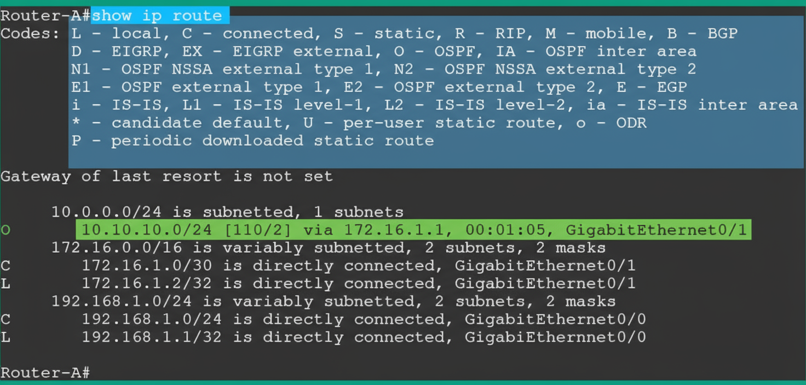

# **Understanding Networking Devices** 🌐

Networking devices are intermediary components used to build and extend a network. Their purpose is to allow users to access and share resources effectively.

---

#### 📑 Table of Contents

<strong>🔍 Introduction</strong>

- [End Devices vs. Intermediary Devices](#️-end-devices-vs-intermediary-devices)
- [Scaling for Organizations](#-scaling-for-organizations)

<strong>🌐 Network Devices</strong>

- [💻 Hub](#-hub)
  - [How Hubs Function](#️-how-hubs-function)
  - [Congested Network Issues](#congested-network-issues)
  - [Collision Domains](#-collision-domains)
  - [Managing Collisions](#-managing-collisions)
  - [Obsolete Technology](#-obsolete-technology)
- [💡 Layer 2 Switch](#-layer-2-switch)
  - [Understanding Switch Operation](#️-understanding-switch-operation)
  - [The Forwarding Process](#-the-forwarding-process-step-by-step)
  - [Unknown Unicast Flooding](#-unknown-unicast-flooding)
  - [Collision Domains](#-collision-domains-1)
  - [Broadcast Domains](#-broadcast-domains)
- [🚀 Layer 3 Capable Switch](#-layer-3-capable-switch)
  - [Understanding VLANs and Inter-VLAN Routing](#-understanding-vlans-and-inter-vlan-routing)
  - [Layer 3 Switches vs. Routers](#-layer-3-switches-vs-routers)
- [🌉 Bridge](#-bridge)
  - [The Problem with Hubs](#-the-problem-with-hubs)
  - [Dividing Collision Domains](#dividing-collision-domains)
  - [Broadcasts vs. Collisions](#-broadcasts-vs-collisions)
- [🛰️ Router](#️-router)
  - [Packet Forwarding Process](#packet-forwarding-process)
  - [The Routing Table](#the-routing-table)
  - [Collision and Broadcast Domains](#collision-and-broadcast-domains)
  - [Identifying Network Domains](#identifying-network-domains)

<strong>📡 Wireless Devices</strong>

- [📶 Access Point](#-access-point)
  - [Contention-Based Wireless Networks](#-contention-based-wireless-networks)
  - [CSMA/CA](#️-carrier-sense-multiple-access-with-collision-avoidance-csmaca)
- [📡 Wireless Router](#-wireless-router)
- [📡 Wireless LAN Controller (WLC)](#-wireless-lan-controller-wlc)
  - [The Challenge of Managing Access Points](#the-challenge-of-managing-access-points)
  - [The Problem of Scaling](#-the-problem-of-scaling)
  - [Centralized Solution: The WLC](#-centralized-solution-the-wlc)
  - [Additional WLC Benefits](#-additional-wlc-benefits)
  - [Deployment Models](#️-deployment-models)

<strong>⚙️ Network Infrastructure Devices</strong>

- [⚖️ Load Balancer](#️-load-balancer)
  - [The Problem: Server Overload](#-the-problem-server-overload)
  - [The Solution: Distributing the Load](#-the-solution-distributing-the-load)
  - [Implementation and Operation](#️-implementation-and-operation)
  - [Fault Tolerance and Operating States](#️-fault-tolerance-and-operating-states)
  - [Common Load Balancing Algorithms](#-common-load-balancing-algorithms)
- [🛡️ Proxy Server](#️-proxy-server)
  - [URL Filtering](#-url-filtering)
  - [How a Proxy Server Works](#-how-a-proxy-server-works)
  - [Content Caching](#️-content-caching)
  - [Common Types of Proxy Servers](#️-common-types-of-proxy-servers)
- [🌐 Internet Modems](#-internet-modems)
  - [Cable Modem](#-cable-modem)
  - [Digital Subscriber Line (DSL) Modems](#️-digital-subscriber-line-dsl-modems)
- [🔁 Repeater](#-repeater)
  - [The Problem: Signal Degradation](#-the-problem-signal-degradation)
  - [The Solution: Regenerating the Signal](#-the-solution-regenerating-the-signal)
- [📞 Voice Gateways](#-voice-gateways)
- [🔄 Media Converters](#-media-converters)

<strong>🛡️ Security Appliances</strong>

- [Exploring Security Appliances](#️-exploring-security-appliances)
- [🔥 Firewall](#-firewall)
  - [Inbound and Outbound Filtering](#inbound-and-outbound-filtering)
  - [Network-Based Firewalls](#-network-based-firewalls)
  - [Next-Generation Firewalls](#-next-generation-firewalls)
  - [Security Zones](#️-security-zones)
  - [Zone-Based Firewall Rules](#-zone-based-firewall-rules)
  - [Host-Based Firewalls](#-host-based-firewalls)
  - [The Importance of Layered Security](#the-importance-of-layered-security)
- [🛡️ IPS/IDS](#️-ipsids)
  - [Intrusion Detection System (IDS)](#-intrusion-detection-system-ids)
  - [Intrusion Prevention System (IPS)](#-intrusion-prevention-system-ips)
  - [Types of Alerts](#-types-of-alerts)

<strong>💻 Networked Devices</strong>

- [Types of Networked Devices](#-types-of-networked-devices)
  - [VoIP Phone](#-types-of-networked-devices)
  - [Printers](#-types-of-networked-devices)
  - [Physical Access Control Devices](#-types-of-networked-devices)
  - [IP Cameras](#-types-of-networked-devices)
  - [HVAC Sensors](#-types-of-networked-devices)
  - [Internet of Things (IoT) Devices](#-types-of-networked-devices)
  - [Industrial Control Systems (ICS)](#-types-of-networked-devices)

---

### 🖥️ End Devices vs. Intermediary Devices

End devices, such as computers and laptops, can operate on their own and perform tasks as needed by the user. For example, computers can store data on their local storage devices.

In a very small setup, users are able to physically transport data between devices using a USB storage device, like a USB flash drive or an external storage drive. This method of sharing data is often called "sneakernet."

### 📈 Scaling for Organizations

This manual method of sharing data is suitable for a small organization with only a few users. However, it is not practical for larger organizations with hundreds or even thousands of employees.

As an organization increases in size, network professionals are required. Their job is to ensure each user is able to access and share resources efficiently over a network.

Networks are built by these professionals using various intermediary networking devices. These devices perform critical functions:
* They accept a message from a sender device.
* They determine the best suitable path for that message to travel.
* They forward the message along that path to its final destination.

There are many different networking devices used in the industry. It is very important to understand the specific **role**, **function**, and **forwarding method** of each device to see how traffic moves along a network between a source and a destination.

---

# 💻 **Hub**

A **network hub** is a legacy networking device that operates at **Layer 1 (Physical Layer)** of the Open System Interconnection (OSI) networking model. The network hub was an early-generation networking device that allowed end devices to be interconnected and share resources.

However, this type of networking device became **obsolete**. This was due to its limitations, lack of support for scalability, and the inefficiency of forwarding messages between a source and a destination.

### ⚙️ How Hubs Function

Unlike many modern network devices that intelligently forward a message between a sender and receiver, a network hub operates like a **repeater device**. It simply accepts an incoming electrical signal on the wire and **rebroadcasts** it through all other interfaces on the hub.

To put it simply: if four computers are connected to a hub and PC 1 sends a message into the hub, the hub will rebroadcast that same message to all other devices connected to it.

The following diagram shows how a hub forwards a message.

  

As shown in the diagram:

1.  **PC 1 (Source)** wants to send a message to **PC 3 (Destination)** on the network.
2.  PC 1 creates a message in the form of an electrical signal and places it onto the media (a copper cable).
3.  When the hub receives the message (electrical signal) from PC 1, it simply rebroadcasts that message out of all other interfaces.
4.  This means **PC 2** and **PC 4** receive a copy of the message that was only intended for PC 3. This creates a significant **security concern** on the network.

### Congested Network Issues

Furthermore, imagine that an organization has many more devices and is using network hubs to interconnect all end devices and share resources.

As you can imagine, a hub is a **non-smart device** that simply rebroadcasts incoming signals throughout the network. In a large network with many hubs, every single message sent by *any* device will be rebroadcasted through the *entire* network.

This behavior creates **excess or unnecessary traffic** within various sections of a network, which can lead to severe **network congestion**.

### 💥 Collision Domains

A **single collision domain** is created for all devices that are connected to the hub.

A **collision domain** is a segment of the network where a packet collision can occur. This happens because more than one device may transmit a message at the same time on the shared network segment. Once a packet collision occurs, the message is discarded, and the sender has to transmit the message again.

The following diagram shows the effects of using only hubs on a network.

  

As shown in the diagram:

  * **Node A** sends a message to **Node B** on the network.
  * However, as the message is transported to the destination, **each hub along the way rebroadcasts** and sends a copy of the message to all other devices on the network.

As a network grows with more hubs and devices, network congestion is bound to happen. This can cause **packet loss** and **high latency**. Furthermore, the collision domain increases in size as more hosts connect to the network of hubs.

### 🚦 Managing Collisions

Since a network hub simply rebroadcasts messages without inspecting the destination Media Access Control (MAC) address or the destination IP address, what happens if two different devices send a message to the hub at the same time?

A **network collision** will occur. This causes the packets from both senders to be corrupted. Therefore, on a hub network, **only one device can transmit a message at a time** while all others must wait. If a network collision occurs and/or the packets are corrupted, the sender of the message will have to resend it.

#### Carrier Sense Multiple Access with Collision Detection (CSMA/CD)

To prevent these issues on a hub network, end devices like computers use **Carrier Sense Multiple Access with Collision Detection (CSMA/CD)**.

Here is how it works:

1.  **Carrier Sense**: Before an end device places a message (electrical signal) on the media, it first "listens" to the media to check for the presence of a signal.
2.  **Detection**: If a signal is detected, it means another device is already using the media/network and is transmitting a message.
3.  **Waiting**: Therefore, the device waits and checks the media again.
4.  **Transmitting**: The device waits until no signals are detected, and only then does it proceed to transmit its message.

Since a hub network is a shared medium of communication, each device *must* check the media before sending a message, or else a collision can occur.

### 🚫 Obsolete Technology

Since network hubs have a lot of limitations and do not support scalability very well, these are **obsolete devices** and are not recommended for use on modern networks.

---

# 💡 **Layer 2 Switch**

Network switches are intermediary networking devices that operate at **Layer 2 (Data Link Layer)** of the OSI networking model. They allow end devices such as computers, servers, and printers to connect to a network.

Additionally, using switches to interconnect devices within an office or building allows network professionals to create a **local area network (LAN)**.

A network switch is an **intelligent** networking device. It does not simply rebroadcast inbound electrical signals to all other interfaces like a hub. Instead, the network switch inspects the **destination MAC address** found within the Layer 2 header of a frame to determine the correct destination host.

### ⚙️ Understanding Switch Operation

To gain a better understanding of how network switches operate, let’s study the following network topology, in which three computers are all interconnected using a switch.

  

Figure 8.3 – Network topology with a switch

As shown in the preceding diagram, each computer is assigned an IPv4 address and has a unique MAC address on its network interface card (NIC).

When a switch first boots up, it does not know which computer is connected to any of its local interfaces. The switch only learns this information when a device (like a computer) sends a message. The switch inspects the **source and destination MAC addresses** within the Layer 2 frame, which it then uses to populate its **content-addressable memory (CAM) table**.

> #### 📝 Important Note: The CAM Table
>
>   * The **CAM table** is used by Cisco switches to store MAC addresses that are learned on an interface.
>   * This table helps the switch determine how to forward a message to a destination on the network.
>   * Each time a frame enters an interface, the switch will check the **source MAC address**.
>   * If the source MAC address was never seen before on that inbound interface, the switch will temporarily store it in the CAM table and map it to that interface. This is how switches populate entries within a CAM table.
>   * Keep in mind that the contents of the CAM table are stored in **random access memory (RAM)**, and the contents are lost whenever the switch loses power or reboots.

### 🚀 The Forwarding Process: Step-by-Step

Let’s imagine that **PC 1** wants to send a message to **PC 3** but doesn’t know the destination host’s MAC address.

On a network, all senders must include:

  * Source and destination MAC addresses in the **Layer 2 header**.
  * Source and destination IP addresses in the **Layer 3 header**.

Since switches operate at Layer 2, they will not be able to view the Layer 3 header details. They only look at the MAC addresses in the Layer 2 header. Therefore, it’s essential that the source and destination MAC addresses are inserted correctly on a frame before placing the message on the network for delivery.

#### Step 1: The ARP Request

The **Address Resolution Protocol (ARP)** allows devices to resolve an IPv4 address to a MAC address on a LAN.

To put it simply, PC 1 will send an **ARP request** message with a destination MAC address of `FF:FF:FF:FF:FF:FF` (a broadcast address). The switch will receive this message and **broadcast** it to all other interfaces, *except* the interface the message originated on (interface 1), as shown in the following diagram.

  

  Figure 8.4 – ARP request message

#### Step 2: CAM Table Update (Learning PC 1)

As shown in the preceding diagram, the ARP request message is sent to the switch and broadcasted. As this frame enters interface 1, the switch inspects its **source MAC address** (`AA-AA-AA-AA-AA-AA`).

The switch stores this source MAC address in its CAM table and maps it to **interface 1**, as shown in the following table.

  

  Figure 8.5 – CAM table

#### Step 3: The ARP Reply

Next, PC 2 and PC 3 will receive the ARP request message and inspect the requested target IP address of `192.168.1.30`.

  * Since **PC 2** has an IP address of `192.168.1.20`, it will discard the message and not respond.
  * **PC 3** has the target IP address and will respond directly to PC 1 with its MAC address (`CC-CC-CC-CC-CC-CC`) using an **ARP reply** message.

  

  Figure 8.6 – ARP reply message

#### Step 4: CAM Table Update (Learning PC 3)

When the switch receives the ARP reply message from PC 3 on **interface 3**, it inspects the source and destination MAC addresses.

1.  **Learn Source:** The switch sees PC 3’s source MAC address (`CC-CC-CC-CC-CC-CC`) and stores it within the CAM table, mapped to **interface 3**.
2.  **Forward to Destination:** The switch checks the destination MAC address (PC 1's `AA-AA-AA-AA-AA-AA`). It looks in the CAM table and sees that this MAC address was previously recorded on **interface 1**.
3.  The switch forwards the ARP reply *directly* to the destination host (PC 1) out of interface 1.

The following table shows the entries of the CAM table after receiving the ARP reply from PC 3.

  

  Figure 8.7 – CAM table updated

#### Step 5: Sending the Data

At this point, the switch knows where PC 1 and PC 3 are located based on the CAM table entries. Additionally, PC 1 now knows the MAC address of PC 3 from the ARP reply.

1.  PC 1 inserts PC 3's MAC (`CC-CC-CC-CC-CC-CC`) into the destination MAC address field of the frame and sends the message.
2.  The switch receives the frame on interface 1.
3.  It inspects the destination MAC address (`CC-CC-CC-CC-CC-CC`).
4.  It checks the CAM table, determines that this MAC address is on **interface 3**, and forwards the message *only* out of interface 3, as shown in the following diagram.

  

Figure 8.8 – Switching forwarding method

Once a switch already knows PC 3 is connected to interface 3, it sends the message directly to the destination host on the network.

### ❓ Unknown Unicast Flooding

However, there’s another real-world scenario: what if the sender device (like a computer) knows the destination host’s MAC address, but the **switch does not**?

This can happen if the CAM table entry for the destination has timed out and been erased.

1.  Whenever a switch receives a frame, it inspects the destination MAC address and checks the CAM table to determine how to forward the message.
2.  In the event that a switch does not know the location of the destination host (because the MAC address is **not found** within the CAM table), the switch will **flood** the message.
3.  Flooding means sending the message out of **all interfaces** *except* the interface the message originated on.

This means all devices connected to the switch (except the sender) will receive a copy of the message.

  * Each device, upon receiving the message, will inspect the destination MAC address.
  * If a device receives a message and the destination MAC address does not match its own, the message is **discarded**.
  * If a device receives a message and the destination MAC address *does* match its NIC's MAC address, the frame is processed and sent to the upper layers of the network model.

### 💥 Collision Domains

Switches help **reduce the size of a collision domain** as compared to hubs on a network.

Since switches are intelligent devices and forward frames by inspecting destination MAC addresses, they are able to isolate a collision to a **per-interface level**.

To put it simply, **each interface on a switch represents one collision domain**. It is recommended that only one device is connected to each switch interface.

> **ℹ️ Information**
>
> Each interface/port on a switch represents one collision domain. Therefore, a switch with eight ports has eight collision domains. A 48-port switch will contain 48 collision domains.

The following diagram shows a representation of collision domains on a switch.

  

Figure 8.9 – Collision domains

As shown in the preceding diagram, there are **four collision domains**. Since one device is attached to each interface on the switch, the possibility of a collision occurring between a computer and the switch is dramatically reduced.

### 📣 Broadcast Domains

However, if a device sends a **Layer 2 broadcast message** (with a destination MAC address of `FF:FF:FF:FF:FF:FF`), the switch will forward the message out of **all interfaces**.

This creates a single broadcast domain. A **broadcast domain** is simply described as a network segment where all devices can be reached by using a Layer 2 broadcast message.

The following diagram shows a broadcast domain on a network switch.

  

Figure 8.10 – Broadcast domain

As shown in the preceding diagram, by default, all interfaces on a switch collectively create a **single broadcast domain**. This allows all devices on that switch to be reached by a Layer 2 broadcast message.

As a network professional, creating smaller Layer 2 broadcast domains helps to improve network efficiency and overall performance.

---

# 🚀 **Layer 3 Capable Switch**

Network switches are commonly referred to as **Layer 2 devices**. They operate at the data link layer of the OSI networking model and have the capabilities to forward frames based on destination MAC addresses.

Nowadays, **Layer 3 network switches** also exist. These devices operate at the **network layer (Layer 3)** of the OSI networking model. Layer 3 switches allow network professionals to interconnect and perform routing between different **virtual local area networks (VLANs)** within an organization.

### 🌐 Understanding VLANs and Inter-VLAN Routing

Large organizations often implement VLANs within their physical network. This allows network professionals to **logically segment** a physical network into multiple, small broadcast domains. This practice allows each department (such as human resources, sales, IT, and so on) to be on its own logical network.

Therefore, if a device within the sales VLAN generates a broadcast message, that message is limited only to devices within that same sales VLAN.

Since an organization may have multiple VLANs, hosts within one VLAN will not be able to communicate with devices on another VLAN by default. To ensure different VLANs are able to exchange messages with each other, a **Layer 3 device** is needed to route traffic between them.

### 🔄 Layer 3 Switches vs. Routers

One of the most common Layer 3 devices is a **router**, which allows network professionals to interconnect two or more different networks together.

However, network professionals can also use a **Layer 3 switch** that provides routing functionalities, just like a router, to allow communication between VLANs within an organization.

It is important to keep in mind:
* **Routers** 🛰️: These are *dedicated* Layer 3 devices for forwarding packets. They often include additional Layer 3 functionalities such as advanced data, security, and voice features.
* **Layer 3 Switches** 🔀: These devices can perform *both* Layer 2 functions (switching) and Layer 3 functions (routing) on a network.

Using a Layer 3 switch allows an organization to **reduce the cost** of needing a dedicated router on the network just to perform inter-VLAN routing.

---

# 🌉 **Bridge**

A **network bridge** is a special networking device that operates at **Layer 2 (Data Link Layer)** of the OSI networking model. Its purpose is to allow network professionals to divide the network into multiple **collision domains**.

### 💥 The Problem with Hubs

If you recall, older networks were built using a **hub** to interconnect end devices and extend a network within an office space or building.

However, the downside of using a hub is that it creates a **single, large collision domain** with all connected devices. This is not good for network performance or security.

  * To put it simply, if a computer sends a message to a hub, that message is **rebroadcasted** to all devices on the network.
  * Additionally, if two or more computers transmit a message at the same time, a **packet collision** will occur.

The following diagram shows a single, large collision domain that is created using hubs.

  

  Figure 8.11 – Broadcast domain

### Dividing Collision Domains

Network professionals can implement a **bridge** into a large collision domain to create two **smaller collision domains** on a network.

The following diagram shows a network topology with two collision domains that are separated by a bridge in the middle.

  

Figure 8.12 – Creating a smaller collision domain

As shown in the preceding diagram:

  * **Collision Domain A** is separated from **Collision Domain B** by a bridge.
  * Therefore, if PC 1 and PC 2 (in Domain A) send a message at the same time, a packet collision will occur.
  * However, this collision will **only affect the devices connected to Collision Domain A**, leaving Collision Domain B completely unaffected.

### 📣 Broadcasts vs. Collisions

It is important to note that while a bridge separates *collision domains*, it does not separate *broadcast domains*.

If PC 1 sends a **broadcast message** (e.g., an ARP request), all devices (such as PC 2, PC 3, and PC 4) will still receive the message. This is because they are all still connected to the same **broadcast domain**.

---

# 🛰️ **Router**

Routers are **Layer 3 devices** that operate at the network layer of the OSI networking model. They allow network professionals to interconnect two or more different networks together. These are dedicated networking devices that function as the **default gateway** and forwarding device, allowing hosts on one network to communicate with hosts on another network.

### Packet Forwarding Process

Whenever a router accepts an inbound message, such as a packet, it follows a specific process:

1.  **Layer 2 Inspection**: The router inspects the Layer 2 header for the destination MAC address to determine whether the message is intended for the router itself.
2.  **De-encapsulation**: If the destination MAC address of the message matches the MAC of the router's inbound interface, the frame is de-encapsulated (the Layer 2 header and trailer are removed) and sent up to the network layer.
3.  **Layer 3 Inspection**: At the network layer, the router inspects the **destination IP address** within the Layer 3 header of the packet.
4.  **Routing Table Lookup**: The router checks its **routing table** for a suitable route or path to forward the message to its final destination.

Each router contains a routing table that lists various routes to different destination networks, including the internet. The router checks this table from top to bottom each time it has to perform a lookup before forwarding a packet. Once a suitable route is found, the router stops the lookup and processes the information within that matching route.

### The Routing Table

The following diagram shows a few networks that are interconnected using routers.

  

  Figure 8.13 – Network diagram

As shown in the preceding diagram, there are three networks that are interconnected using two routers. Each router has a local routing table that tells it how to forward an incoming packet.

  * **Router-A**: Has two directly connected networks: `192.168.1.0/24` and `172.16.1.0/30`. Networks that are directly connected to a router will automatically appear within the routing table when the router boots up. The `10.10.10.0/24` network will *not* automatically appear in Router-A's routing table by default, as it is a remote network.
  * **Router-B**: The `10.10.10.0/24` and `172.16.1.0/30` networks will automatically be inserted in the routing table of Router-B by default, as they are directly connected.

### Example: Router-A Routing Table

The following snippet shows the routing table of Router-A.

  

Figure 8.14 – Routing table

As shown in the preceding figure, the routing table of a router such as Router-A contains the following:

  * The source of a route (usually indicated by a code, like `C` for connected or `O` for OSPF).
  * The destination network.
  * The next-hop address (the IP address of the next router to send the packet to).
  * The exit interface of the router (which port to send the packet out of).

### Example: Packet Walkthrough

Therefore, if **PC1** wants to exchange a message with another host such as **PC4**, it will determine whether PC4 is on the same network as itself or not by calculating its own network ID and determining whether PC4 is on the same network.

Once PC1 determines that PC4 is on a **different IP subnet** from itself, PC1 sends a message to its **default gateway**, which is `192.168.1.1` on Router-A’s `GigabitEthernet 0/0` interface. Routers will use the destination IP address found within the packet and check the routing table, as shown here.

  

  Figure 8.15 – Routing table

Router-A uses the network route that is highlighted in the preceding figure and forwards the packet out of its `GigabitEthernet 0/1` interface to Router-B, which is assigned the `172.16.1.1` address.

The process is repeated on each router for every incoming packet to determine how to forward the message to its destination, and eventually, the packet will be delivered. Routers are simply essential networking devices that help network professionals to interconnect different physical and IP networks together.

### Collision and Broadcast Domains

Each interface on a router represents a **collision domain**. Hence, it’s recommended that only one device should be connected to an interface, which prevents packet collisions from occurring.

Additionally, each interface on a router is also attached to a **broadcast domain**. Routers **stop** a Layer 2 broadcast from propagating from one network to another.

### Identifying Network Domains

Let’s study the following network diagram and identify the number of collision domains and broadcast domains.

  

  Figure 8.16 – Network diagram

There are **three broadcast domains**, as shown in the following diagram.

  

  Figure 8.17 – Identifying the number of broadcast domains

In this network, there are **three (3) broadcast domains**, as shown in the diagram below:

*Figure 8.17 – Identifying the number of broadcast domains*

Why are there 3 broadcast domains? Because **routers block broadcasts**:

- **Domain 1 (Left)**: The entire network connected to the left-side interface of Router-A (SW1, PC1, PC2, PC3). If PC1 sends a broadcast, it will reach Router-A, but Router-A will not forward it further.
- **Domain 2 (Middle)**: The link (network) between Router-A and Router-B. This is a separate broadcast domain.
- **Domain 3 (Right)**: The entire network connected to the right-side interface of Router-B (SW2, Hub, PC6, PC7, PC8).

As a network professional, it is crucial to identify the number of collision domains and broadcast domains. **Routers do not forward Layer 2 broadcast messages** from one broadcast domain to another.

## Identifying Collision Domains 

  

  Figure 8.18 – Identifying the number of collision domains

Now, let's identify the **collision domains** in the same diagram. Keep in mind: **Each switch port is a separate collision domain**, but a **hub creates a single, large collision domain**.

*Figure 8.18 – Identifying the number of collision domains*

According to the diagram, there are **eight (8) collision domains**:

- **Domain 1, 2, 3**: PC1, PC2, and PC3 are each connected to a separate port on SW1 (3 Domains).
- **Domain 4**: The link between SW1 and Router-A (1 Domain).
- **Domain 5**: The link between Router-A and Router-B (1 Domain).
- **Domain 6**: The link between Router-B and SW2 (1 Domain).
- **Domain 7**: The link between PC6 and SW2 (1 Domain).
- **Domain 8**: The hub connected to a port on SW2, along with all devices connected to the hub (PC7, PC8), forms a single, large collision domain (1 Domain).

---

# 📶 **Access Point**

An **access point (AP)** is a networking device that allows Wi-Fi-capable devices to connect to a wired network. This enables users to share resources and access services wirelessly.

While the core of many organizations’ networks consists of wired connections, wireless networking provides significant convenience and support for mobility. Network professionals can easily extend the capabilities of a wired network by simply connecting an AP to a network switch.

Since a network operates at **Layer 2** of the OSI networking model, the AP simply generates wireless signals on the **2.4 GHz** and **5 GHz** frequencies, based on the **IEEE 802.11 standards** for wireless networking.

Once a client, such as a laptop, connects to an AP, the client gains access to all the resources and services available on the wired network. Implementing a wireless network allows users to roam around the office with their Wi-Fi-capable devices and work from anywhere within the vicinity of the AP.

The following diagram shows a small wireless network with an AP.

  

Figure 8.19 – Wireless network

### 🚦 Contention-Based Wireless Networks

There are various IEEE 802.11 wireless standards in the wireless networking industry. It is important to know that older APs using the **IEEE 802.11a/b/g/n/ac** standards create a **contention-based** wireless network for all connected clients.

The following steps are written in layman’s terms to provide clarity on how a wireless client proceeds to send a message on such a wireless network:

1.  **Client-A** wants to send a message to another wireless client that is connected to the same AP.

2.  Before Client-A transmits the message, it sends a **Request to Send (RTS)** message to the AP. This is to determine whether the wireless network is clear to send the message.

  

Figure 8.20 – Requesting status from the AP

3.  The AP will respond with a **Clear to Send (CTS)** message *if* no other devices are transmitting on the wireless network.

  

Figure 8.21 – AP providing a response

4.  Then, Client-A will send the message to the AP, which is responsible for forwarding it to the destination host on the wireless network.

5.  The AP will simply **rebroadcast** the message to all other connected hosts, similar to how a hub operates on a wired network.

  

Figure 8.22 – AP forwarding message

As shown in the preceding diagrams, all wireless clients that are associated with an AP operating on IEEE 802.11a/b/g/n/ac wireless standards are all on a **single collision domain** and a **single broadcast domain**.

### 🛡️ Carrier Sense Multiple Access with Collision Avoidance (CSMA/CA)

Wireless networks that use IEEE 802.11a/b/g/n/ac use **Carrier Sense Multiple Access with Collision Avoidance (CSMA/CA)** to *avoid* the collision of frames on a wireless network.

With CSMA/CA, a wireless client will first check with the AP (using an RTS) to determine whether the network is clear to send or not. The AP will respond to the client with an all-clear (CTS) or not. This method prevents collisions that would occur if more than one client tried to transmit a message over the wireless network at the same time.

> #### 📝 Important Note
>
> Newer wireless routers and APs that use the **IEEE 802.11ax (Wi-Fi 6)** standard do not contain the limitations and shortcomings of previous generations of wireless networking standards.
>
> To put it simply, devices that are connected to a Wi-Fi 6 network do not need to use CSMA/CA, as IEEE 802.11ax has improved on forwarding traffic more efficiently. However, they can still use RTS/CTS to communicate with legacy APs.

# 📡 Wireless Router

Another type of wireless networking device commonly implemented within small office networks and homes is a **wireless router**.

A wireless router is an **all-in-one device** that contains the function of an AP, a switch, and a router in a single device.

  * **Access Point Function**: The AP feature allows the wireless router to create a wireless network on 2.4 GHz and 5 GHz frequencies, according to the IEEE 802.11 standard for wireless networking.
  * **Switch Function**: On the back of a typical wireless router are a few interfaces known as **switch ports** or switch interfaces. These interfaces allow a user to establish a wired connection between their end device and the wireless router. These switch ports operate as a typical Layer 2 network switch, where all devices connected to the wireless router using a wired connection will all be able to communicate with each other.
  * **Router Function**: Lastly, the wireless router performs routing functions, such as routing traffic between the wireless and wired networks.

The wireless network is assigned an IP subnet that is uniquely different from the IP subnet used on the wired network. To put it simply, a smartphone that’s connected to a wireless router will obtain an IP address that’s different from the IP addresses being used on the wired LAN.

The following diagram shows a typical wireless network with a wireless router.

  

Figure 8.23 – Wireless router

As shown in the preceding diagram:

  * PC 1 is assigned an IP address from the `192.168.1.0/24` network and is connected to the wireless router.
  * The wireless router is connected to the wired LAN (via the network switch) that is on the `172.16.1.0/24` network.
  * Therefore, the wireless router performs **routing** between these two different types of networks (wired and wireless) and between the different IP networks.

---

# 📡 **Wireless LAN Controller** (WLC)

A **Wireless LAN Controller (WLC)** is a special networking device that provides a centralized platform for network professionals. Its primary purpose is to allow for the efficient management of all the **Wireless Access Points (WAPs)** within an organization from a single, central controller on the network.

---

### The Challenge of Managing Access Points

If an organization has multiple WAPs, network professionals *could* simply log in to each device individually. From there, they would perform tasks such as:
* Making configuration changes.
* Upgrading the firmware.
* Troubleshooting to resolve any issues.

A small number of WAPs are generally manageable for a small to medium-sized organization with only a few wireless devices, such as laptops and smart devices.

---

### 📈 The Problem of Scaling

As an organization provides more wireless devices to its employees, the network infrastructure must be able to support this increase. Network professionals need to ensure the wireless network can handle the growing number of devices and provide sufficient bandwidth for each device to exchange messages.

To meet this demand, network professionals will implement **additional WAPs** within the organization. This ensures:
1.  There is sufficient coverage of the wireless signals.
2.  Any "dead zones" (areas with no Wi-Fi) are eliminated.
3.  Wireless clients can connect to any WAP within the organization and have continuous access to resources.

---

###  centralized Solution: The WLC

As more WAPs are implemented to support wireless clients, network professionals need to continuously monitor the performance of the wireless network to ensure it is operating optimally.

If a WAP becomes unavailable—perhaps due to a faulty firmware update or a hardware deficiency—the wireless clients within the range of that faulty WAP will be affected. This, in turn, impacts the users who rely on the wireless network.

Using a **WLC** solves this management problem. It allows network professionals to configure each WAP on the network to establish a connection directly to the WLC. From that point, network professionals can simply log in to the WLC (often through a web interface) and **centrally manage the entire wireless network**.

#### Example: Changing Security Configurations

Imagine you need to change the security configurations and methods for a user accessing the wireless network.
* **Traditionally**: The network professional would need to log in to *each WAP* within the organization and perform the configuration changes manually, one by one. This method is time-consuming and often leads to human errors or misconfigurations.
* **With a WLC**: The network professional makes the changes *directly on the controller*. The WLC will then **push** these configurations to all WAPs on the network automatically. This ensures the changes take effect as soon as possible and are consistent everywhere.

---

### 🌟 Additional WLC Benefits

A WLC also allows network professionals to:
* Determine the firmware version of all WAPs.
* Schedule firmware updates for all devices from one place.
* Actively monitor the entire wireless network from a single dashboard.
* Identify issues on the network more effectively.

---

### ☁️ Deployment Models

A WLC can be implemented in two primary ways:
1.  **On-premises solution**: The WLC hardware is physically located within the organization.
2.  **In the cloud**: The WLC is hosted by a provider and managed remotely.

Overall, the WLC is simply a custom operating system or firmware that runs on a hardware-based device. Each deployment provides its own set of advantages and disadvantages. Therefore, it is important to evaluate which type of deployment is most suitable for the organization while providing the most benefits to achieve its objectives.

---

# ⚖️ **Load Balancer**

A **load balancer** is a special networking device that allows network professionals to distribute inbound network and application traffic. This traffic is spread across a **cluster of servers** that are providing services and/or resources to users.

### 🚧 The Problem: Server Overload

Imagine an organization creates a web server and connects it to the internet. This server hosts an e-commerce web application to sell products and services online.

For every user who connects and performs a transaction, some of the server's processing power is used. As more users connect and perform more transactions, the utilization of computing resources on the server will continue to increase. Eventually, the server will become **overwhelmed** and perform slowly.

As a result, users will be affected by the slow performance and the server's inability to handle a large number of users and their transactions.

### 💡 The Solution: Distributing the Load

One solution is to deploy **multiple servers** to host the *same* e-commerce web application. A load balancer device is then implemented on the network.

This device accepts incoming messages from users and **distributes the load evenly** across the cluster of servers. Therefore, one server will not be handling all the transactions.

Furthermore, the load balancer ensures that no single server is overwhelmed with the number of web request messages from users on the internet. This allows each server to perform optimally.

The following diagram shows a load balancer deployed on a network.

  

  Figure 8.24 – A load balancer on a network

As shown in the preceding diagram, any incoming traffic from users on the internet is intercepted by the load balancer. The load balancer is responsible for distributing the network and application traffic types to the group of servers. This ensures each server is not overburdened with a lot of transactions or requests.

### ⚙️ Implementation and Operation

Load balancers can be implemented on a network in two ways:

  * As a **hardware-based device**.
  * As an **application** that runs on a hypervisor or in a cloud environment.

Load balancers typically operate at either **Layer 4** or **Layer 7** of the OSI networking model.

  * **Layer 4 (Transport Layer)**: Can distribute network traffic based on common transport layer protocols (like TCP or UDP).
  * **Layer 7 (Application Layer)**: Can distribute the load based on common application layer protocols, such as **Hypertext Transfer Protocol Secure (HTTPS)**.

### 🛡️ Fault Tolerance and Operating States

Furthermore, load balancers are able to provide **fault tolerance**. In the event a server within the cluster becomes unavailable or offline, the load balancer can simply distribute the incoming network traffic to the *available* servers within the cluster.

Load balancers can operate in two main states:

  * **Active/Active**: This state allows the distribution of network and application traffic between *all active servers* within a cluster.
  * **Active/Passive**: This state allows the distribution of the load to an *active server only*. It performs a **failover** to a standby (passive) server *if* the active server is no longer available.

### 🔀 Common Load Balancing Algorithms

The following are the four most common algorithms used by load balancers. These algorithms determine how the load is distributed to servers on a network.

  * **Round Robin**

      * This is the most common and simplest method used on load balancers to distribute the load.
      * The round robin method simply forwards a request message from a user to each server within the group in turn.
      * When the load balancer reaches the last server within the group/cluster, it will start again from the first server to the second and third, and so on.
      * While this forwarding method is simple, it is not the most efficient for traffic distribution. This is because the load balancer *assumes* each server within the group or cluster is always available, has the same hardware and software specification, and is processing the same amount of load.

  * **Weighted Round Robin**

      * This method allows the load balancer to distribute the load to each server within a group based on a **weight** that is assigned to the servers.
      * The weight can be based on a specific criterion, which is usually chosen by the network professional.
      * However, the higher the weight value assigned to a server, the more requests will be forwarded to that specific server. Less traffic/load will be sent to the servers with a lesser weight value.

  * **Least Connections**

      * This technique is a dynamic load-balancing method.
      * It forwards a request to the server within the group that has the **least active number of connections**.
      * When the load balancer receives a request message from a client, it checks which server from the group or cluster has the least active connections and forwards the client request to that server.

  * **Least Response Time**

      * This is another forwarding method used on load balancers.
      * It forwards a request message from a client to the server with the **lowest average response time** within the group of servers.

---

# 🛡️ **Proxy Server**

A **proxy server** is a server on the network that performs the function of a **relay** between clients and other servers.

Proxy servers are commonly implemented by network professionals to prevent hackers from invading a corporate network within an organization. It does this by **intercepting all messages** that flow between the clients (like user computers) and the servers they are trying to reach.

### 🔒 URL Filtering

Within companies, proxy servers are commonly used to perform **URL filtering**. This involves inspecting the destination URL that a user is trying to reach.

  * **Blacklist**: If the URL is within the blacklist (a list of forbidden web addresses), the proxy server **does not forward** the client's request to the destination.
  * **Whitelist**: If the destination URL exists within the whitelist (a list of allowed web addresses), the proxy server **forwards** the message to the destination server.

### 🔄 How a Proxy Server Works

The following diagram shows a proxy server on a network.

  

Figure 8.25 – Proxy server on a network

As shown in the preceding diagram, the process works as follows:

1.  **Request Sent**: When PC 1 wants to send a message to a public server on the internet, PC 1 is configured to forward all its web request messages to the proxy server on the network for inspection.
2.  **Inspection**: The proxy server checks the destination URL and determines whether it is allowed or denied.
3.  **Forwarding**: If the web request is permitted, the proxy server forwards the message to the web server (acting on behalf of the PC).
4.  **Response Intercepted**: When the web server responds, the proxy server intercepts the response message.
5.  **Caching**: The proxy server **caches** (stores a temporary copy of) the data.
6.  **Response Delivered**: The proxy server forwards a copy of the data to PC 1.

> #### 📝 Important Note
>
> WAPs (Wireless Access Points) or wireless routers can also be configured to function as proxy servers on a network.

### 🗃️ Content Caching

Proxy servers are commonly used to perform the **caching of content**.

  * When a client sends a web request to the proxy server, the proxy first checks its cache (its local storage) to determine whether the requested data already exists.
  * If a cached version of the web page already exists within the memory of the proxy server, it is sent directly to the client.

Caching helps an organization **reduce the amount of internet bandwidth consumption** (since it doesn't have to fetch the same data multiple times). However, the cache also means there is a likelihood that an **outdated version** of a web page is sent to a client if the original has changed.

### ➡️ Common Types of Proxy Servers

The following are common types of proxy servers:

  * **Forward Proxy**: This is a common type of proxy that intercepts a client's request message and forwards it to the destination on the internet. It acts on behalf of the *client*.
  * **Reverse Proxy**: This type of proxy server intercepts and forwards request messages *from* devices that are on the internet *to* the servers on the internal network of the organization. It acts on behalf of the *server*.

### Modern Relevance

Nowadays, proxy servers are still implemented as dedicated devices on a network. However, many **next-generation firewalls** are now able to perform content and URL filtering.

Despite this, proxy servers are still able to perform **content caching**, which security appliances such as firewalls are unable to do in a large-scale environment. Hence, there is still a need for implementing dedicated proxy servers within a network.

---

# 🌐 **Internet Modems**

An internet modem is a crucial piece of networking hardware. It acts as the bridge between your local network and the wider internet, provided by your Internet Service Provider (ISP).

### 📡 Cable Modem

A **cable modem** is a specific type of modem, often referred to as **customer premises equipment (CPE)**. It is provided by an ISP to connect a customer's location to the ISP's network.

Its primary function is to terminate the **Cable Modem Termination System (CMTS)** network, which is distributed over **coaxial cables** (the same type of cables often used for cable television).

In most modern homes, the cable modem is an **all-in-one** unified device that performs the functions of a:

  * **Router**: Manages traffic between your local network and the internet.
  * **Switch**: Provides multiple wired ports (like Ethernet) to connect devices.
  * **Access Point**: Creates a Wi-Fi network for wireless devices.

The following diagram shows a simple representation of the CMTS network.

  

Figure 8.26 – CMTS network

As shown in the preceding diagram:

1.  The ISP implements the **CMTS** network infrastructure.
2.  This infrastructure distributes cable TV and internet services over a **Hybrid Fiber-Coaxial (HFC)** network to their customers.
3.  A **cable modem** is installed at the customer’s location.
4.  This modem interconnects the customer’s private network (your home or office) to the HFC and CMTS infrastructure, allowing you to access internet services.

As you may have realized, modems are all-in-one devices that perform multiple roles:

  * Functioning as a **router** between the customer’s and the ISP’s networks.
  * Operating as a **switch** to allow the customer to physically connect a few devices.
  * Providing a **wireless signal** as an AP to allow users to connect their wireless-capable devices.

### ☎️ Digital Subscriber Line (DSL) Modems

**Digital Subscriber Line (DSL) modems** are another type of modem provided by ISPs. Instead of using coaxial cables, DSL distributes internet services over the **Public Switched Telephone Network (PSTN)** lines. These are sometimes called the **Plain Old Telephone Service (POTS)** lines.

The following diagram shows a representation of a typical PSTN network with a DSL modem.

  

Figure 8.27 – DSL modem

As shown in the preceding diagram:

1.  The **DSL modem** is installed at the customer’s location.
2.  It **terminates** and **converts** the digital signals coming from the ISP’s network (which travel over the phone lines).
3.  This conversion allows the devices within the customer’s network to access the internet services.

---

# 🔁 **Repeater**

A **repeater**, sometimes referred to as a **Wi-Fi extender** or **Wi-Fi repeater**, is a simple networking device that operates at **Layer 1 (Physical Layer)** of the OSI networking model.

Its sole function is to accept a signal and then **regenerate** (or rebroadcast) the *exact same signal* at a higher power.

### 📶 The Problem: Signal Degradation

These devices are commonly found on wireless networks implemented by network professionals within a building or large compound area.

An **Access Point (AP)** or a wireless router contains one or more antennas. These antennas are used to emit a radio frequency (RF) signal, which allows wireless clients (like laptops and phones) to connect to the AP and share resources.

However, the antennas of an AP or wireless router can only emit a signal that is strong enough to travel over a certain distance. As the signal travels further away from the AP, it starts getting weaker as the distance increases.

Additionally, **physical obstacles** such as concrete and steel walls can **absorb** the wireless signals. This absorption prevents the signals from traveling further away from the AP. This results in areas with very weak or no signal, often called **"dead zones."**

### 💡 The Solution: Regenerating the Signal

To solve this, network professionals implement **repeaters** in strategic locations within their building or compound.

1.  A repeater is placed in a location where it can still receive a good, usable signal from the main AP.
2.  It **captures** the signals from the AP.
3.  It then **regenerates** and rebroadcasts that same signal at full strength.

This technique helps **reduce dead zones** within the wireless network. By strategically extending the signal's reach, repeaters ensure there is maximum coverage of the wireless signals for all wireless clients within the organization.

# 📞 **Voice Gateways**

A **voice gateway** is a device that allows an organization to interconnect its enterprise **Voice over IP (VoIP)** network to the telecommunication service provider’s network. This connection is established using various connectivity methods, such as:

* **PSTN** (Public Switched Telephone Network)
* **SIP** (Session Initiation Protocol) technologies

Within an organization, you will commonly find a VoIP network that includes:
* IP phones
* A Unified Communication Server (UCS)
* Networking devices configured to perform the routing of calls *between users within the organization*.

Using a voice gateway is what allows users to establish calls *outside* the organization’s network by using a telecommunication service provider.

# 🔄 **Media Converters**

**Media converters** are specialized networking devices. They allow network professionals to easily convert an **Ethernet communication protocol** from one media type to another.

For instance, consider a scenario where a network professional wants to interconnect a **fiber optic cable** to a switch that supports *only* **Ethernet interfaces** (which use copper cables).

In this case, a media converter is used. It allows the **light signals** from the fiber optic cable to be converted into **electrical signals** for the Ethernet cable, and vice versa (electrical signals back to light signals).

# ➡️ Moving Forward

Having completed this section, you have learned about the roles and functions of various networking devices that are commonly implemented within organizations to create networks.

In the next section, you will discover the roles of various **security appliances** and how they are used to help protect a network.

---

# 🛡️ **Exploring Security Appliances**

Cybersecurity is one of the most demanding fields within the IT industry. This is because threat actors, such as hackers, are always looking for new ways to compromise systems and networks within organizations and steal their data.

**Security appliances** are specialized devices that are designed to protect a system or a network from cyber-attacks and threats. In this section, you will learn about the roles and features of:

  * Firewalls
  * Intrusion Detection Systems (IDSs)
  * Intrusion Prevention Systems (IPSs)

# 🔥 **Firewall**

A **firewall** is a network-based security appliance (hardware) or a host-based application (software) designed to **filter malicious traffic** between networks.

Network security professionals commonly implement network-based firewalls between their organization's corporate network and the internet. The intention is to filter any potentially dangerous traffic originating from the internet that is attempting to enter the organization's private network.

### Inbound and Outbound Filtering

The internet is the most unsafe network in the entire world, and organizations must monitor and filter network traffic both **to** and **from** their networks.

  * **Inbound Filtering**: While it is important to filter inbound traffic *from* the internet,
  * **Outbound Filtering**: It is equally important to filter outbound traffic *from* the corporate network *to* the internet.

If an organization’s network is compromised with malware, it usually attempts to infect other systems on the internet. By using a firewall to monitor and filter outbound traffic, network security professionals are able to detect and block any potentially malicious traffic that is also *leaving* the organization. This prevents the threat from spreading to devices on the internet.

### 🌐 Network-Based Firewalls

The following diagram shows a typical hardware-based firewall that is implemented within a company.

  

  Figure 8.28 – Network-based firewall

As shown in the preceding diagram, a network-based firewall is implemented to filter traffic between the internet and the corporate network of an organization.

The advantages of using a network-based firewall are:

  * It is a hardware-based device.
  * It sits between two or more networks.
  * It has the capabilities of filtering traffic between those networks.

However, network-based firewalls have to be **carefully configured** by a security professional to efficiently filter traffic.

  * If a firewall is **misconfigured**, malicious traffic can be allowed from the internet to the internal networks of the organization.
  * Additionally, threat actors may be able to discover a security vulnerability within the misconfiguration of the security appliance and exploit it.

### 🚀 Next-Generation Firewalls

**Next-generation firewalls** are able to perform **Deep Packet Inspection (DPI)**. They do this by decrypting any encrypted packets to inspect the **Layer 7 protocol** (the application layer) for any potential threat or malware that may be embedded within an application-layer protocol.

Additionally, next-generation firewalls are able to perform **Data Loss Prevention (DLP)** to prevent employees from sending confidential data and files outside the organization’s network. These are just a few of the many features within firewalls that help network security professionals protect their organization’s assets.

### 🛡️ Security Zones

When deploying network-based firewalls, it is important to identify the following security zones:

  * **Outside Zone**

      * This is identified as a network that does not belong to the organization, such as the **internet**.
      * Traffic originating from the outside zone is considered unsafe and **not trusted**.
      * By default, any interface in the firewall assigned to the outside zone has a **security level of 0**.
      * The firewall will automatically *not permit* any traffic that is originating from any interfaces that have a security level of 0 by default.

  * **Inside Zone**

      * This is identified as a network that is managed by the organization and is usually the internal corporate network within the company.
      * The inside zone is usually assigned a **security level of 100**, which is **fully trusted** by the firewall.
      * Therefore, any traffic that originates from the inside zone will automatically be *permitted* to access any other networks or zones that are attached to the firewall.

  * **Demilitarized Zone (DMZ)**

      * The DMZ is a **semi-trusted zone** within the organization’s network.
      * It allows network professionals to deploy and implement servers that are accessible to users on the internet (for instance, an on-premises email server).
      * A firewall is configured with very strict rules to allow *specific traffic types* to an email server.
      * Since the DMZ is a semi-trusted segment, security professionals usually configure the DMZ with a **security level of 50**.

The following diagram shows all three zones attached to a network-based firewall.

  

  Figure 8.29 – Security zones on a firewall

### 🚦 Zone-Based Firewall Rules

The security levels assigned to each zone are very important as they determine whether the firewall will permit or deny traffic between a zone.

By default, **Cisco firewall appliances** allow traffic that originates from a zone with a **higher security level** to a zone with a **lower security level**.

  * This logic denies traffic originating from a zone with a lower security level to a zone with a higher security level.
  * Put simply, the firewall **does not trust** traffic originating from zones with lower security levels.

By default, the following rules are applied to a network-based firewall:

  * Traffic from the **Inside Zone (100)** is **permitted** to the **DMZ (50)**.
  * Traffic from the **Inside Zone (100)** is **permitted** to the **Outside Zone (0)**.
  * Traffic from the **DMZ (50)** is **not permitted** to the **Inside Zone (100)**.
  * Traffic from the **DMZ (50)** is **permitted** to the **Outside Zone (0)**.
  * Traffic from the **Outside Zone (0)** is **not permitted** to the **Inside Zone (100)**.
  * Traffic from the **Outside Zone (0)** is **selectively permitted** to the **DMZ (50)** based on the firewall rules.

> #### 📝 Important Note: The 5-Tuple
>
> Packet filtering firewall rules are created using the **five tuples**. These are used to identify a flow or stream of traffic between a source and a destination.
>
> 1.  Source IP address
> 2.  Destination IP address
> 3.  Source port number
> 4.  Destination port number
> 5.  Protocol
>
> Therefore, when creating a firewall rule to permit or deny traffic, it is important that the network security professional has a clear understanding of the source and destination of the traffic flow.

### 💻 Host-Based Firewalls

There are **host-based firewalls** that are simply security applications installed on a host device, such as a computer. These have the capability of filtering network traffic **entering and leaving the host device**.

Unlike network-based firewalls (which can filter traffic *between networks*), host-based firewalls are capable of filtering traffic *on the host device only*.

The following snippet shows the Windows Defender Firewall on a Windows 11 device.

  

  Figure 8.30 – Host-based firewall

Many operating systems, such as Microsoft Windows and various flavors of Linux, have a built-in native firewall that filters traffic on the host device. However, many antimalware applications provide a third-party host-based firewall to improve threat detection and prevention.

### The Importance of Layered Security

Whether there is a network-based firewall implemented within an organization’s network, it is **recommended to ensure all host-based firewalls are enabled** on all client and end devices.

Imagine that an organization has disabled all their host-based firewalls and implemented only a single network-based firewall.

  * The network-based firewall becomes a **single layer of protection** and a **single point of failure**.
  * If it is misconfigured or unable to detect malware entering the corporate network, the malware can easily spread to all end devices within the company’s network.
  * If the host-based firewall is disabled on each end device, there is nothing stopping the malware from attempting to compromise other hosts within the internal network.

Hence, it is important to ensure host-based firewalls are enabled at all times. Both host- and network-based firewalls can be configured to allow and block traffic as needed. Network security professionals should **configure firewall rules accordingly rather than disable a firewall completely**.

---

# 🛡️ **IPS/IDS**

## 🔍 Intrusion Detection System (IDS)

An **Intrusion Detection System (IDS)** is a **reactive** security solution. Its purpose is to inspect network traffic, detect if an intrusion is found within a packet, and send an alert if an intrusion is discovered.

An IDS is considered **reactive** because it will trigger an alert *after* a security intrusion is detected. It **does not stop** the cyber-attack or threat on the network; it only reports it.

### IDS Implementation: The SPAN Port

Since an IDS does not have the capability of stopping an intrusion as it occurs, it is not placed directly in the line of traffic.

Instead, the **IDS sensor** is connected to a network switch. This switch is configured with a **Switched Port Analyzer (SPAN)** port, which is also known as a *mirror port*.

  * The SPAN port is a dedicated interface on the network switch.
  * It takes a **copy** of all the network traffic that is flowing between a source and a destination (e.g., through the switch).
  * It sends this copy out of the SPAN port directly to the IDS sensor for analysis, while the original traffic continues to its destination uninterrupted.

The following diagram shows an IDS sensor connected to a SPAN port on a switch.

  

  Figure 8.31 – IDS sensor on a network

\
\</p\>

As shown in the preceding diagram, the IDS sensor receives a copy of the network traffic that is passing through the switch. This allows it to analyze the traffic for threats. If an intrusion is detected, the IDS reacts and triggers an alert, but it does not stop the attack as it is happening.

IDSs are commonly used by security professionals to understand how attacks occur on a network and what the objectives of a threat actor are. Using the intelligence collected from an IDS can provide a lot of information on how hackers are performing new and sophisticated cyber-attacks.

## 🚫 Intrusion Prevention System (IPS)

The **Intrusion Prevention System (IPS)** is a **proactive** security solution.

  * An IPS sits **in-line** with network traffic (meaning all traffic must pass *through* it).
  * It actively inspects and detects any intrusions.
  * If an intrusion is detected, the IPS **immediately blocks** the intrusion and then sends an alert.

Unlike the IDS, the IPS has the capability of **stopping an intrusion** as it occurs on the network.

The following diagram shows an IPS on a network.

  

Figure 8.32 – IPS on a network

As shown in the preceding diagram, the IPS is placed between the network-based firewall and the internal network of the organization. Some firewalls are not able to detect intrusions within various traffic types. This creates the need for a dedicated security solution (the IPS) that has the capabilities of detecting intrusions that are missed by the firewall.

Additionally, the IPS is placed behind the firewall. It inspects traffic that is entering and leaving the corporate network *after* the firewall has already filtered it, hence the reason for its placement between the firewall and the corporate network.

### Modern and Host-Based Deployments

Years ago, **Network-Based Intrusion Detection Systems (NIDSs)** and **Network-Based Intrusion Prevention Systems (NIPSs)** were dedicated hardware-based security appliances.

Nowadays, these features are built directly into **next-generation firewalls**. They are simply activated with a software license from the firewall vendor.

There are also host-based versions:

  * **Host-Based Intrusion Detection Systems (HIDSs)**
  * **Host-Based Intrusion Prevention Systems (HIPSs)**

These are security applications installed on host devices, such as computers. HIDSs and HIPSs have the same function as their network-based counterparts, with the exception that they can **only monitor the security events within that one host**.

They can also monitor network traffic coming into the host and are often used as **file integrity checkers** (to see if important system files have been maliciously altered).

## 📊 Types of Alerts

The following are the four types of alerts that are generated by an IDS and an IPS:

  * **False Positive**: An alarm is triggered, but **no threat exists**.
  * **False Negative**: No alarm is triggered, but **a threat does exist**.
  * **True Positive**: An alarm is triggered, and **a threat does exist**.
  * **True Negative**: No alarm is triggered, and **no threat exists**.

Network security professionals continuously work to improve the rules within an IDS and IPS. The goal is to ensure there are **fewer false positives** (which waste time) and **fewer false negatives** (which are dangerous). Therefore, each alert has to be investigated by a security professional to determine whether it is a real security intrusion or not.

Having completed this section, you have learned about the roles and functions of firewalls, and IDS and IPS security appliances on a network. In the next section, you will discover various networked devices that are commonly found within organizations and homes.

---

# 💻 **Types of Networked Devices**

Within a network, there are many host and client devices that can be found within organizations and even home networks. The following is a list of common networked devices:

  * **VoIP Phone** 📞

      * Voice over IP phones that use the network to make and receive calls.

  * **Printers** 🖨️

      * Printers can be connected to a network, allowing all users within the organization to share the resource simultaneously rather than connecting to a single computer.

  * **Physical Access Control Devices** 🚪

      * Network-connected systems, such as key card scanners or security doors, that control entry to secure areas.

  * **IP Cameras** 📹

      * Security cameras can connect to a wired and/or wireless network. This allows a user to remotely access the live feed and manage the cameras from anywhere.

  * **HVAC Sensors** 🌡️

      * Heating, Ventilation, and Air Conditioning (HVAC) sensors are implemented within critical areas like a data center.
      * Their purpose is to detect changes in the temperature of the room.
      * The sensors communicate with the HVAC system to ensure the temperature is properly controlled, ensuring all networking devices are adequately cooled.

  * **Internet of Things (IoT) Devices** 💡

      * A broad category of smart devices, including smart refrigerators, smart speakers, smart thermostats, and smart doorbells.

  * **Industrial Control Systems (ICS)** 🏭

      * These are systems implemented within an industrial plant.
      * A common example is **Supervisory Control and Data Acquisition (SCADA)**.
      * These systems automate and control many processes critical to the day-to-day operations of the facility.

---