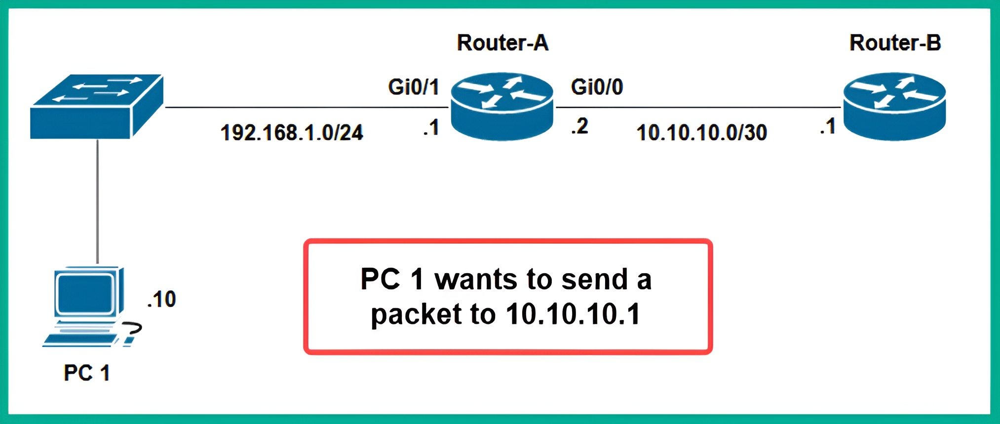
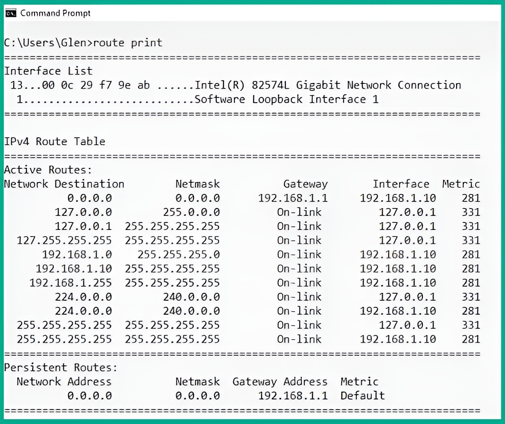
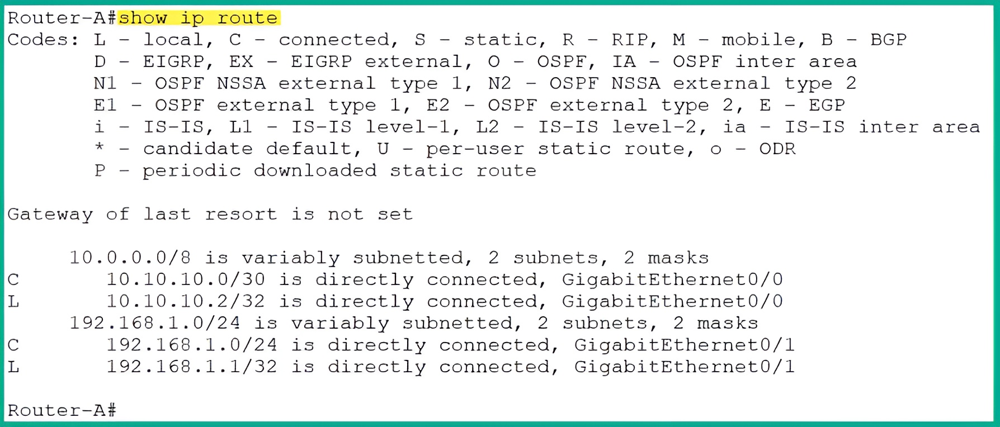
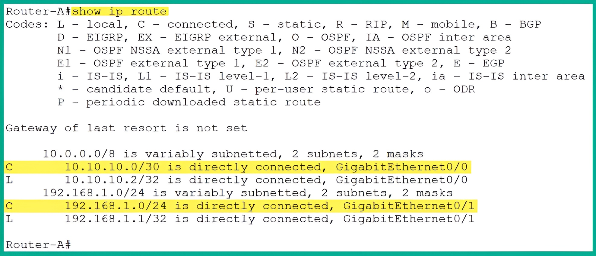
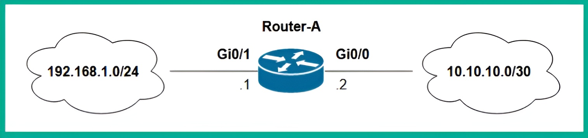
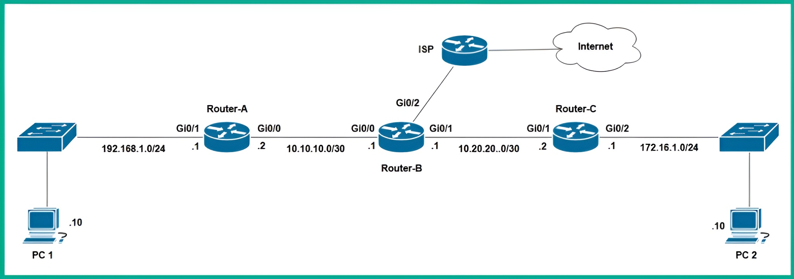
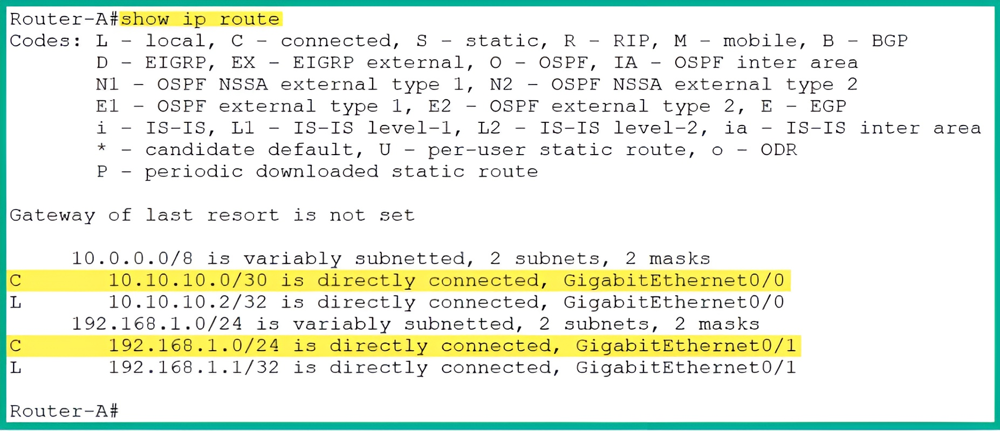
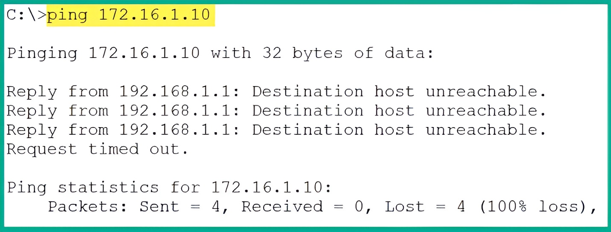

# 🛰️ **Exploring Routing Concepts**

Routers are **Layer 3 devices**. They operate at the **Network layer** of the Open Systems Interconnection (OSI) and the **Internet layer** of the Transmission Control Protocol/Internet Protocol (TCP/IP) networking models.

Routers are one of the most essential networking devices found within private and public networks. They allow network professionals to interconnect two or more different networks together and forward packets to their destinations.

For instance, routers can:
* **Interconnect different IP subnets**, allowing devices on one IP network to communicate with hosts on another IP network.
* **Interconnect networks with different media types**, such as connecting an Ethernet network with a fiber optic network.


## ⚙️ Core and Advanced Functions

Routers are built to perform many Layer 3 operations, such as:
* **Network Address Translation (NAT)**
* **Filtering traffic** using Access Control Lists (ACLs)
* **Virtual Private Network (VPN)** capabilities, allowing network professionals to set up site-to-site and remote access VPNs.

However, all routers have one **core function**: to route or forward packets to their destinations efficiently, using the **most suitable path**.

For instance, have you ever wondered how your computer or smartphone can communicate with servers on the internet? Or how routers can forward your packets to the intended destination network or host?

Routers are configured with **routing protocols**. These protocols use an **algorithm** that helps them determine the **best path** or route to a destination. Between your device and a server on the internet, many paths are available that can be used to forward the packets. However, not all paths are suitable due to various factors within each path.


## 🗺️ Finding the Best Path

Imagine if the routers within an Internet Service Provider (ISP) network forward packets along paths that were heavily congested with a lot of network traffic (load). All the internet subscribers of that particular ISP will experience **high latency**, which causes slow response times when they are communicating with hosts on the internet.

Using **dynamic routing protocols** helps routers calculate the best path from a source to a destination. They do this by assigning **metric values** to various factors about a path, such as the following:

* Cumulative bandwidth
* Latency
* Reliability
* Outgoing load (TX load)
* Receiving load (RX load)
* Hop count
* Path


## 📖 The Routing Table

Each algorithm within a dynamic routing protocol uses one or more of these factors to determine and install the best path to a destination within the **routing table** of a router.

Each router has a **local routing table** that contains a list of destination routes or paths. This table simply tells the router how to forward a packet to its destination.

# ➡️ **Packet Forwarding Example**

The following diagram shows a computer that wants to send a message to a remote device.

<div align="center">
  

  Figure 9.1 – Network diagram
</div>

As shown in the preceding diagram, **PC 1** wants to send a message to **Router-B**, which has been configured with an IP address of `10.10.10.1`.

Before PC 1 places the message on the network media, it checks its **local routing table**. This is to determine whether the destination exists within the same network as PC 1 (the `192.168.1.0/24` network) or on a remote network.


## 💻 Step 1: PC 1 Checks its Routing Table

The following screenshot shows the routing table within PC 1.

<div align="center">
  

  Figure 9.2 – PC 1 routing table
</div>

Since the destination `10.10.10.1` **does not exist** within its local `192.168.1.0/24` network, PC 1 sends the message to its **default gateway**. In this case, the default gateway is **Router-A** on the network.


## 🛰️ Step 2: Router-A Checks its Routing Table

When Router-A receives the message from PC 1, it inspects the **destination IP address** (`10.10.10.1`) within the Layer 3 header of the packet. It then checks its local routing table for a suitable route or path to forward the packet to its destination.

The following screenshot shows the routing table of Router-A.

<div align="center">
  

Figure 9.3 – Routing table of a Cisco router
</div>

As shown in the preceding screenshot, the routing table contains a list of destination routes (paths) that are known to the router.

### Understanding the Routing Table

  * **Codes**: The code listed in the upper portion of the snippet indicates *how* a route was learned by the router.
  * **Routes**: In the lower portion of the snippet, there are various parent routes and child routes.
  * **Parent/Child Routes**: The child routes can be easily identified as they are indented compared to the parent routes (which are not indented).
  * **Route Codes (`C` and `L`)**: Each child route has a code that indicates how the route was learned.
      * **C**: This code indicates the route is **directly connected** to the router.
      * **L**: This code indicates it’s a **local route** that points to a specific IP address on the router itself.
  * **Route Information**: Each route contains a destination network followed by either the **exit interface** of the router or the **next hop address**.

> #### 📝 Important Note: Routing Logic
>
>   * A router will check its routing table using a **top-down approach** until it finds a suitable route.
>   * Once a suitable route is found, the router **stops searching** and forwards the packet to the destination based on the details specified within that route.
>   * A network route will specify the **exit interface** and/or the **next hop address**.
>       * **Exit Interface**: This simply indicates which port on the router should be used to forward the packet to its destination.
>       * **Next Hop Address**: This is the IP address of the next router to receive the packet along the way to the destination.


## 🏁 Step 3: Forwarding the Packet

Therefore, Router-A uses the following network route to forward the packet to Router-B:

```
C 10.10.10.0/30 is directly connected, GigabitEthernet0/0
```

Simply put, Router-A will forward the packet out from its **GigabitEthernet 0/0** interface, to which Router-B is connected.


## 🛑 Exception: No Route Found

However, if a default gateway or router does not have a valid route to a destination network, it will return a **Destination Unreachable** message to the sender.

# 🗺️ **Understanding Routing Protocols**

Routers can populate their routing tables with **directly connected routes**. These are networks that are physically attached to the local interfaces of the router.

However, a router is unable to determine the path or route to a destination network that is **not** directly connected. This includes remote networks on the internet or networks attached to other routers within an organization.

For instance, the following screenshot shows the routing table of Router-A, which has two directly connected routes/networks on the local router.

<div align="center">
  

  Figure 9.4 – Routing table
</div>


As shown in the preceding diagram, Router-A contains:

  * The **10.10.10.0/30** network, which is directly connected to its `GigabitEthernet 0/0` interface.
  * The **192.168.1.0/24** network, which is directly connected to the `GigabitEthernet 0/1` interface.

The following diagram provides a visual representation of the routing table within Router-A.

<div align="center">
  

Figure 9.5 – Network topology
</div>


## 🚧 The Problem of Remote Networks

However, what if the network topology were to expand to include additional networks that are interconnected with multiple routers? This can be seen in the following diagram.

<div align="center">
  

Figure 9.6 – Network diagram
</div>

As shown in the preceding diagram, **Router-A** is **not** directly connected to the `10.20.20.0/24` and `172.16.1.0/24` networks.

Therefore, if **PC 1** wants to send a message to **PC 2** over the network, Router-A will **not be able to forward the message**. This is because those remote networks are not yet known to Router-A.

As a result, if PC 1 forwards a packet to Router-A with the destination IP address of `172.16.1.10`, Router-A will return a **Destination Host Unreachable** message to PC 1. This happens because a route to the destination host or network does not exist within the routing table of Router-A.

The following screenshot shows the routing table of Router-A on the new topology.

<div align="center">
  

Figure 9.7 – Router-A routing table
</div>

As shown in the preceding screenshot, Router-A **does not have a network route** for the `172.16.1.0/24` network. Because of this, it will not be able to forward any packets to **PC 2**, which has an IP address of `172.16.1.10`.

The following screenshot shows the response from Router-A (PC 1's gateway), which indicates it does not have a valid route to the destination host.

<div align="center">
  

Figure 9.8 – Destination unreachable message from the router
</div>


## 💡 The Solution: Dynamic Routing Protocols

A network professional can resolve this issue by configuring Router-A, Router-B, and Router-C with a **dynamic routing protocol**.

This type of protocol **automatically shares network routes between routers**. This allows them to update their routing tables with any network topology changes and ensures each router knows how to forward packets to its intended destination.

Many dynamic routing protocols are commonly implemented within organizations by network professionals. Each protocol has unique characteristics that define how they choose the most suitable path to a destination.