# 🛰️ **Exploring Routing and Switching Concepts**

<details>
<summary>📑 Table of Contents</summary>

- [🛰️ **Exploring Routing and Switching Concepts**](#️-exploring-routing-and-switching-concepts)
  - [⚙️ Core and Advanced Functions](#️-core-and-advanced-functions)
  - [🗺️ Finding the Best Path](#️-finding-the-best-path)
  - [📖 The Routing Table](#-the-routing-table)
- [➡️ **Packet Forwarding Example**](#️-packet-forwarding-example)
  - [💻 Step 1: PC 1 Checks its Routing Table](#-step-1-pc-1-checks-its-routing-table)
  - [🛰️ Step 2: Router-A Checks its Routing Table](#️-step-2-router-a-checks-its-routing-table)
    - [Understanding the Routing Table](#understanding-the-routing-table)
  - [🏁 Step 3: Forwarding the Packet](#-step-3-forwarding-the-packet)
  - [🛑 Exception: No Route Found](#-exception-no-route-found)
- [🗺️ **Understanding Routing Protocols**](#️-understanding-routing-protocols)
  - [🚧 The Problem of Remote Networks](#-the-problem-of-remote-networks)
  - [💡 The Solution: Dynamic Routing Protocols](#-the-solution-dynamic-routing-protocols)
- [⚙️ **Dynamic Routing**](#️-dynamic-routing)
    - [🌟 Benefits of Dynamic Routing](#-benefits-of-dynamic-routing)
    - [Protocol Categories](#protocol-categories)
    - [🚦 Administrative Distance](#-administrative-distance)
    - [➡️ RIP (Routing Information Protocol)](#️-rip-routing-information-protocol)
      - [Analyzing the First RIP Route](#analyzing-the-first-rip-route)
      - [Disadvantages of RIP](#disadvantages-of-rip)
    - [➡️ OSPF (Open Shortest Path First)](#️-ospf-open-shortest-path-first)
    - [➡️ EIGRP (Enhanced Interior Gateway Routing Protocol)](#️-eigrp-enhanced-interior-gateway-routing-protocol)
    - [➡️ BGP (Border Gateway Protocol)](#️-bgp-border-gateway-protocol)
- [➡️ **Static Routing**](#️-static-routing)
    - [⚙️ Use Cases and Drawbacks](#️-use-cases-and-drawbacks)
    - [🗂️ Types of Static Routes](#️-types-of-static-routes)
    - [🖥️ Static Routing Example](#️-static-routing-example)
- [📊 **Managing Bandwidth**](#-managing-bandwidth)
  - [🚦 TCP vs. UDP](#-tcp-vs-udp)
  - [📥 Device Buffers](#-device-buffers)
  - [📞 The Problem with Time-Sensitive Traffic](#-the-problem-with-time-sensitive-traffic)
  - [💡 Solutions for Traffic Management](#-solutions-for-traffic-management)
    - [1. Traffic Shaping](#1-traffic-shaping)
    - [2. Quality of Service (QoS)](#2-quality-of-service-qos)
      - [📈 Key QoS Metrics](#-key-qos-metrics)
      - [⚙️ The QoS Prioritization Process](#️-the-qos-prioritization-process)
      - [🔬 The Classification Process in Detail](#-the-classification-process-in-detail)
- [🔄 **Delving into Switching Concepts**](#-delving-into-switching-concepts)
  - [⚡ Power over Ethernet (PoE)](#-power-over-ethernet-poe)
    - [Standards and Specifications](#standards-and-specifications)
- [🌳 **Spanning-Tree Protocol** (STP)](#-spanning-tree-protocol-stp)
    - [🏛️ The 3-Tier Architecture](#️-the-3-tier-architecture)
    - [⚠️ The Problem: Layer 2 Loops](#️-the-problem-layer-2-loops)
    - [⚠️ The Second Problem: Duplicate Messages](#️-the-second-problem-duplicate-messages)
  - [💡 The Solution: Spanning-Tree Protocol (STP)](#-the-solution-spanning-tree-protocol-stp)
    - [📨 Bridge Protocol Data Units (BPDUs)](#-bridge-protocol-data-units-bpdus)
    - [👑 The Root Bridge Election](#-the-root-bridge-election)
    - [🗺️ STP Port Role Example](#️-stp-port-role-example)
      - [Strategy for Identifying Port States](#strategy-for-identifying-port-states)
      - [Step-by-Step Port Role Identification](#step-by-step-port-role-identification)
- [🔗 **Port Aggregation** (EtherChannel)](#-port-aggregation-etherchannel)
    - [🚧 The Problem: Redundancy vs. Aggregation](#-the-problem-redundancy-vs-aggregation)
    - [💡 The Solution: EtherChannel](#-the-solution-etherchannel)
    - [🤝 LACP (Link Aggregation Control Protocol)](#-lacp-link-aggregation-control-protocol)
    - [📋 Requirements for EtherChannel](#-requirements-for-etherchannel)
- [🤝 **Neighbor Discovery Protocol**](#-neighbor-discovery-protocol)
  - [🔵 Cisco Discovery Protocol (CDP)](#-cisco-discovery-protocol-cdp)
  - [🌍 Link-Layer Discovery Protocol (LLDP)](#-link-layer-discovery-protocol-lldp)
- [🖥️ **Exploring VLANs**](#️-exploring-vlans)
  - [Converged Networks and Logical Segmentation](#converged-networks-and-logical-segmentation)
    - [🌟 Benefits of Implementing VLANs](#-benefits-of-implementing-vlans)
    - [broadcast Broadcast Domains](#broadcast-broadcast-domains)
    - [🏷️ VLAN Tagging (IEEE 802.1Q)](#️-vlan-tagging-ieee-8021q)
    - [🌐 VLANs and IP Subnetting](#-vlans-and-ip-subnetting)
    - [🔗 Access Ports vs. Trunk Links](#-access-ports-vs-trunk-links)
    - [📂 Types of VLANs](#-types-of-vlans)
    - [Example of Access Port vs. Trunk](#example-of-access-port-vs-trunk)
    - [🔑 Key Points: Port Tagging and IEEE 802.1Q](#-key-points-port-tagging-and-ieee-8021q)
- [⚙️ **Understanding Switch Port Configurations**](#️-understanding-switch-port-configurations)
  - [🔄 Duplex and Speed](#-duplex-and-speed)
    - [Half Duplex](#half-duplex)
    - [Full Duplex](#full-duplex)
    - [Auto Duplex](#auto-duplex)
    - [🏎️ Speed](#️-speed)
- [🔍 **Port Mirroring**](#-port-mirroring)
    - [🔑 Key Points of Port Mirroring](#-key-points-of-port-mirroring)
    - [💻 Example SPAN Configuration](#-example-span-configuration)
      - [📖 Code Explanation](#-code-explanation)
- [🔒 Port Security](#-port-security)
- [🔄 Auto MDI-X](#-auto-mdi-x)

</details>

---

Routers are **Layer 3 devices**. They operate at the **Network layer** of the Open Systems Interconnection (OSI) and the **Internet layer** of the Transmission Control Protocol/Internet Protocol (TCP/IP) networking models.

Routers are one of the most essential networking devices found within private and public networks. They allow network professionals to interconnect two or more different networks together and forward packets to their destinations.

For instance, routers can:
* **Interconnect different IP subnets**, allowing devices on one IP network to communicate with hosts on another IP network.
* **Interconnect networks with different media types**, such as connecting an Ethernet network with a fiber optic network.


## ⚙️ Core and Advanced Functions

Routers are built to perform many Layer 3 operations, such as:
* **Network Address Translation (NAT)**
* **Filtering traffic** using Access Control Lists (ACLs)
* **Virtual Private Network (VPN)** capabilities, allowing network professionals to set up site-to-site and remote access VPNs.

However, all routers have one **core function**: to route or forward packets to their destinations efficiently, using the **most suitable path**.

For instance, have you ever wondered how your computer or smartphone can communicate with servers on the internet? Or how routers can forward your packets to the intended destination network or host?

Routers are configured with **routing protocols**. These protocols use an **algorithm** that helps them determine the **best path** or route to a destination. Between your device and a server on the internet, many paths are available that can be used to forward the packets. However, not all paths are suitable due to various factors within each path.


## 🗺️ Finding the Best Path

Imagine if the routers within an Internet Service Provider (ISP) network forward packets along paths that were heavily congested with a lot of network traffic (load). All the internet subscribers of that particular ISP will experience **high latency**, which causes slow response times when they are communicating with hosts on the internet.

Using **dynamic routing protocols** helps routers calculate the best path from a source to a destination. They do this by assigning **metric values** to various factors about a path, such as the following:

* Cumulative bandwidth
* Latency
* Reliability
* Outgoing load (TX load)
* Receiving load (RX load)
* Hop count
* Path


## 📖 The Routing Table

Each algorithm within a dynamic routing protocol uses one or more of these factors to determine and install the best path to a destination within the **routing table** of a router.

Each router has a **local routing table** that contains a list of destination routes or paths. This table simply tells the router how to forward a packet to its destination.

# ➡️ **Packet Forwarding Example**

The following diagram shows a computer that wants to send a message to a remote device.

<div align="center">
  

  Figure 9.1 – Network diagram
</div>

As shown in the preceding diagram, **PC 1** wants to send a message to **Router-B**, which has been configured with an IP address of `10.10.10.1`.

Before PC 1 places the message on the network media, it checks its **local routing table**. This is to determine whether the destination exists within the same network as PC 1 (the `192.168.1.0/24` network) or on a remote network.


## 💻 Step 1: PC 1 Checks its Routing Table

The following screenshot shows the routing table within PC 1.

<div align="center">
  

  Figure 9.2 – PC 1 routing table
</div>

Since the destination `10.10.10.1` **does not exist** within its local `192.168.1.0/24` network, PC 1 sends the message to its **default gateway**. In this case, the default gateway is **Router-A** on the network.


## 🛰️ Step 2: Router-A Checks its Routing Table

When Router-A receives the message from PC 1, it inspects the **destination IP address** (`10.10.10.1`) within the Layer 3 header of the packet. It then checks its local routing table for a suitable route or path to forward the packet to its destination.

The following screenshot shows the routing table of Router-A.

<div align="center">
  

Figure 9.3 – Routing table of a Cisco router
</div>

As shown in the preceding screenshot, the routing table contains a list of destination routes (paths) that are known to the router.

### Understanding the Routing Table

  * **Codes**: The code listed in the upper portion of the snippet indicates *how* a route was learned by the router.
  * **Routes**: In the lower portion of the snippet, there are various parent routes and child routes.
  * **Parent/Child Routes**: The child routes can be easily identified as they are indented compared to the parent routes (which are not indented).
  * **Route Codes (`C` and `L`)**: Each child route has a code that indicates how the route was learned.
      * **C**: This code indicates the route is **directly connected** to the router.
      * **L**: This code indicates it’s a **local route** that points to a specific IP address on the router itself.
  * **Route Information**: Each route contains a destination network followed by either the **exit interface** of the router or the **next hop address**.

> #### 📝 Important Note: Routing Logic
>
>   * A router will check its routing table using a **top-down approach** until it finds a suitable route.
>   * Once a suitable route is found, the router **stops searching** and forwards the packet to the destination based on the details specified within that route.
>   * A network route will specify the **exit interface** and/or the **next hop address**.
>       * **Exit Interface**: This simply indicates which port on the router should be used to forward the packet to its destination.
>       * **Next Hop Address**: This is the IP address of the next router to receive the packet along the way to the destination.


## 🏁 Step 3: Forwarding the Packet

Therefore, Router-A uses the following network route to forward the packet to Router-B:

```
C 10.10.10.0/30 is directly connected, GigabitEthernet0/0
```

Simply put, Router-A will forward the packet out from its **GigabitEthernet 0/0** interface, to which Router-B is connected.


## 🛑 Exception: No Route Found

However, if a default gateway or router does not have a valid route to a destination network, it will return a **Destination Unreachable** message to the sender.

# 🗺️ **Understanding Routing Protocols**

Routers can populate their routing tables with **directly connected routes**. These are networks that are physically attached to the local interfaces of the router.

However, a router is unable to determine the path or route to a destination network that is **not** directly connected. This includes remote networks on the internet or networks attached to other routers within an organization.

For instance, the following screenshot shows the routing table of Router-A, which has two directly connected routes/networks on the local router.

<div align="center">
  

  Figure 9.4 – Routing table
</div>


As shown in the preceding diagram, Router-A contains:

  * The **10.10.10.0/30** network, which is directly connected to its `GigabitEthernet 0/0` interface.
  * The **192.168.1.0/24** network, which is directly connected to the `GigabitEthernet 0/1` interface.

The following diagram provides a visual representation of the routing table within Router-A.

<div align="center">
  

Figure 9.5 – Network topology
</div>


## 🚧 The Problem of Remote Networks

However, what if the network topology were to expand to include additional networks that are interconnected with multiple routers? This can be seen in the following diagram.

<div align="center">
  

Figure 9.6 – Network diagram
</div>

As shown in the preceding diagram, **Router-A** is **not** directly connected to the `10.20.20.0/24` and `172.16.1.0/24` networks.

Therefore, if **PC 1** wants to send a message to **PC 2** over the network, Router-A will **not be able to forward the message**. This is because those remote networks are not yet known to Router-A.

As a result, if PC 1 forwards a packet to Router-A with the destination IP address of `172.16.1.10`, Router-A will return a **Destination Host Unreachable** message to PC 1. This happens because a route to the destination host or network does not exist within the routing table of Router-A.

The following screenshot shows the routing table of Router-A on the new topology.

<div align="center">
  

Figure 9.7 – Router-A routing table
</div>

As shown in the preceding screenshot, Router-A **does not have a network route** for the `172.16.1.0/24` network. Because of this, it will not be able to forward any packets to **PC 2**, which has an IP address of `172.16.1.10`.

The following screenshot shows the response from Router-A (PC 1's gateway), which indicates it does not have a valid route to the destination host.

<div align="center">
  

Figure 9.8 – Destination unreachable message from the router
</div>


## 💡 The Solution: Dynamic Routing Protocols

A network professional can resolve this issue by configuring Router-A, Router-B, and Router-C with a **dynamic routing protocol**.

This type of protocol **automatically shares network routes between routers**. This allows them to update their routing tables with any network topology changes and ensures each router knows how to forward packets to its intended destination.

Many dynamic routing protocols are commonly implemented within organizations by network professionals. Each protocol has unique characteristics that define how they choose the most suitable path to a destination.

# ⚙️ **Dynamic Routing**

Dynamic routing protocols are designed to help routers automatically learn about destination networks by sharing routing information with other routers. The routing information that is shared between routers within an organization is used to add the **best suitable route** to a destination network within the routing table of each router.

Additionally, if a network or path is no longer available, the dynamic routing protocol automatically detects changes within the network topology. It shares updated routing information with all routers within the network to ensure their routing table is always up to date. Hence, if a router receives a packet with a destination IP address and the router no longer has an available route to the destination, the router informs the sender that the destination host or the network is unreachable.

> #### 📝 Important Note
>
> Each dynamic routing protocol is designed with an algorithm that calculates the **best suitable path** to a destination. It does this by determining the **metric** (or cost) of each available path and choosing the path with the **least metric** to install within the routing table.


### 🌟 Benefits of Dynamic Routing

Dynamic routing protocols provide the following benefits:

  * Automatically discover remote networks by sharing routing information between routers on a network.
  * Maintain an up-to-date routing table on all routers within the network.
  * Choose the best suitable destination path to forward packets to their destinations.
  * Can find a new best path in the event the current path is no longer available.


### Protocol Categories

The following diagram shows a breakdown of each dynamic routing protocol within the industry.

<div align="center">
  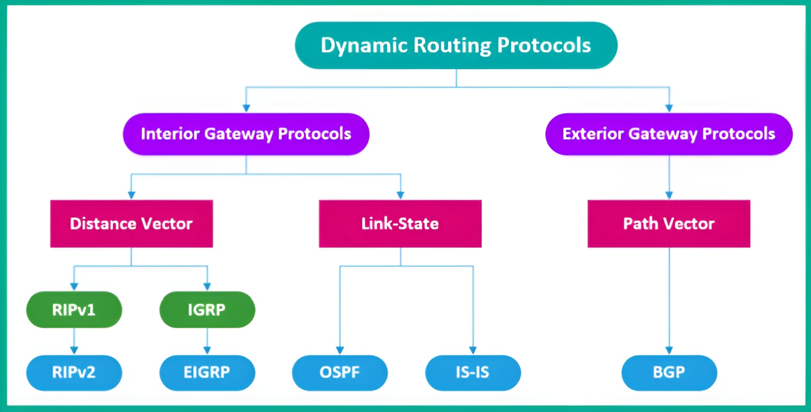

Figure 9.9 – Dynamic routing protocols
</div>

As shown in the preceding diagram, routing protocols belong to either **Interior Gateway Protocols (IGPs)** or **Exterior Gateway Protocols (EGPs)**.

  * **IGPs (Interior Gateway Protocols)**: These are dynamic routing protocols implemented *within* an organization's private network. They do not share routing information on the public internet. When all routers know about all networks within an organization, it is commonly referred to as a **converged network**.

> #### 📝 Important Note
>
> **Interior Gateway Routing Protocol (IGRP)** is a legacy Cisco proprietary routing protocol. It is no longer implemented on networks and has been replaced with its successor, **Enhanced Interior Gateway Routing Protocol (EIGRP)**.

Additionally, IGPs are further divided into two sub-categories:

1.  **Distance-Vector Protocols**

      * These protocols forward packets based on distance (a metric) and direction (the next hop).
      * Each distance-vector routing protocol uses an algorithm to calculate the best path and sends that information to its neighbor routers.
      * These protocols use factors relative to distance and direction, such as hop counts, bandwidth, reliability, outgoing and receiving load, and delays.
      * The algorithms within distance-vector routing protocols consist of the following:
          * A mechanism for exchanging routing information between neighbor routers.
          * **Distance-Vector routers send out their *entire routing table*** to immediate neighbor routers (this differs from Link-State, which only sends changes).
          * A mechanism for calculating the best path and adding the route(s) to the routing table.
          * A mechanism to detect and adapt to changes in the network topology and update the routing table.
      * **Examples:**
          * Routing Information Protocol (RIP)
          * Enhanced Interior Gateway Routing Protocol (EIGRP)

2.  **Link-State Protocols**

      * These protocols use the **cumulative bandwidth** to a destination network as the metric (referred to as "cost").
      * Each router configured with a link-state protocol builds its own **topological map** of the entire network. This map helps the router determine the shortest path to every destination.
      * Link-state routing protocols will only send an update to a neighbor router if there is a change within the network topology.
      * **Examples:**
          * Open Shortest Path First (OSPF)
          * Intermediate System - Intermediate System (IS-IS)

<!-- end list -->

  * **EGPs (Exterior Gateway Protocols)**: These are dynamic routing protocols implemented *between* different Autonomous Systems (ASs), such as ISPs, to share public network routes.
      * IGP routes *internal* to one AS, whereas EGP routes *between* ASs.
      * At the time of writing, the **Border Gateway Protocol (BGP)** is the only EGP that exists within the networking industry. It is used between ISPs to share their public networks with other ISPs on the internet.
      * BGP is a **path-vector** routing protocol that allows ISP routers to learn about other public networks and maintain an up-to-date routing table with BGP routes.


### 🚦 Administrative Distance

A router can be configured with multiple dynamic routing protocols to operate simultaneously. Each routing protocol operating on the router will use its algorithm to determine the best path to a destination network.

However, this raises a question: **which route should be added to the routing table?** A route to a single destination network can only appear once within the routing table. If a router is configured with both EIGRP and OSPF, and each protocol determines a "best path" to the same destination, the router must decide which route to use, since duplicates are not supported.

Usually, network professionals only configure one routing protocol within their organization. However, in situations where more than one is used, Cisco IOS routers use **Administrative Distance (AD)** to determine the **trustworthiness** of a route.

Each dynamic routing protocol is assigned a unique AD value. This value helps the router determine which route source is most trustworthy.

The following table shows the AD values for each route source for Cisco IOS routers.

<div align="center">
  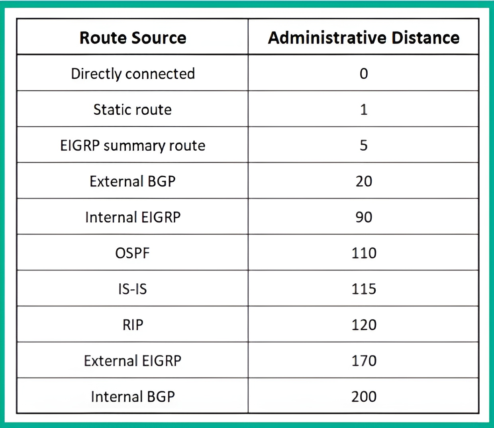

Figure 9.10 – Administrative distance chart
</div>

As shown in the table, the router chooses the route source to a destination network that has the **lowest AD value**.

  * **Example**: If a router is configured with both EIGRP and OSPF, and each protocol finds a path to the same destination, the **EIGRP route will be added** to the routing table. This is because EIGRP has a default AD value of **90**, which is lower (more trustworthy) than OSPF's AD value of **110**.
  * **Exception**: If a network professional configures a **static route** to that same destination, the static route will be prioritized and added to the routing table, as its AD value is **1**.

Over the next few sub-sections, you will gain a solid foundation on various distance-vector, link-state, and path-vector routing protocols.


### ➡️ RIP (Routing Information Protocol)

RIP is a **legacy, distance-vector** routing protocol. It is no longer implemented on large enterprise networks due to its many limitations.

  * **Algorithm**: RIP uses the **Bellman-Ford algorithm**.
  * **Metric**: It uses **hop count** as the metric to calculate the best path. The hop count is simply the number of routers (hops) that exist on the path to the destination.
  * **Limit**: RIP uses a maximum hop count of **15**. A packet's hop count decrements by 1 at each router. If the hop count reaches 0, the last router discards the packet. This is similar to the Time To Live (TTL) value in an IP packet.
  * **Transport**: RIP uses **UDP port 520** to exchange messages between RIP-enabled routers.

The following diagram shows a network topology with routers configured using the RIP dynamic routing protocol.

<div align="center">
  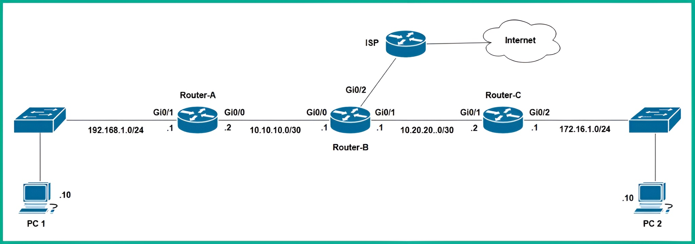

Figure 9.11 – Routers using the RIP dynamic routing protocol
</div>

Let’s assume Router-A, Router-B, and Router-C are all managed by an organization and have been configured with RIP. The following screenshot shows the RIP routes that have been installed within the routing table of Router-A.

<div align="center">
  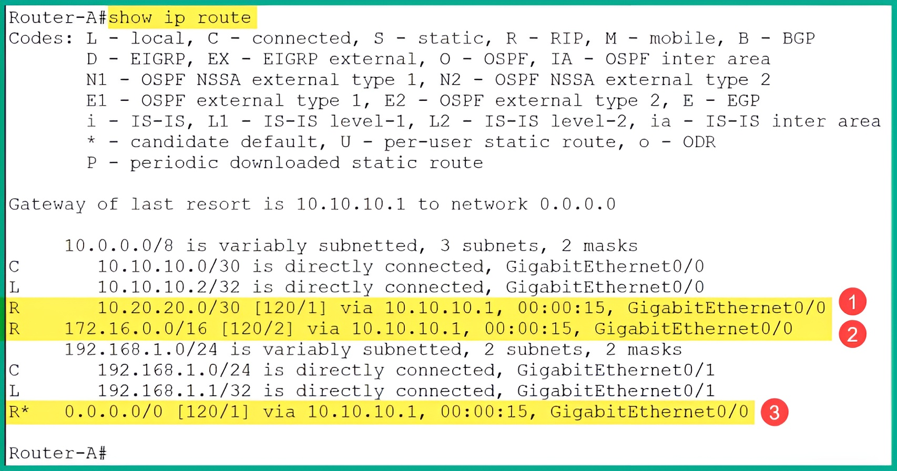

Figure 9.12 – Routing table
</div>

As shown in the preceding screenshot, there are three network routes (labeled 1, 2, and 3) that were discovered via RIP and added to Router-A's routing table.

#### Analyzing the First RIP Route

The first remote network route (`10.20.20.0/30`) is described as follows:

  * **`R`**: The `R` code indicates the network route was learned and added to the routing table via **RIP**.
  * **`10.20.20.0/30`**: This portion indicates the **destination network** by its network prefix.
  * **`[120/1]`**: This is the administrative distance and metric.
      * `120`: This value indicates the **Administrative Distance (AD)** for RIP. This shows the trustworthiness of the protocol.
      * `1`: This value represents the **metric** of the route. Since RIP uses hop count, we can determine that the destination network is **one hop away**.
  * **`10.10.10.1`**: This value is the **next-hop address**—that is, the IP of the next Layer 3 device (Router-B) that will receive the packet from Router-A.
  * **`00:00:15` (Timer)**: This time value increases as long as the route is installed in the routing table. It helps network professionals determine how long the router has known about this route.
  * **`GigabitEthernet0/0` (Exit Interface)**: This indicates the interface that Router-A will use to forward the packet toward its destination.

#### Disadvantages of RIP

While RIP seems good for automatically learning routes, it has many drawbacks:

  * RIP **broadcasts the *entire* routing table** of each router every **30 seconds**, regardless of whether a network change has occurred.
  * RIP does not support large networks with greater than **15 hops**.
  * **RIPv1** does not support networks that use custom subnet masks (VLSM).
  * **RIPv2** supports Variable Length Subnet Mask (VLSM) but doesn't allow manual specification of the custom subnet mask during configuration.

> #### 📝 Important Note
>
>   * **RIPng** is the next generation of RIP and supports **IPv6** routing.
>   * RIPv1 and RIPv2 support **IPv4** routing.
>   * RIPng uses **UDP port 521** to exchange messages.


### ➡️ OSPF (Open Shortest Path First)

Open Shortest Path First (OSPF) is a **link-state** dynamic routing protocol. It is commonly used within many organizations' networks, especially those with mixed-vendor devices (as it is an open standard).

  * **Algorithm**: OSPF uses the **Shortest Path First (SPF)** algorithm.
  * **Metric**: The SPF algorithm determines the cumulative bandwidth to a destination and chooses the path with the lowest **cost**. A low cost indicates a fast path, while a high cost indicates a slower link.
  * **Transport**: OSPF does not use TCP or UDP. It uses its own datagrams and is tagged in the IP protocol as **protocol number 89**.
  * **Adjacency**: Each OSPF-enabled router exchanges **Hello packets** with its neighbors to establish an *adjacency* (a mutual handshake).
  * **Updates**: Once the handshake is established, each router exchanges **Link-State Advertisements (LSAs)** of their directly connected networks. These LSAs contain information about the state and cost of each link.
  * **Database**: Once all OSPF-enabled routers collect the LSAs, they build the **Link-State Database (LSDB)**, also known as the topology table. This means every OSPF router knows the entire network topology.
  * **Routing**: After the LSDB is complete, the SPF algorithm is used to determine the best (shortest) path to all known networks and adds those paths to the routing table.

> #### 📝 Important Note
>
> OSPF-enabled routers send **Hello packets** to their neighbors every **10 seconds** by default to indicate their presence. A neighbor router is considered "down" or unavailable if a Hello packet is not received within **40 seconds**. If a neighbor router is down, all networks learned from that neighbor are removed from the routing table.

The following network topology shows routers configured with OSPF.

<div align="center">
  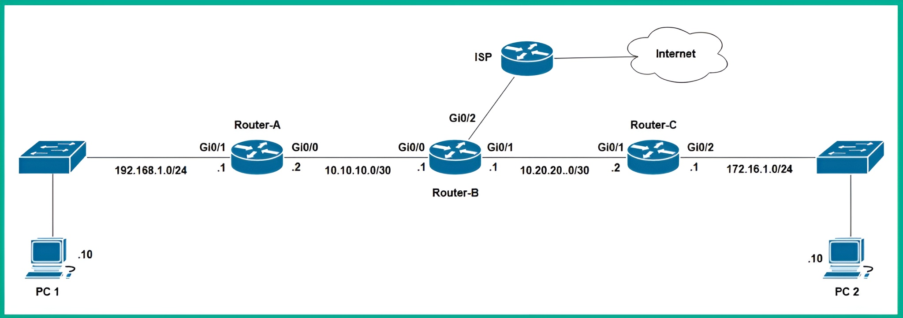

Figure 9.13 – OSPF network topology
</div>

As shown, Router-A, Router-B, and Router-C are configured to use OSPF to share routing information about their directly connected networks.

The following screenshot shows the routing table of Router-A.

<div align="center">
  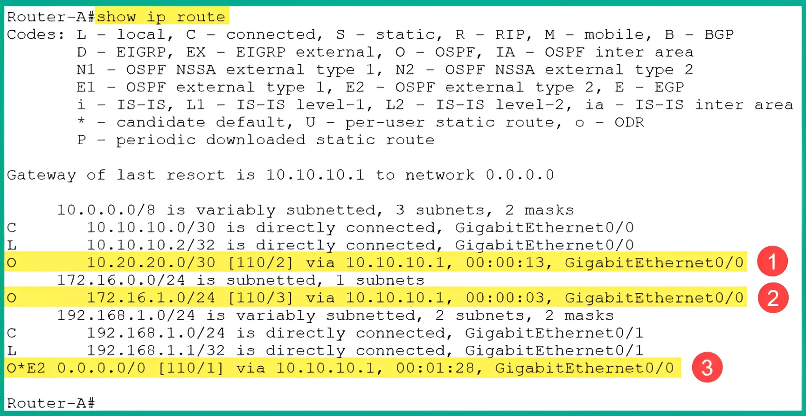

Figure 9.14 – Router-A’s routing table
</div>

As shown in the screenshot:

  * The routing table contains directly connected routes (code `C`).
  * It also contains remote networks learned via OSPF (code `O`).
  * Notice that all standard OSPF routes (labeled 1 and 2) have the same AD value of **110**.
  * The third OSPF route (labeled 3), `O*E2`, indicates it is an **external route** (Type 2) that was redistributed into OSPF. Its purpose is to act as a default route (`0.0.0.0/0`) to the internet.

> #### 📝 Important Note
>
>   * **OSPFv2** is used on **IPv4** networks.
>   * **OSPFv3** is used on **IPv6** networks.


### ➡️ EIGRP (Enhanced Interior Gateway Routing Protocol)

EIGRP is a **hybrid, dynamic routing protocol**. It was a Cisco proprietary protocol until 2013, but organizations were long using OSPF as it is interoperable with mixed-vendor equipment.

  * **Algorithm**: EIGRP uses the **Diffusing Update Algorithm (DUAL)**.
  * **Metric**: DUAL uses the following factors as metrics to calculate the best path:
      * Bandwidth
      * Delay
      * Reliability
      * Outgoing load (TX load)
      * Receiving load (RX load)
      * By default, DUAL *only* uses **bandwidth and delay** to calculate the metric. The other metrics are disabled but can be enabled by a network professional.
  * **Transport**: EIGRP uses **protocol number 88**, encapsulated directly into IP datagrams, rather than TCP or UDP.
  * **Backup Path**: Unlike other protocols, EIGRP's DUAL calculates a **best path** (the Successor) and a **backup path** (the Feasible Successor) to the same destination. EIGRP ensures the backup path is loop-free and is ready to be placed in the routing table immediately if the primary route is no longer available.

The following network topology shows routers configured with EIGRP.

<div align="center">
  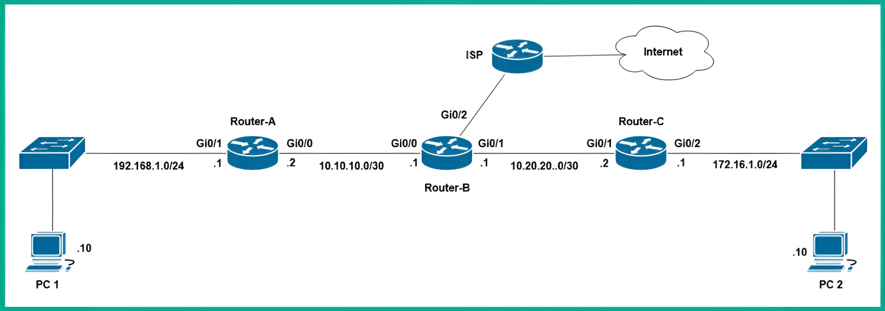

Figure 9.15 – EIGRP-enabled routers
</div>

Let’s assume Router-A, Router-B, and Router-C have all been configured with EIGRP. DUAL will calculate the metric (cost) to reach each network and install the paths within the routing tables.

The following screenshot shows the EIGRP network routes within the routing table of Router-A.

<div align="center">
  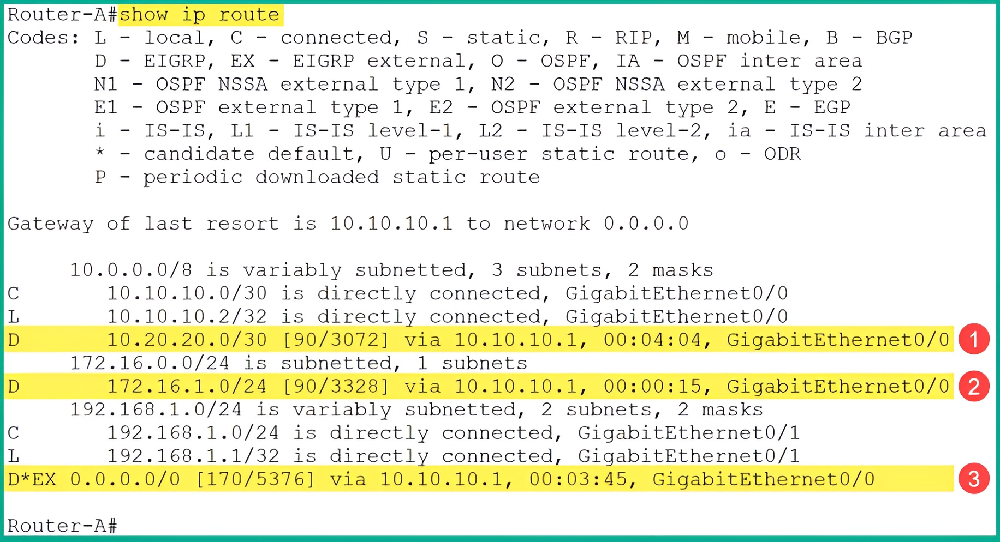

Figure 9.16 – Routing table
</div>

As shown in the screenshot:

  * The remote network routes (labeled 1, 2, and 3) are indicated by the `D` code, which stands for EIGRP.
  * Each of these internal routes has a default AD value of **90**.
  * The default route (`0.0.0.0/0`), labeled 3, has a code of `D*EX`. This indicates it is an **external EIGRP route** that was redistributed.
  * Notice its AD value is **170**. This is the default AD for external EIGRP routes, making them less trustworthy than internal EIGRP routes.


### ➡️ BGP (Border Gateway Protocol)

BGP is a **path-vector** routing protocol. It is the primary protocol used by ISPs to exchange routing information with each other over the internet.

  * **Transport**: BGP operates on **TCP port number 179**.
  * **Convergence**: Unlike IGPs, BGP is a **very slow converging** protocol. It does not send updates as soon as a topology change occurs. It was designed to be stable for massive, global-scale networks.
  * **Autonomous Systems (ASs)**: BGP was designed to operate *between* ASs. An AS is simply a large collection of public networks all managed by a single organization, such as an ISP. Each AS is assigned a unique **Autonomous System Number (ASN)**.

The following diagram shows different ASs (ISPs) interconnected using BGP to share their routing information.

<div align="center">
  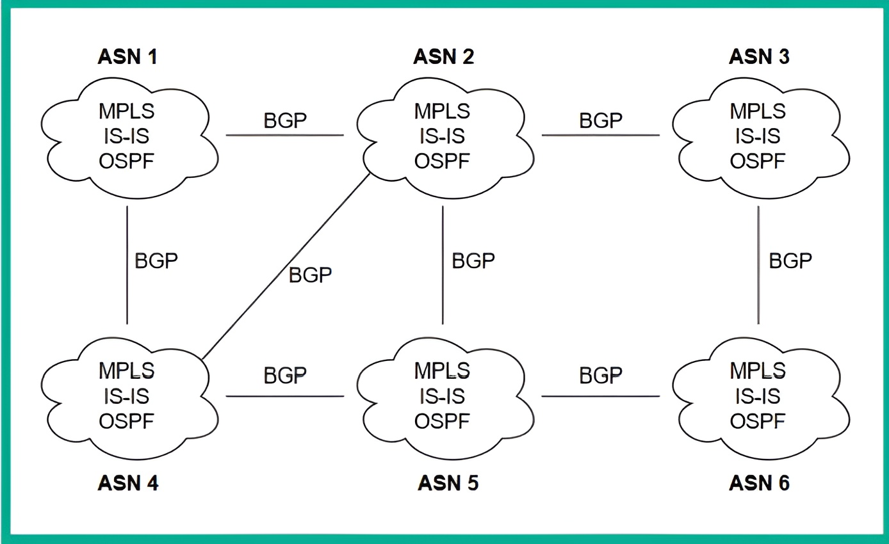

Figure 9.17 – ASs
</div>

As shown, one ISP (AS) establishes an adjacency with another ISP using BGP to share routing information about their public networks. While they use IGPs (like OSPF or IS-IS) *inside* their own network, they use BGP to advertise their public networks to other ISPs around the world.

> #### 📝 Important Note
>
> When discussing BGP, it's important to know there are two versions:
>
>   * **External BGP (eBGP)**: Used between *different* ASs.
>   * **Internal BGP (iBGP)**: Used *within* a single AS.

The following screenshot shows the BGP routing table of a router.

<div align="center">
  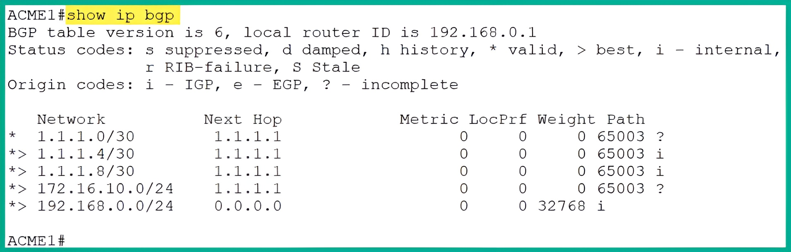

Figure 9.18 – BGP routing table
</div>

As shown in the screenshot:

  * The destination networks are on the left.
  * The paths to those networks are on the right.
  * Since BGP is a **path-vector** protocol, the **`Path` column** shows the list of **AS numbers** a route has traversed. It does *not* show the number of hops. This AS path is the primary metric BGP uses to determine the best route and prevent loops.

> #### 💡 Tip
>
> If you are interested in seeing more BGP routing tables, check out the **BGP Looking Glass** project. This service is maintained by many ISPs around the world and allows limited, read-only access to their BGP routers. Simply type the Google search term `bgp looking glass` in your web browser.

---

# ➡️ **Static Routing**

**Static routing** allows network professionals to **manually configure** destination network routes within the routing table of a router.

Static routes always take precedence over any network route that was learned using a dynamic routing protocol. This is because static routes have a default **Administrative Distance (AD) of 1**, which is lower (and therefore more trustworthy) than the AD of any dynamic routing protocol. If you recall, the AD defines the trustworthiness of a route. Hence, if a network professional creates a static route to a destination network, the router will automatically trust this route over others.

-----

### ⚙️ Use Cases and Drawbacks

Network professionals can configure static routes on all routers within a small network. However, static routing has significant limitations:

  * **No Automatic Updates**: If the network topology changes, the static routes within the routers will **not automatically update** to reflect the changes. This is the primary difference compared to dynamic routing protocols.
  * **Manual Maintenance**: Static routes require a network professional to always update the configurations manually on *all* routers of an organization.
  * **Scalability**: Static routing is workable for small networks that change **infrequently** and where there are fewer IP networks.
  * **Misconfiguration Risk**: If a network professional misconfigures a static route on a router, the router will not forward packets correctly to the intended destination network. As a result, these misconfigurations can affect the performance of a network.
  * **"Black Hole" Routes**: A router will still forward packets to a network that is no longer reachable. This happens simply because the static route configured within the router tells the device how to forward packets and does not update the routing table if the network topology changes.
  * **Complexity**: Removing or modifying a static route requires the skills of a network professional. As an organization’s network grows, network professionals will need to implement a static route for each destination network on each router. Additionally, the complexity of troubleshooting issues increases as the network topology gets larger.

-----

### 🗂️ Types of Static Routes

The following are various types of static routes:

  * **Standard static route**: This type of static route specifies how to reach a specific destination network.
  * **Default static route**: A default static route is used when no other routes within the routing table of a router match the destination IP address of a packet. This type of route is usually configured to forward packets to the internet.
  * **Floating static route**: This type of static route functions as a **backup route** to a primary route on a router. It is configured with an AD that is *higher* than the primary route, so it is only used if the primary route is no longer available.
  * **Summary static route**: A summary static route is used to represent multiple destination IP networks in the form of a single, consolidated static route. Summary static routes are used to reduce the size of a routing table that has too many routes forwarding traffic to the same destination.

-----

### 🖥️ Static Routing Example

The following diagram shows a simple network topology where each router has been configured with static routing to forward traffic to remote networks.

<div align="center">
  

  Figure 9.19 – Network topology
</div>

As shown in the preceding diagram, **Router-A** has to be configured with static routes to forward traffic to `10.20.20.0/30`, `172.16.1.0/24`, and the internet, as these networks are not directly connected to the router.

The following screenshot shows the static routes within the routing table of Router-A that are used to forward packets to the `10.20.20.0/30` and `172.16.1.0/24` networks.

<div align="center">
  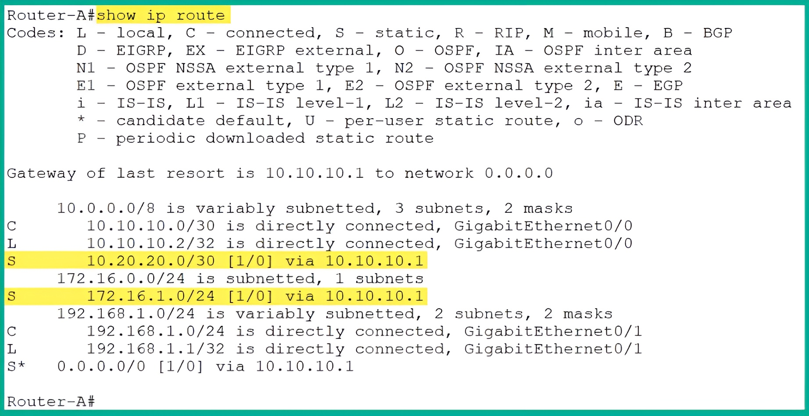


  Figure 9.20 – Static routes
</div>


Lastly, the following screenshot highlights the **default static route**, which indicates the **gateway of last resort** on the routing table of Router-A.

<div align="center">
  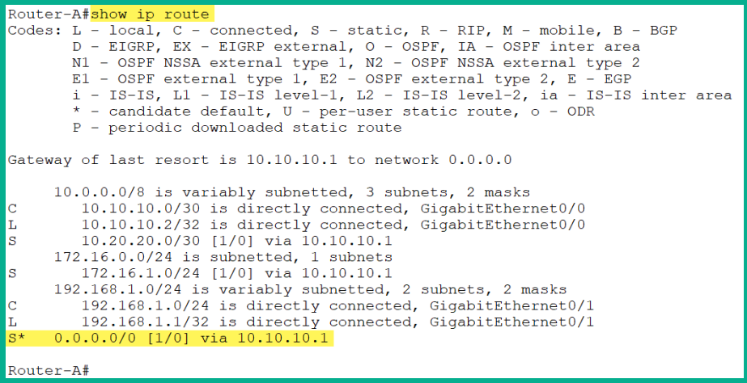


  Figure 9.21 – Default static route
</div>

As shown in the preceding screenshot, the default static route (indicated by `S*`) is used when no other routes within the routing table of a router have a match for the destination IP address within a packet. Additionally, the next-hop address (`10.10.10.1`) of a default static route is used as the **gateway of last resort** on the router.

Having completed this section, you have learned about the fundamentals of static routing and dynamic routing.

---

# 📊 **Managing Bandwidth**

Within an organization’s network, many devices and users are sending and receiving messages to and from each other. Some users are uploading and downloading files from the internet, while others are having a teleconference meeting using a Voice over IP (VoIP) or Video over IP solution.

Overall, many different traffic types are traveling along a network.

  * Some of these traffic types use a connection-oriented protocol, such as **Transport Control Protocol (TCP)**.
  * Others use a connectionless protocol, such as **User Datagram Protocol (UDP)**.

## 🚦 TCP vs. UDP

One of the major differences between TCP and UDP is that **TCP provides guaranteed delivery** for packets over a network.

  * If a packet is not delivered to its intended destination, the sender will retransmit the message until the destination host provides an acknowledgment.
  * Packets that use TCP as their preferred transport layer protocol have a higher priority on the network because TCP provides guaranteed delivery.
  * Therefore, if a network becomes saturated or congested with too many packets, each device that wants to send a message tries to access the available bandwidth, which becomes an issue.

## 📥 Device Buffers

Furthermore, each networking device has two buffers for temporarily storing messages that are awaiting processing and forwarding. These are known as **port-based memory** and **shared memory**.

  * **Port Buffer (Port-based memory):** This buffer exists on each interface of a networking device.
      * It temporarily stores *inbound messages* that have to be processed by the device.
      * It also temporarily stores *outbound messages* that have already been processed and are waiting to be placed on the physical network.
  * **Shared Memory:** This is simply used to temporarily store all messages in a common buffer that is shared by all interfaces and the memory of the networking device.

If a networking device's buffer is filled, any additional messages will be **dropped** from the network.

  * If **TCP** messages are dropped, the sender will **retransmit** them to the destination.
  * However, if **UDP** messages are dropped, the sender will **not retransmit** them. This is because UDP does not have any mechanism to determine whether a packet arrived at a destination or not.

## 📞 The Problem with Time-Sensitive Traffic

For instance, voice and video traffic types use **UDP** as their preferred transport layer protocol. This is because UDP provides better capabilities for delivering messages that are time-sensitive over a network compared to TCP.

Imagine speaking to a colleague using a VoIP telephone within your office, and the dialog is not smooth.

  * Some packets are being sent and received more slowly than others (this is **jitter**).
  * Some packets are being dropped entirely.
  * This is happening because another employee is transferring a huge file and saturating the network.

## 💡 Solutions for Traffic Management

Network professionals use two types of solutions to ensure specific traffic types (like voice and video) have a high priority of accessing the bandwidth over others on a network:

1.  **Traffic Shaping**
2.  **Quality of Service (QoS)**

### 1\. Traffic Shaping

Traffic shaping allows network professionals to **create delays for some traffic types** using a traffic profile.

This technique is commonly used to improve latency and optimize the performance of a network, while also increasing the allocation of bandwidth for specific, important traffic types.

Simply put, if a sender is transmitting too many packets that are congesting the network, networking devices (such as switches) can create a delay or slow down the amount of traffic between that host and its destination. This allows other, higher-priority traffic types to access the bandwidth and flow with optimal speed, while the lower-priority traffic is delayed.

### 2\. Quality of Service (QoS)

QoS is another solution commonly implemented within many organizations’ networks. It helps control traffic on a network while ensuring the improved performance of mission-critical applications over a limited network capacity.

#### 📈 Key QoS Metrics

The following metrics are used within QoS to measure types of traffic over a network:

  * **Bandwidth:** The number of bits that can be transmitted in a second between a source and a destination.
  * **Congestion:** In a network, congestion results in packets being delayed while they are arriving at their destinations. Congestion occurs when there is a lot more traffic on the network than the available bandwidth can handle.
  * **Delay (Latency):** This measures the time a packet takes to travel between a source and a destination. Users on a congested network usually experience high latency (slow response time).
  * **Jitter:** This measures the **variation in the delay times** of incoming packets on a network. For instance, on an optimal network, all packets received from the same sender should have the same latency. Jitter increases on the network as users send and receive messages, saturating the network.
  * **Packet Loss:** This measures how many packets are discarded or dropped between a source and destination over a given time. Any discarded TCP messages are retransmitted, while UDP messages are not resent.

#### ⚙️ The QoS Prioritization Process

The following steps show how QoS prioritizes traffic on a network:

1.  **Classification:** Inbound traffic on a networking device is inspected. It is then placed within a waiting queue based on the **Differentiated Services (DS) field** of an IPv4 packet or the **Traffic Class field** of an IPv6 packet.
2.  **Marking:** This is the process where the QoS tools on the networking device modify one or more fields within the packet header to insert a priority value.
3.  **Queuing:** This phase is responsible for managing all the queues for outgoing messages on a networking device. Traffic is sent out of a networking device based on its priority.
4.  **Policing and Shaping:**
      * The **policing** feature is responsible for *discarding* or *dropping* packets that exceed a configured rate.
      * The **shaping** feature is responsible for *keeping* or *holding* the packets within a queue to delay them.
5.  **Congestion Avoidance:** This feature is used to proactively reduce the amount of congestion that exists within a network to reduce packet loss (for example, by dropping some packets *before* the buffer is completely full).

#### 🔬 The Classification Process in Detail

The following diagram shows the classification process when using QoS.

<div align="center">
  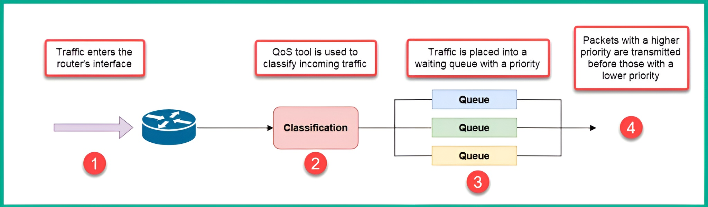

  Figure 9.22 – Classification process
</div>

As shown in the preceding diagram:

1.  **Traffic enters the router's interface.** A single flow of data arrives at the device.
2.  **A QoS tool is used to classify incoming traffic.** The router inspects the packet's header (e.g., the DS field) to identify what kind of traffic it is (e.g., voice, video, or file transfer).
3.  **Traffic is placed into a waiting queue with a priority.** Based on its classification, the packet is sorted into a high-priority, medium-priority, or low-priority queue.
4.  **Packets with a higher priority are transmitted before those with a lower priority.** The router's scheduler pulls packets from the high-priority queue first, ensuring that critical traffic (like VoIP) is sent out with the least amount of delay.

Having completed this section, you have gained an understanding of bandwidth management techniques such as traffic shaping and QoS.


---

# 🔄 **Delving into Switching Concepts**

As you have learned so far, network switches are designed and configured to forward frames to their destinations over a network. However, network switches have a lot of additional cool features that allow network professionals to enable special services and functions on a network.

In this section, you will learn how network professionals can:
* Distribute power over network cables to wireless access points and VoIP phones.
* Prevent a Layer 2 loop on a switching network.
* Aggregate multiple physical links into a single logical link between switches.
* Discover connected devices on a network.

## ⚡ Power over Ethernet (PoE)

**Power over Ethernet (PoE)** is the technology that allows **Direct Current (DC)** power to be sent over a copper Ethernet cable to devices. This reduces the need for a dedicated power supply and a separate Alternating Current (AC) power outlet for each device.

For instance, imagine you’re a network professional who has been assigned to install an access point in the center of a ceiling within a large office space.
* Before installing the access point, you notice that the closest AC power outlet is located in the furthest corner of the room.
* Additionally, attaching a power extension cord to the access point while running the power cord above the ceiling is perhaps not a good idea due to safety concerns.

Enabling the PoE feature on a **PoE-supported switch** will allow DC power to be distributed along the Ethernet cable to the access point. This hence reduces the need for a dedicated power supply and AC power outlet. The same concepts are commonly implemented to provide power to **VoIP phones** and **IP cameras** within organizations.

> #### 📝 Important Note
>
> Since an Ethernet cable is used to support both PoE and data, **PoE does not add any additional Ethernet capabilities** to the data that’s transported along the same cable.

### Standards and Specifications

PoE is defined by **IEEE 802.3af**, which was created in 2003. It specifies how electrical power can be delivered to another device by using:
* The **spare pairs** within a copper Twisted Pair cable (pins 4 and 5 or pins 7 and 8).
* The **data pairs** of an Ethernet cable (pins 1 and 2 or pins 3 and 6).

The concept of using PoE within networks allows organizations to save a lot of money by reducing the need for AC outlets and dedicated power supplies for devices.

* **PoE (IEEE 802.3af):** Provides up to **15.4 watts** of DC power with a maximum of **350 milliamps (mA)** of electrical current.
* **PoE+ (IEEE 802.3at):** An improved variation of PoE defined in 2009. It provides an increased power rating of up to **25.5 watts** with a maximum of **600 mA** of electrical current to devices.

> #### 📝 Important Note
>
> There are two modes of PoE:
> * **Mode A:** Delivers power on the **data pairs** (1, 2, 3, and 6).
> * **Mode B:** Delivers power on the **spare pairs** (4, 5, 7, and 8).

Therefore, before a network professional purchases PoE switches for their organization, it’s important to check the power rating of their PoE-supported devices (such as access points, IP cameras, and VoIP phones). This is to determine which version of PoE is more efficient to distribute power to these devices – that is, **PoE** or **PoE+**.

# 🌳 **Spanning-Tree Protocol** (STP)

When designing a network topology for any organization, it is essential to implement **redundancy** and **fault tolerance**. This ensures that multiple paths are available between a source and a destination.

While redundancy seems to be good, it is also very bad for Layer 2 switched networks. When multiple switches are interconnected to create redundancy, the design also creates a **Layer 2 loop**. Simply put, a Layer 2 loop exists whenever there are two or more available paths between a sender and the destination host on a switched network.

### 🏛️ The 3-Tier Architecture

The following diagram shows the 3-tier architecture that is commonly implemented within large organizations.

<div align="center">
  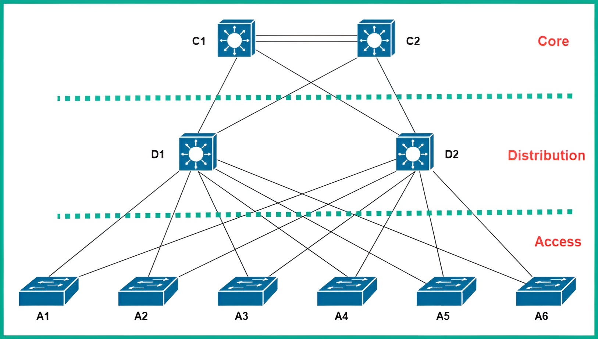

Figure 9.23 – 3-tier architecture model
</div>

As shown in the preceding diagram, this model allows for scalability and provides lots of redundancy between each layer:

  * **Access Layer**: Allows end devices to connect and access resources on the network.
  * **Distribution Layer**: Provides link aggregation, Quality of Service (QoS), and inter-VLAN routing.
  * **Core Layer**: This is the high-speed backbone of the network that interconnects the distribution layer, often between remote branch offices.

### ⚠️ The Problem: Layer 2 Loops

Let’s take a look at how a Layer 2 loop is formed when there are redundant paths within a switched network. The following diagrams show a small network with a redundant path between PC 1 and PC 3.

**Phase 1: Initial Frame**
As shown in the diagram, PC 1 sends a frame to PC 3. It inserts the MAC address of PC 3 (`CC:CC:CC:CC:CC:CC`) into the destination MAC address field of the frame header.

<div align="center">
  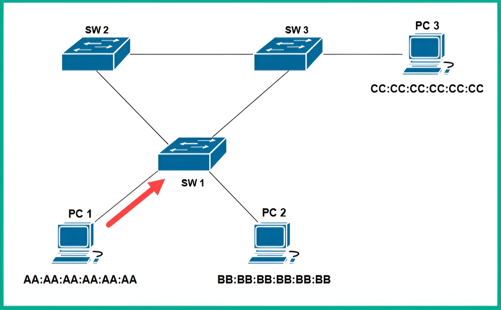

Figure 9.24 – Looping phase 1
</div>

**Phase 2: The Flood**
When the frame arrives on SW1, the switch inspects the destination MAC address. Let's assume SW1 does not know where PC 3 is. It forwards a copy of the frame out the two available paths: one via SW2 and one via SW3.

However, during this time, **PC 3 becomes unavailable** on the network. Because of this, SW3 no longer has the MAC address of PC 3 within its Content Addressable Memory (CAM) table.

<div align="center">
  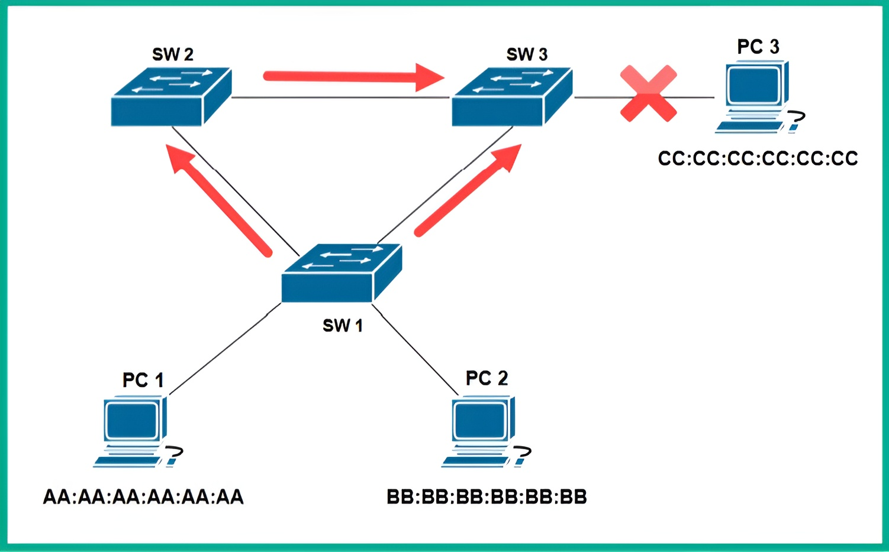

Figure 9.25 – Looping phase 2
</div>

**Phase 3: The Loop Begins**
Since SW3 no longer has the MAC address of PC 3 in its CAM table, when SW3 receives the frame from SW1, it will **flood** the frame out of all other ports (except the one it arrived on). This means it sends the frame to SW2.

The same thing occurs when SW3 receives the frame *from* SW2. It floods that frame back to SW1. This is the default behavior of switches when a destination MAC address is not found in their CAM table.

<div align="center">
  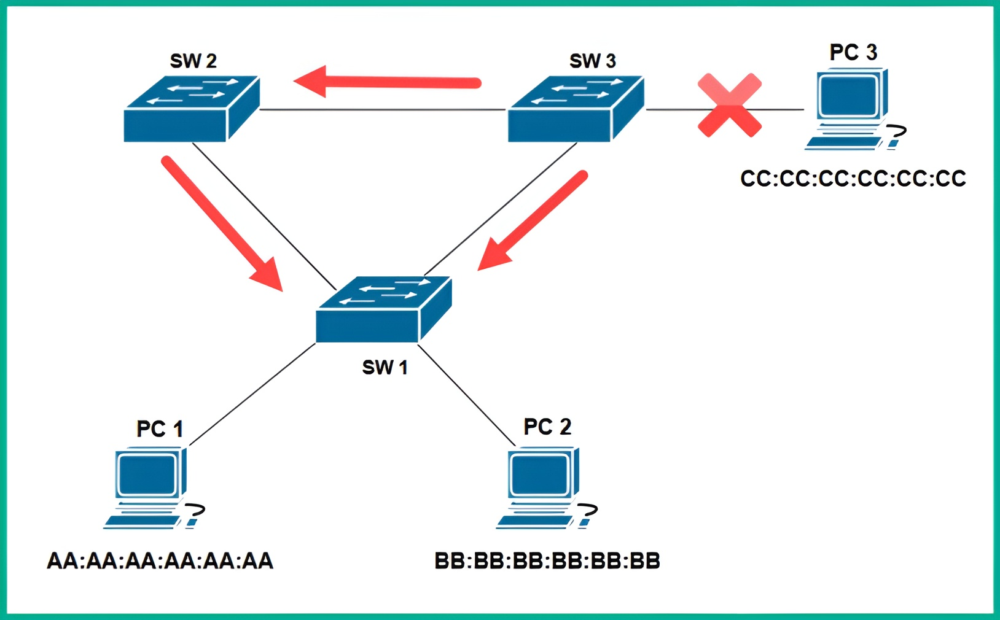

Figure 9.26 – Looping phase 3
</div>

**Phase 4: The Broadcast Storm**
This loop will occur on all switches within the topology as long as each switch does not know how to find the destination host. For this reason, each switch will simply regenerate the frame and rebroadcast it over and over.

<div align="center">
  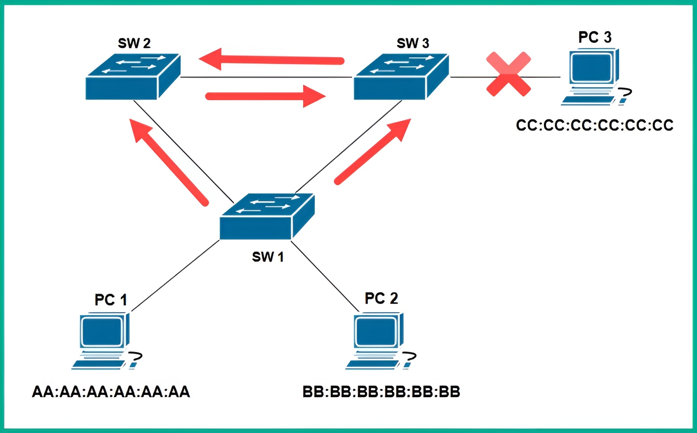

Figure 9.27 – Looping phase 4
</div>


The frames will loop in a never-ending cycle. This is because **Layer 2 frames do not contain a TTL (Time To Live) field** like Layer 3 packets do.

  * Packets contain TTL fields that are assigned a value (number). Each hop (router) along the way decreases the TTL value by 1. This ensures packets do not live forever on a network if a routing loop occurs. If the TTL value reaches 0, the router discards the packet.
  * Since frames do not have a TTL, they will not be automatically discarded. This creates a **broadcast storm** that can congest and crash an entire network.

### ⚠️ The Second Problem: Duplicate Messages

Another issue with redundant paths is the creation of duplicate messages between a source and a destination. To understand this, let's look at the following diagram, where PC 1 is sending a message to PC 3 (which is now connected).

**Phase 1: Initial Frame**
PC 1 sends a single frame to PC 3.

<div align="center">
  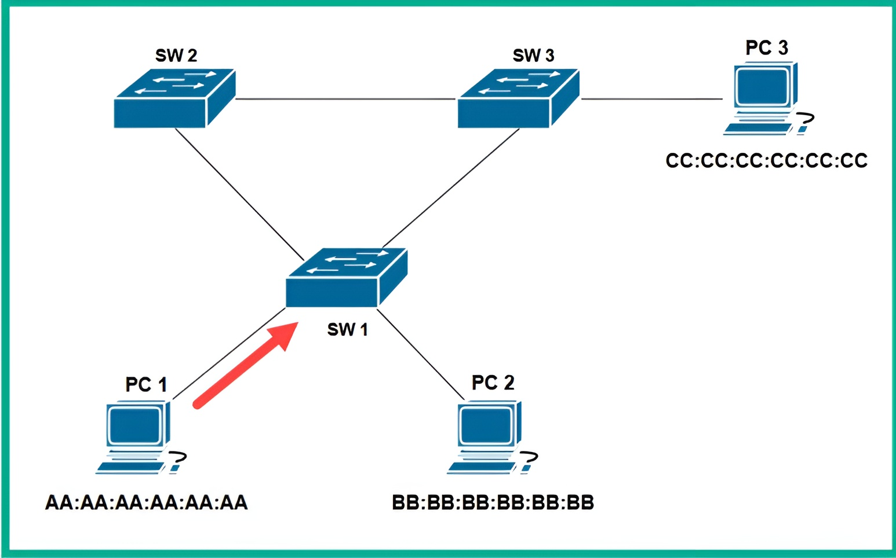

Figure 9.28 – Duplication phase 1
</div>

**Phase 2: Duplicate Delivery**
Without any loop prevention, when SW1 receives the frame, it will forward it to PC 3 using the two available paths (via SW2 and SW3). SW3 will then receive a copy from SW1 and another copy from SW2, and it will forward **both messages** to PC 3.

<div align="center">
  

Figure 9.29 – Duplication phase 2
</div>

**Phase 3: Duplicate Replies**
Since PC 3 receives two copies of the message, it will **respond twice**. This duplication of responses will then multiply as it is sent back to PC 1, creating another storm.

<div align="center">
  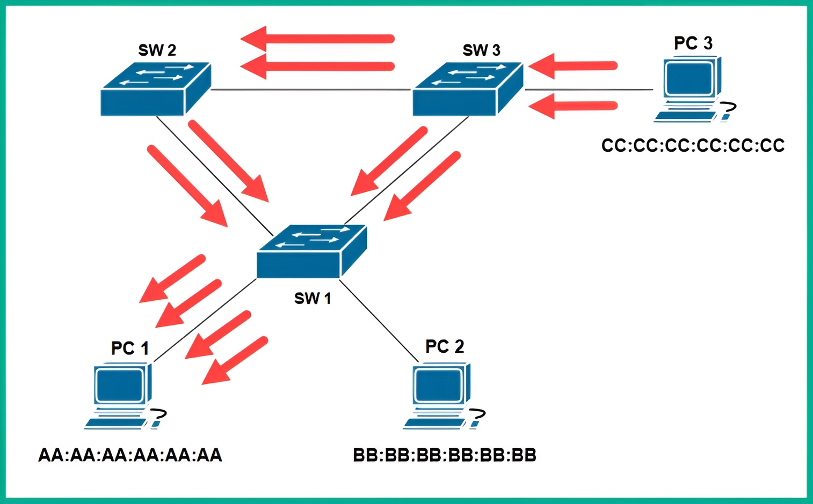

Figure 9.30 – Duplication phase 3
</div>


## 💡 The Solution: Spanning-Tree Protocol (STP)

To resolve these issues, the **Spanning-Tree Protocol (STP)** was designed. STP is a **Layer 2 loop prevention protocol** that can detect any physical Layer 2 loops on a network and **logically block the redundant path**. This ensures only one active logical path between a source and destination is available at any time.

> #### 📝 Important Note
>
> STP is defined by the **IEEE 802.1D** standard.

The following diagram shows a network with STP enabled on all switches, which have already blocked a redundant path.

<div align="center">
  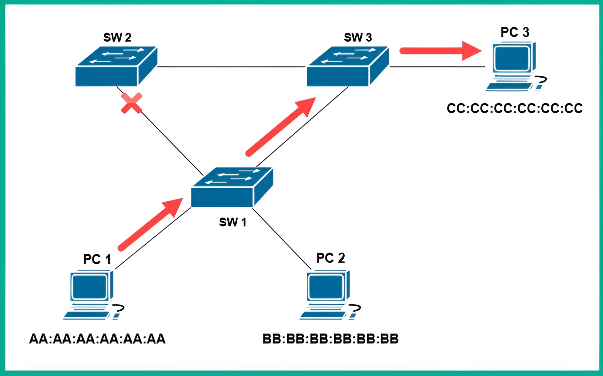

Figure 9.31 – STP enabled on all switches
</div>

As shown, when PC 1 wants to send a message to PC 3, there is only one active logical path, which prevents a loop.

However, if that primary path becomes unavailable, STP can detect the failure and automatically redirect the flow of traffic using one of the backup paths.

<div align="center">
  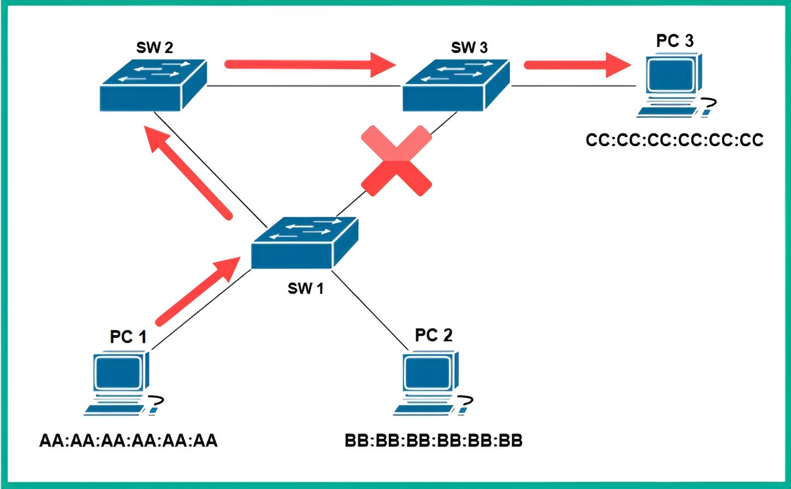

Figure 9.32 – Detecting a network failure
</div>
As shown, STP can detect a failure on an active path and automatically unblock a redundant path to redirect traffic.

### 📨 Bridge Protocol Data Units (BPDUs)

Whenever a switch is powered on, it sends **Bridge Protocol Data Unit (BPDU)** frames every 2 seconds to its neighbor switches. A BPDU contains the switch’s **Bridge ID**, which is made of:

  * Bridge Priority value
  * Extended System ID (Ext-ID)
  * MAC address

<div align="center">
  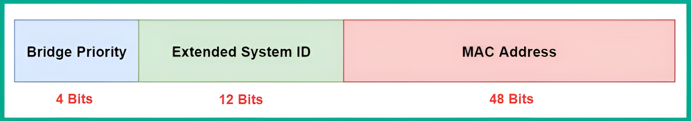

Figure 9.33 – BPDU frame
</div>

### 👑 The Root Bridge Election

The information in these BPDUs is used to elect a special switch as the **Root Bridge**.

1.  The Root Bridge informs all other switches to create one logical, loop-free path. It becomes the central reference point for all traffic.
2.  The switch with the **lowest bridge priority** gets elected as the Root Bridge.
3.  All Cisco switches have a default bridge priority of **32768**.
4.  If all switches have the same priority, the switch with the **lowest MAC address** will be elected as the Root Bridge.

Network professionals commonly configure their core or distribution layer switches to become the Root Bridge by manually lowering the bridge priority (in decrements of 4096).

Once the Root Bridge is elected, all other switches on the network create a logical path that points to the Root Bridge.

### 🗺️ STP Port Role Example

To get a better understanding of how STP identifies redundant paths, let’s look at the following network topology.

<div align="center">
  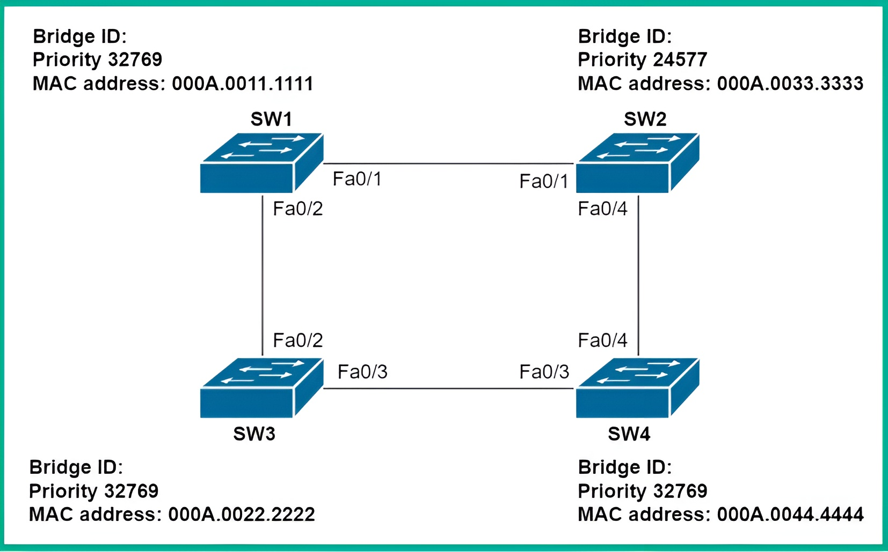

Figure 9.34 – Spanning-Tree network topology
</div>

As shown, each switch has a priority value (Priority + Ext-ID value) and a unique MAC address.

  * **SW1**: Priority 32769, MAC 000A.0011.1111
  * **SW2**: Priority **24577**, MAC 000A.0033.3333
  * **SW3**: Priority 32769, MAC 000A.0022.2222
  * **SW4**: Priority 32769, MAC 000A.0044.4444

#### Strategy for Identifying Port States

Here is a strategy for identifying the root bridge and port states on a network:

1.  **Identify the Root Bridge**: The central reference point for all traffic.
2.  **Identify Root Ports**: Ports *closest* to the Root Bridge (but not on the Root Bridge).
3.  **Identify Designated Ports**: Non-Root ports that are in a forwarding state.
4.  **Identify Alternate/Blocking Ports**: Ports that are logically blocked by STP to prevent a loop.

#### Step-by-Step Port Role Identification

You must follow these steps to identify the root bridge and port status on the topology:

1.  **Identify the Root Bridge**: **SW2** has the lowest priority value (**24577**), and therefore it becomes the **Root Bridge**.
2.  **Identify Root Ports (Easiest Paths)**: Next, the root ports are those with the most direct, lowest-cost path to the Root Bridge.
      * **SW1**'s port `Fa0/1` connects directly to the Root Bridge.
      * **SW4**'s port `Fa0/4` connects directly to the Root Bridge.
      * Therefore, **SW1 `Fa0/1`** and **SW4 `Fa0/4`** are **Root Ports (R)**.
3.  **Identify SW3's Root Port**: We need to determine the port role on SW3. There are two paths from SW3 to the Root Bridge:
      * Path 1: SW3 → SW1 → SW2
      * Path 2: SW3 → SW4 → SW2
      * Both paths have the same cost (interface bandwidth). We must observe the Bridge ID of the *next-hop* switch (SW1 vs. SW4). The path through the switch with the **lower Bridge ID** will be the preferred path.
      * SW1's Bridge ID (MAC `...1111`) is lower than SW4's (MAC `...4444`).
      * As a result, the path via SW1 is chosen, and **SW3 `Fa0/2`** becomes a **Root Port (R)**.
4.  **Identify Designated Port on SW1**: Since the preferred path from SW3 to the Root Bridge is via SW1, the other side of that link, **SW1 `Fa0/2`**, becomes a **Designated Port (D)**.
5.  **Identify Root Bridge Ports**: All ports on the Root Bridge are **Designated Ports (D)** by default. Therefore, SW2 `Fa0/1` and SW2 `Fa0/4` are Designated Ports.
6.  **Identify the Blocking Port**: Finally, the ports between SW3 and SW4 are yet to be assigned. One will be a Designated Port, and the other will be an Alternate/Blocking Port.
      * The switch with the **lower Bridge ID** will take precedence in having the Designated Port.
      * SW3's Bridge ID (MAC `...2222`) is lower than SW4's (MAC `...4444`).
      * Therefore, **SW3 `Fa0/3`** becomes a **Designated Port (D)**, and **SW4 `Fa0/3`** becomes the **Alternate/Blocking Port (A)**.

The following diagram shows the final port labels on each switch within the topology.

<div align="center">
  

Figure 9.35 – STP port labels
</div>

---

# 🔗 **Port Aggregation** (EtherChannel)

**EtherChannel**, also known as **port aggregation**, is a technology that allows network professionals to **combine multiple physical links** into a **single logical connection** between switches. The primary purpose is to aggregate (or sum up) the bandwidth between these devices.

### 🚧 The Problem: Redundancy vs. Aggregation

If a network professional connects two network cables to the Gigabit Ethernet interfaces of two switches, their goal might be to double the bandwidth.

However, **Spanning-Tree Protocol (STP)** will identify this as a redundant path. To prevent a Layer 2 loop, STP will **logically block one of the links**, leaving only one link active for transmitting messages.

The following diagram illustrates this exact problem.

<div align="center">
  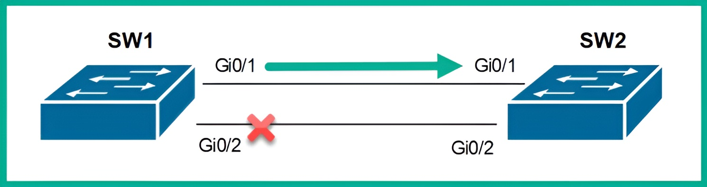


  Figure 9.36 – STP blocking a redundant path
</div>

As shown in the diagram, the objective was to combine the bandwidth of both Gigabit Ethernet interfaces to create a sum of 2 Gigabits per second (Gbps) between SW1 and SW2. However, because this creates redundant links, STP blocks one of them, completely defeating the goal of aggregation.

### 💡 The Solution: EtherChannel

To solve this issue, you can use **EtherChannel**. This technology allows a network professional to successfully aggregate the bandwidth of two or more physical connections, creating a single logical link. This logical link supports much greater bandwidth between devices.

Key benefits of using EtherChannel include:

  * **Hardware Re-use**: The existing switch interfaces are used to create the EtherChannel link, so network professionals do not need to upgrade the hardware components of a switch that already supports the technology.
  * **Load Balancing**: EtherChannels create load balancing of network traffic between the bundled links on a network.
  * **Redundancy**: The technology also helps with traffic aggregation while providing redundancy (if one physical link in the bundle fails, traffic automatically redirects to the remaining links).

### 🤝 LACP (Link Aggregation Control Protocol)

The **Link Aggregation Control Protocol (LACP)** is an open-source protocol defined by **IEEE 802.3ad**. It allows switches from any vendor to form EtherChannels with each other.

An LACP EtherChannel is formed when two switches use compatible modes on their interfaces. The **Active** LACP mode, for example, actively tries to negotiate an EtherChannel.

The following table shows the results of different LACP mode combinations on SW1 and SW2.

<div align="center">
  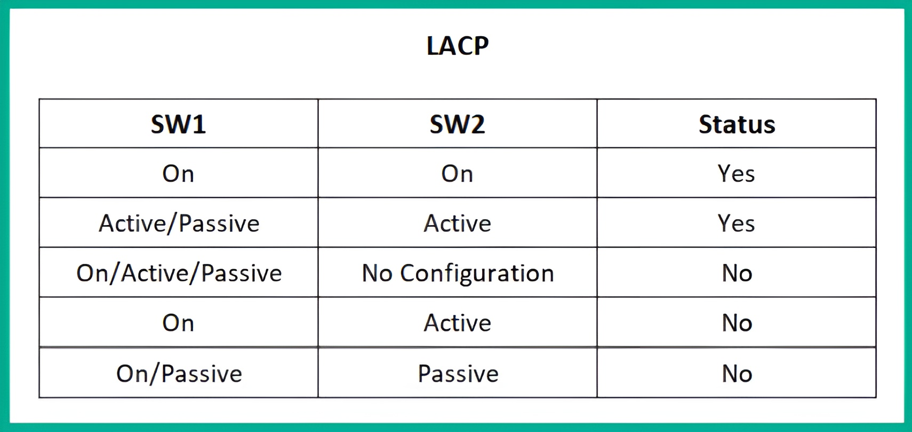

  Figure 9.37 – LACP modes
</div>

### 📋 Requirements for EtherChannel

For an EtherChannel to be established successfully between switches, several requirements must be met on all participating interfaces:

  * The same **type of interface** must be used (e.g., all GigabitEthernet).
  * The same **number of interfaces** must be used in the bundle.
  * The **speed and duplex** settings must be the same on all interfaces.
  * The same **configurations** (such as allowed VLANs and Native VLAN) must be applied to all interfaces.

The following diagram shows an example of an EtherChannel that is **unable to form**. This is because there is a **duplex mismatch** (SW1 is set to Half, SW2 is set to Full).

<div align="center">
  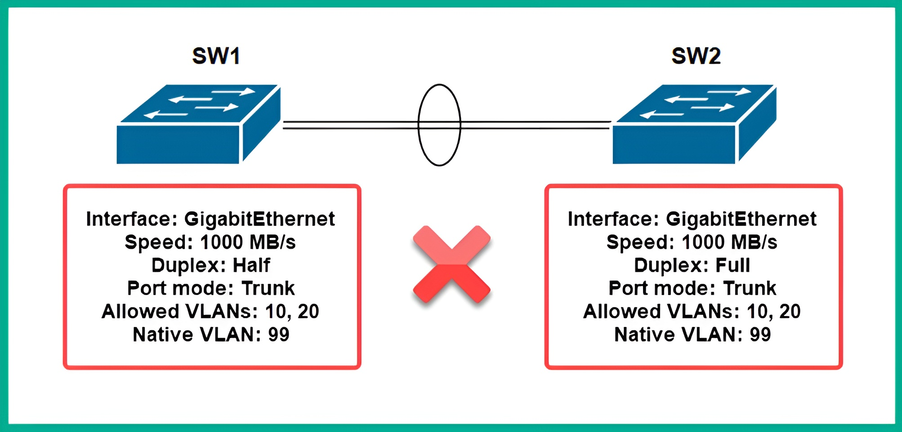

  Figure 9.38 – Unable to form an EtherChannel
</div>

When the configurations are the same on all interfaces being used, the EtherChannel is established successfully.

<div align="center">
  

  Figure 9.39 – Establishing an EtherChannel
</div>

If one of the physical interfaces of an EtherChannel becomes unavailable or has any misconfigurations, the **entire EtherChannel is broken**. All the physical interfaces will then function independently from each other (which will likely cause STP to block one of them again).

---

# 🤝 **Neighbor Discovery Protocol**

As an aspiring network professional, it is nice to have an always up-to-date network topology diagram. Such diagrams help determine the type of networking devices, their capabilities, the interfaces used to connect to another device, their model numbers, and even their IP addresses.

## 🔵 Cisco Discovery Protocol (CDP)

The **Cisco Discovery Protocol (CDP)** is a **Cisco proprietary** protocol. It operates between Layers 2 and 3 of the OSI networking model.

CDP is used to assist Cisco switches in learning about their **directly connected neighbors**, such as other switches and routers. On Cisco devices, CDP is enabled by default. It exchanges advertisement messages using a multicast address of `01:00:0C:CC:CC:CC`.

A CDP message contains the following details about the sender device:

  * Cisco IOS version of the switch or router
  * Device model and type
  * Connected interfaces for both local and remote devices
  * The hostname of the device

The following screenshot shows the devices that are connected to a Cisco switch that uses CDP.

<div align="center">
  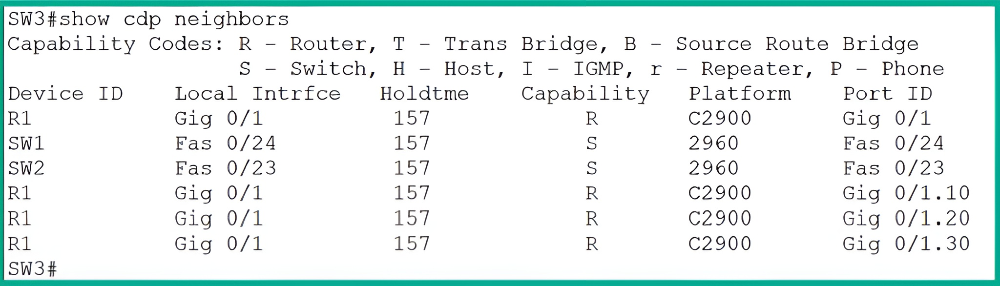

Figure 9.40 – CDP details
</div>

As shown in the preceding screenshot, the command output provides several columns of information:

  * **Device ID**: Indicates the hostname of the directly connected device (e.g., `R1`, `SW1`, `SW2`).
  * **Local Intrfc**: Identifies the interface on *this* switch (`SW3`) used by the connected device.
  * **Holdtme**: Indicates how long (in seconds) the information will remain in the table before being discarded if no new advertisement is received.
  * **Capability**: Indicates the type of device (e.g., `R` for Router, `S` for Switch).
  * **Platform**: Indicates the hardware model of the device (e.g., `C2900`, `2960`).
  * **Port ID**: Indicates the local interface on the *remote* device that is used to establish the connection.

## 🌍 Link-Layer Discovery Protocol (LLDP)

Since CDP is a Cisco proprietary protocol, it is **not interoperable** with non-Cisco devices on a network.

However, the **Link-Layer Discovery Protocol (LLDP)** is another discovery protocol that operates over **Layer 2** of the OSI network model and is supported on **both Cisco and non-Cisco devices**.

LLDP is defined by **IEEE 802.1AB**, which makes it interoperable on other vendor devices. It provides similar details as CDP on a network.

The following screenshot shows the LLDP details on a Cisco switch.

<div align="center">
  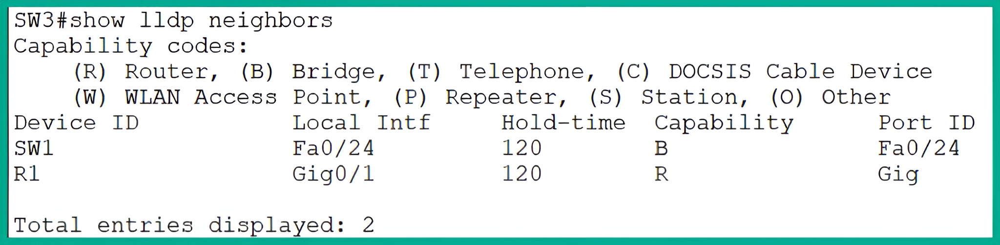

Figure 9.41 – LLDP details
</div>


Hence, in many organizations with mixed-vendor equipment, **LLDP is the preferred neighbor discovery protocol**. It helps both network professionals and networking devices identify the types of devices on their network.

---

# 🖥️ **Exploring VLANs**

In most networks, there are a lot of different traffic types:

  * **Voice traffic** generated from VoIP phones
  * **Video traffic** from surveillance systems and telepresence equipment
  * **Data traffic** from end devices such as computers, servers, and printers

Imagine that an organization wants to segment these traffic types by implementing separate and dedicated network equipment for each type. This would mean creating three **physically isolated networks** to keep each traffic type apart from the other. The disadvantage of performing this physical segmentation is the high cost of purchasing dedicated network equipment to build these networks.

## Converged Networks and Logical Segmentation

With the evolution of the networking industry, we can create a fully **converged network**. This allows all traffic types to use the same physical network while implementing **logical segmentation** of traffic using network switches. This allows for the creation of a single, well-designed physical network for voice, video, and data traffic, while still segmenting those traffic types within an organization. As an aspiring network professional, you’re probably wondering whether there will be any sort of interference between these traffic types over the same physical network.

Network professionals implement a **Virtual Local Area Network (VLAN)** within their switches to segment physically connected components. This allows them to be logically organized.

### 🌟 Benefits of Implementing VLANs

There are many benefits to implementing VLANs, such as the following:

  * Improving network performance and management
  * Reducing the size of a broadcast domain
  * Improving network security
  * Reducing cost

### broadcast Broadcast Domains

VLANs are used to improve the performance of a network by **reducing the size of a broadcast domain**.

Think of a VLAN as a logical network; devices within the same logical network can reach each other by using a broadcast. Since a broadcast is contained within a VLAN, devices that are assigned to another VLAN will not be affected.

Simply put, if all the devices within the Human Resources (HR) department were assigned to **VLAN 10** and a computer within the HR department was generating a lot of broadcast messages, only devices within the HR department would be affected.

The following diagram provides a visual representation of VLANs within a company.

<div align="center">
  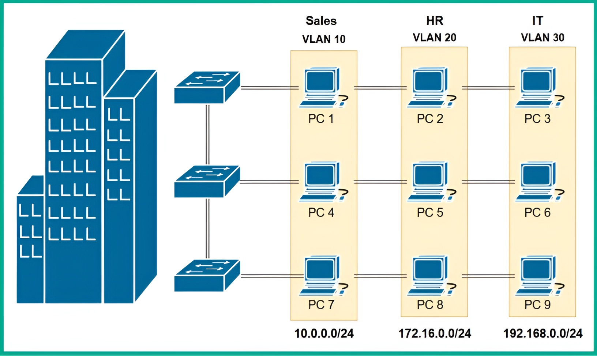

  Figure 9.42 – Network with VLANs
</div>

As shown in the preceding diagram, if PC 2 (HR VLAN 20) generates a lot of broadcast messages, only PC 5 and PC 8 will be affected, as they belong to the same VLAN as PC 2.

### 🏷️ VLAN Tagging (IEEE 802.1Q)

VLANs are created on network switches, and network professionals can assign a VLAN to an interface. Therefore, any device that sends a frame to a switch interface will be assigned an **IEEE 802.1Q tag**, which contains the **VLAN ID** of the interface. This technique ensures all frames are tagged with a VLAN ID, which helps the switch logically separate one piece of VLAN traffic from another.

To understand how VLAN tagging is used within a switch, let’s take a look at the following diagram, which represents a single switch.

<div align="center">
  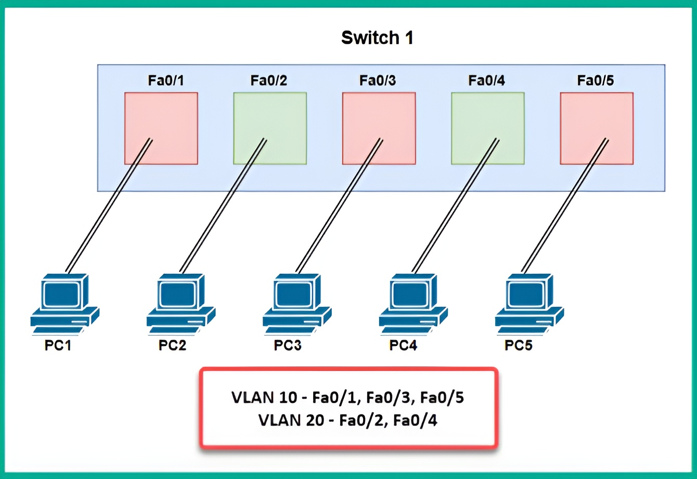

Figure 9.43 – VLAN assignment to each interface
</div>

As shown in the preceding diagram:

1.  Each computer is connected to an interface on the switch, and a VLAN ID is assigned to each port.
2.  Therefore, if PC 1 sends a broadcast to the switch, all inbound traffic on the `Fa0/1` interface will be automatically **tagged with VLAN 10**.
3.  Since the message from PC 1 is a broadcast, the switch will forward the message to **all other ports that are assigned to the same VLAN**.
4.  Therefore, the broadcast message will be sent from both the `Fa0/3` and `Fa0/5` interfaces, and PC 3 and PC 5 will receive the message from PC 1.
5.  Overall, devices that are located on another VLAN, such as VLAN 20, are not affected by the broadcast from PC 1. Each VLAN is logically isolated from the other VLANs within the switch.

### 🌐 VLANs and IP Subnetting

Since each VLAN is logically isolated from the other, each VLAN must be assigned a **unique IP subnet**, as shown in the following diagram.

<div align="center">
  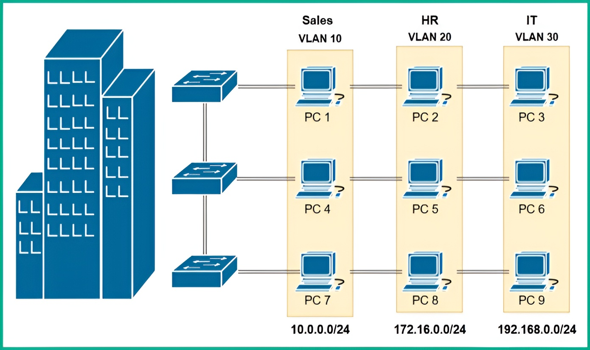

  Figure 9.44 – VLAN segmentation
</div>

However, to ensure intercommunication between VLANs, network professionals will need to implement a **Layer 3** device or a dedicated **router** that has been configured to perform **inter-VLAN routing**. This is a technique that allows devices from one VLAN to communicate with devices on another VLAN.

### 🔗 Access Ports vs. Trunk Links

  * **Access Ports**: An access port allows only **one** statically assigned VLAN on the interface.
  * **Trunk Links**: These are point-to-point connections from switch-to-switch or switch-to-router. Trunks allow **multiple VLANs** to carry their traffic between switches and routers at the same time.

### 📂 Types of VLANs

Various types of VLANs are created on a network. The following are the common types of VLANs within organizations:

  * **Default VLAN**: This is the VLAN created by the vendor. The default VLAN is **VLAN 1**, and all interfaces of the switch are assigned to VLAN 1 by default, so a new enterprise-grade switch will work out of the box. However, it is not recommended to use the default VLAN for security reasons. Unfortunately, network professionals are unable to rename or delete the default VLAN.
  * **Data VLAN**: This VLAN is configured to transport traffic generated by end devices such as computers, servers, printers, and access points.
  * **Native VLAN**: This VLAN is used to transport **untagged traffic** on an IEEE 802.1Q trunk link. Whenever an end device (like a computer) sends traffic to a switch, the receiving switch port inserts an IEEE 802.1Q tag (this is **tagged traffic**). **Untagged traffic** does not originate from a VLAN; it is self-generated traffic from the switch itself, such as CDP and LLDP messages.
  * **Management VLAN**: This VLAN is used to remotely access the switch over a network for management purposes. It is also referred to as a **Switch Virtual Interface (SVI)** and is configured with an IP address and subnet mask.
  * **Voice VLAN**: Voice traffic uses UDP, which does not provide reliability for packet delivery. Since a converged network is recommended, having a dedicated VLAN to transport voice traffic is preferable to ensure it is kept separate from other traffic types.

> #### 📝 Important Note
>
> Only **one data VLAN** can be assigned to a switch port; this type of assignment creates an **access port** on the switch. Two VLANs can be assigned to an access port, but only if the other is a **voice VLAN**. Therefore, only one data and one voice VLAN are allowed on a single access port.

### Example of Access Port vs. Trunk

The following diagram shows that VLAN 10 and 20 have been configured, but the connection between the two switches is an **access port** that has only been statically assigned to **VLAN 10**.

<div align="center">
  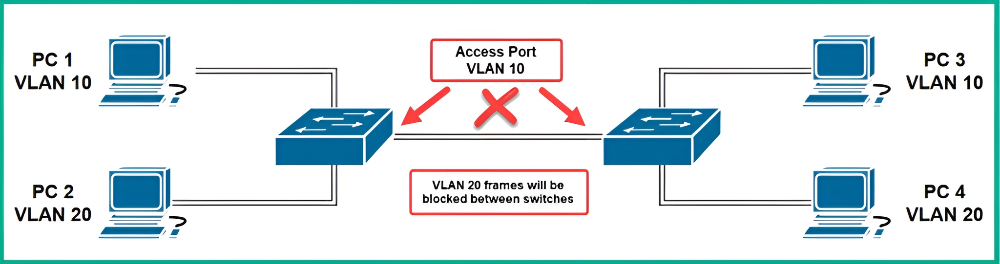

  Figure 9.45 – Issues with access ports
</div>

As shown in the preceding diagram, PC 1 and PC 3 (VLAN 10) will be able to exchange messages. However, PC 2 and PC 4 (VLAN 20) **will not** be able to communicate with each other because their frames will be blocked.

To solve this issue, a **trunk** is needed between the two switches to allow both VLAN 10 and 20 traffic, as shown here.

<div align="center">
  

  Figure 9.46 – Trunk links
</div>

### 🔑 Key Points: Port Tagging and IEEE 802.1Q

  * When a source device (such as a computer) sends a frame into a switch port, the switch will insert an **IEEE 802.1Q tag** into the frame.
  * **Access ports** allow network professionals to configure one data VLAN on an interface.
  * The IEEE 802.1Q tag contains the **VLAN ID** that is assigned to the switch’s interface. This tag helps the switch isolate one piece of VLAN traffic from another, so each VLAN is logically separated.
  * The IEEE 802.1Q tag is kept on the frame as long as it is passing **between switches** (on a trunk link).
  * The IEEE 802.1Q tag is only **removed** when the switch is sending outbound traffic from an **access port** (to an end device).
  * **Trunks** are special interfaces configured on a switch to transport multiple pieces of VLAN traffic between switches.

---

# ⚙️ **Understanding Switch Port Configurations**

Managed switches allow a network professional to configure many components of the device. This includes:

  * Enabling and disabling each interface.
  * Adjusting the support bandwidth on a port.
  * Configuring the speed and duplex settings on each interface.

These are just a few of the many changes network professionals can apply to any port on a switch.

Unlike **managed switches**, **unmanaged switches** are different. Network professionals can’t log into the device or make any modifications to how the switch operates. An unmanaged switch simply operates like a basic switch and forwards frames to its destination – that’s about it.

A managed switch provides the additional capabilities and features that are needed by network professionals within the industry to ensure messages are delivered efficiently and quickly to their destinations.

In this section, you will explore the importance of various switch port/interface configurations and their effects on a network.

-----

## 🔄 Duplex and Speed

**Duplex** simply defines how communication can occur between two devices on a point-to-point connection. Within networking devices, security appliances, and end devices, each of these devices has a network adapter that supports the following duplex modes:

  * Half
  * Full
  * Auto

### Half Duplex

**Half duplex** allows only **one device to communicate at a time** on a point-to-point connection. This applies to two switches that are connected or a computer that is connected to a switch.

Simply put, if two switches are connected and their connected interfaces are operating in half duplex, one switch can send frames while the other receives. If the sender stops transmitting, then the other device can transmit its messages.

For instance, devices that are connected to a hub (such as computers) operating on half duplex can prevent packet collisions by using **Carrier Sense Multiple Access/Collision Detection (CSMA/CD)**.

### Full Duplex

A **full duplex** allows two devices to **simultaneously exchange messages** at any time over a point-to-point network connection.

For instance, the following diagram shows two switches that are connected that can both exchange messages with each other at the same time, unlike half duplex.

<div align="center">
  

Figure 9.47 – Full duplex
</div>


### Auto Duplex

However, the default duplex mode on many devices such as switches, routers, and computers is **auto duplex**. This enables the **automatic negotiation sensing feature**, which allows one device to sense the operating mode of another device and media, allowing the device to match the duplex mode.

The following diagram shows two switches that have their interfaces configured in auto mode.

<div align="center">
  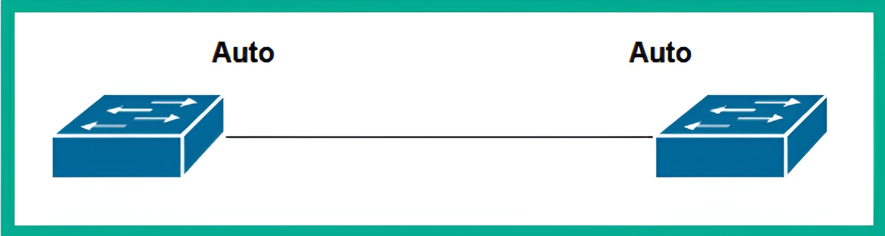


Figure 9.48 – Auto mode
</div>


As shown in the preceding diagram, the interfaces on both switches are operating in auto duplex mode. Ideally, after a few seconds, both switches will automatically negotiate and operate in either a full or half duplex.

By default, they should negotiate to operate in **full duplex**. But, if there are any issues with a cable (media), network adapter, or even the drivers on either device, the duplex mode can result in a **half duplex**.

However, it’s recommended to **statically configure** the operating state of switch interfaces to ensure the best performances and reduce the time to troubleshoot an issue.

> #### 📝 Important Note
>
> If there’s a **mismatch in the duplex** between two devices, high latency and packet loss can occur.

-----

### 🏎️ Speed

**Speed** defines the maximum throughput or transmission speeds that are supported on an interface of a device. The following are various supported speed configurations on networking devices:

  * **10**: Operates at 10 Mbps
  * **100**: Operates at 100 Mbps
  * **1,000**: Operates at 1,000 Mbps
  * **Auto**: Uses an auto-negotiation sensing feature to detect and match the speed of another device

It’s recommended to ensure devices that are connected on a point-to-point connection have the **same speed configurations** on their interfaces. However, keep in mind that the default operating mode for speed is **auto** on networking, security, and end devices.

> #### 📝 Important Note
>
> If there’s a **mismatch in speed** between two devices, high latency and packet loss can occur.

Having completed this section, you learned about the importance of ensuring both speed and duplex settings match on all devices within a network to prevent any issues.

---

# 🔍 **Port Mirroring**

An important part of being a network professional is understanding how to capture network traffic from a switch. This allows you to perform packet analysis to determine potential network and security issues within an organization. Networking devices are designed to forward traffic between a source and destination as efficiently as possible. However, various issues can occur on a network over time, and analyzing packets can help identify the root cause of an issue.

Managed switches allow network professionals to configure **port mirroring**, a feature that is built into many switches within the networking industry. When port mirroring is configured and enabled on a switch, the switch will create a copy of all the traffic. It will also remove both Layer 1 and Layer 2 pieces of data from each message before sending it out to a network security monitoring device.

> #### 📝 Important Note
>
> Cisco commonly refers to port mirroring as **Switch Port Analyzer (SPAN)**, while 3Com uses the term **Roving Analysis Port (RAP)**.

The following diagram shows a switch with port mirroring configured to mirror network traffic.

<div align="center">
  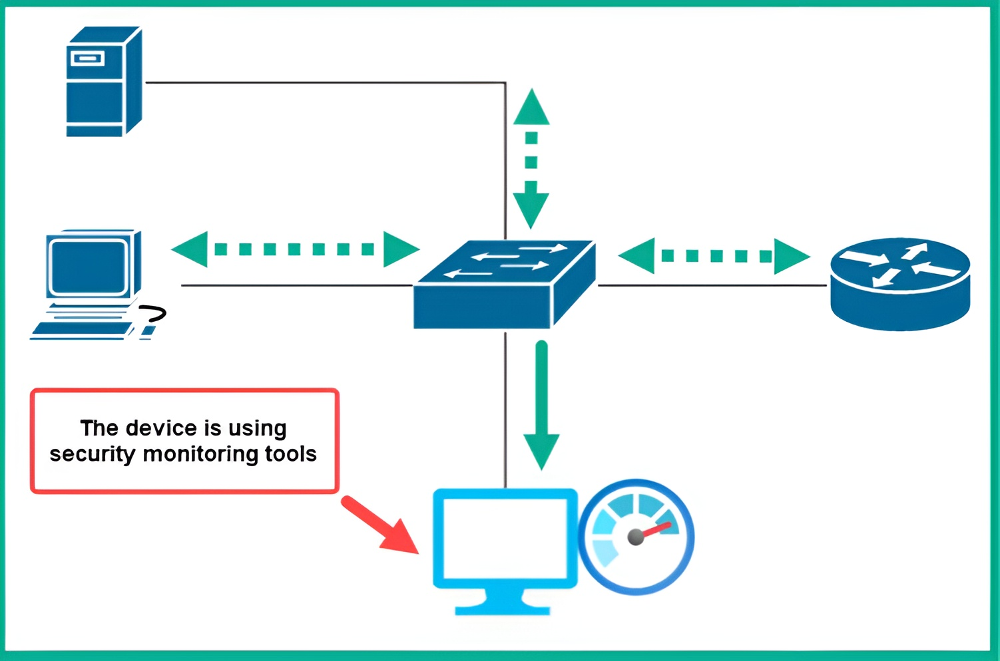

Figure 9.49 – SPAN on a network switch
</div>


As shown in the preceding diagram, the switch is configured with port mirroring to create a copy of all network traffic that is passing through it. A copy is forwarded to the device with a network security monitoring tool, such as an **Intrusion Detection System (IDS)** or a protocol analyzer like **Wireshark**.

### 🔑 Key Points of Port Mirroring

The following are some key points of using the built-in port mirroring feature within supported switches:

  * The port mirroring feature is already built into enterprise-grade networking switches.
  * Port mirroring removes both Layer 1 and Layer 2 pieces of data from each message before sending it to the destination device.
  * Network professionals need to apply the necessary configurations to create the mirror interfaces.
  * **Remote SPAN (RSPAN)** can be configured on a larger network to capture traffic between switches that share a VLAN. This is the Cisco terminology for remote port mirroring.

### 💻 Example SPAN Configuration

The following is an example of SPAN configurations for a Cisco 2960 switch:

```cisco
Switch(config)# no monitor session 1
Switch(config)# monitor session 1 source interface fastEthernet 0/1
Switch(config)# monitor session 1 source interface fastEthernet 0/2
Switch(config)# monitor session 1 destination interface fastEthernet 0/3
```

#### 📖 Code Explanation

The preceding configuration enables monitoring on both the `FastEthernet 0/1` and `FastEthernet 0/2` interfaces and sends a copy of the traffic out of `FastEthernet 0/3` on the switch.

1.  **`Switch(config)# no monitor session 1`**

      * This command ensures any pre-existing configuration for monitoring session number 1 is deleted. This provides a clean setup.

2.  **`Switch(config)# monitor session 1 source interface fastEthernet 0/1`**

      * This command defines a *source* for the monitoring session. It tells the switch to copy all traffic from the `FastEthernet 0/1` interface and associate it with session 1.

3.  **`Switch(config)# monitor session 1 source interface fastEthernet 0/2`**

      * This command adds *another* source interface to the same session. The switch will now copy traffic from *both* `FastEthernet 0/1` and `FastEthernet 0/2`.

4.  **`Switch(config)# monitor session 1 destination interface fastEthernet 0/3`**

      * This command defines the *destination* for all the copied traffic. All traffic gathered from the source interfaces (`Fa0/1` and `Fa0/2`) will be sent out of the `FastEthernet 0/3` interface, where the monitoring device is connected.

Having completed this section, you have learned the fundamentals of port mirroring. Next, you will learn about port security features and how they can be used to prevent unauthorized devices from accessing the network.

# 🔒 Port Security

Imagine if an employee connected their personal laptop or a wireless router to the network switch within your organization. What would happen? Network professionals are not only responsible for designing, building, and troubleshooting networks; they must also help protect the network from cyberattacks and threats.

Enterprise-grade networking switches support a security feature known as **port security**. This feature applies security restrictions to the interfaces of a switch. Therefore, using port security on switches helps prevent unauthorized devices from accessing the network and its resources.

The following are the capabilities of port security when applied to an interface on a switch:

  * Filters inbound traffic based on the source **Media Access Control (MAC) address** of the sender device.
  * Various security **violation modes** are used to either disable the interface automatically or restrict traffic from entering the interface.
  * Allows a network professional to **statically assign** a permitted MAC address on an interface.
  * Allows network professionals to **automatically learn** about and store trusted MAC addresses within the configurations of the switch (often called "sticky MAC").

Keep in mind that port security is applied to an interface. If an attacker is connected to an active interface that is *not* configured with port security, the attacker will be able to access the network.

Furthermore, port security filters inbound traffic based on the source MAC address of a trusted device. A seasoned hacker can easily **spoof** the MAC address of their device to an address that is trusted by the switch. This allows them to connect to the network while pretending to be a trusted device.


# 🔄 Auto MDI-X

The **Auto-Medium-Dependent Interface Crossover (Auto MDI-X)** feature is simply an auto-sensing mechanism. It is built into the firmware or operating systems of modern switches and allows the device to detect the type of cable being used to connect it to another device.

For instance, before Auto MDI-X, network professionals needed to use specific cables:

  * A **crossover cable** was required to interconnect the *same type* of device (e.g., switch to switch, router to router).
  * A **straight-through cable** was used to interconnect *different types* of devices (e.g., switch to router, switch to PC).

Nowadays, network professionals can use either a straight-through or a crossover cable to interconnect two switches without worrying if it’s the right type. The Auto MDI-X feature will simply detect the cable type and the devices. It then makes the necessary adjustments within the firmware or operating system to transmit and receive messages on the specific pins within the interface on the switch.

---