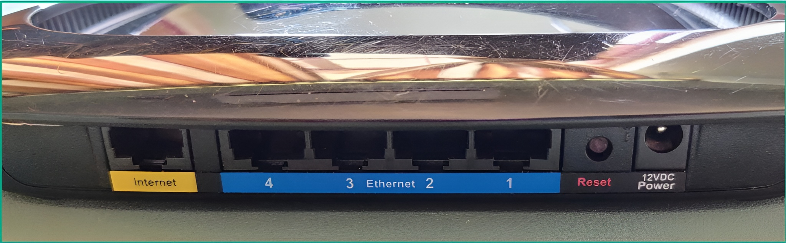
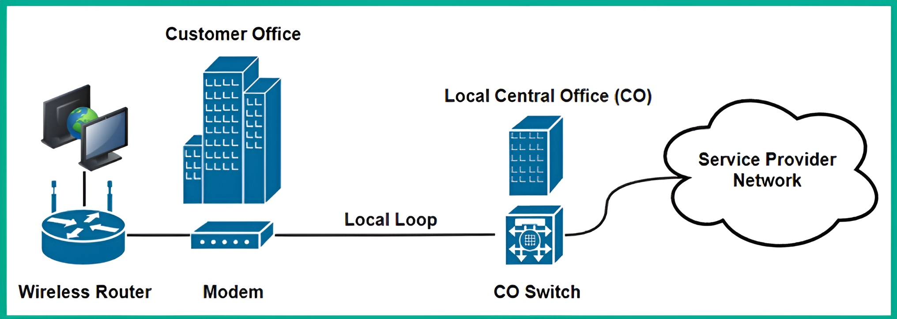
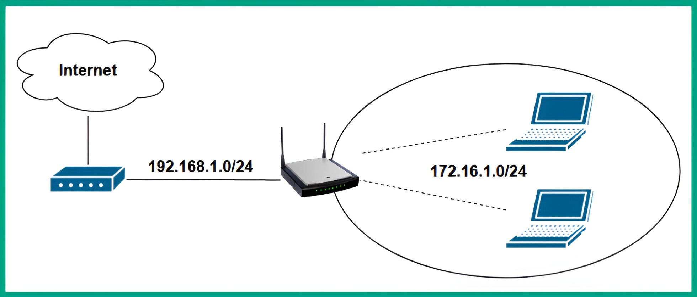
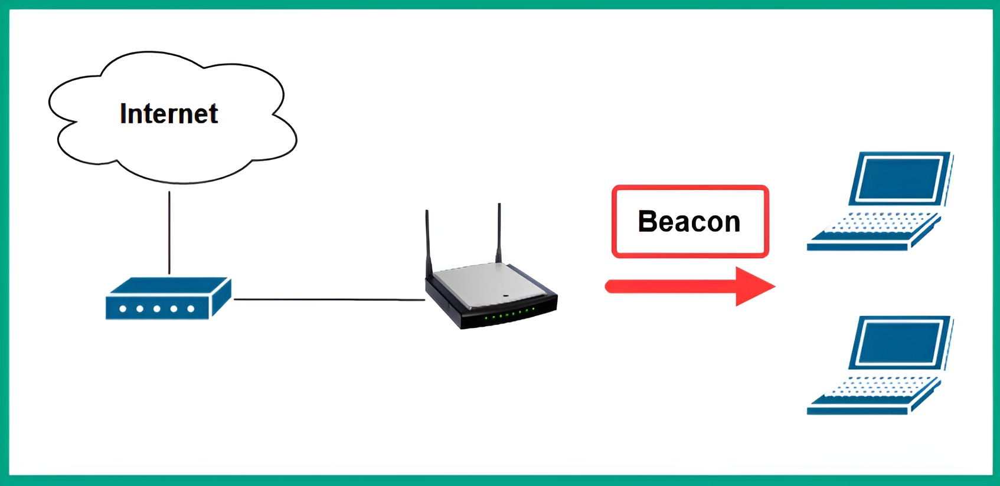
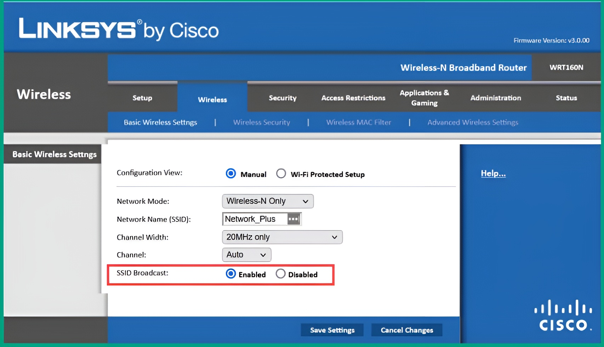

# 📡 **Exploring Wireless Networking**

When designing a wireless network for an organization, it is important to consider several key factors:

  * The components needed.
  * The number of wireless clients that need access to the wireless network.
  * The location of these clients within the organization.

The components needed are typically **access points (APs)** or **wireless routers**, based on the size of the organization and the number of users on the wireless network.

### 🏠 Wireless Routers

Wireless routers are common networking devices, particularly found within **Small Office Home Office (SOHO)** networks. This type of wireless networking device is an all-in-one unified device that combines a:

  * Router
  * Switch
  * Access Point

A wireless router is suitable for small wireless networks, such as those within homes and small office environments.

The following snippet shows the back of a Cisco Linksys 160N wireless router:

  

  Figure 10.1 – Wireless router

As shown in the preceding snippet, there are five interfaces that allow wired Ethernet connections.

  * **Internet Port**: This port (often yellow) is sometimes referred to as the **Wide Area Network (WAN)** port. It allows a network professional to establish a wired connection from the internet modem to the wireless router.
  * **Ethernet Ports**: This 4-port group (often blue) acts as a local switch.

The purpose of the Internet/WAN port is to provide internet access to devices that are connected to the wireless router. Without internet access on the wireless router, wireless clients would be able to communicate with each other locally but would not be able to access any resources on the internet.

The following diagram shows the connection between an internet modem and a wireless router.

  

  Figure 10.2 – Providing internet to a wireless router

Additionally, the wireless router has one or more Ethernet ports (the 4-port switch) that operate like a typical network switch. This allows network professionals to interconnect clients with each other using a wired connection. The built-in switch within the wireless router functions like a typical network switch that forwards frames between devices on the wired and wireless networks.

Therefore, all devices that are connected to the wireless router, whether on the wireless or wired network, will be able to communicate and exchange messages with each other.

### ⚙️ Router Functions

Furthermore, the wireless router leverages several built-in features:

  * **Access Point Feature**: This generates radio frequencies within the **2.4 GHz** and/or **5 GHz** band to create a wireless network, allowing wireless clients to connect to the device.
  * **Router Functionality**: This allows devices that are connected to the wired and wireless network types to intercommunicate with each other.
  * **DHCP Server**: The router feature allows network professionals to create a **Dynamic Host Configuration Protocol (DHCP)** server within the wireless router. This server provides all connected clients with:
      * IP addresses
      * Subnet mask
      * Default gateway
      * Domain Name System (DNS) server addresses

The following diagram shows the different networks that exist when using a wireless router.

  

  Figure 10.3 – Wireless networking

As shown in the preceding diagram:

  * Clients that are connected to the wireless network (the LAN) generated by the wireless router use IP addresses on the **172.16.1.0/24** network.
  * The network that exists between the modem and the internet port of the wireless router (the WAN) is in the **192.168.1.0/24** network range.

Hence, the router function is used to forward packets between these different IP subnets and to the internet.

### 🏢 Access Points (APs)

In medium-sized to large organizations, **access points (APs)** are commonly implemented to provide wireless coverage to all areas within a building.

Access points simply generate a radio frequency that is supported by wireless devices, allowing wireless clients (such as mobile devices) to establish a connection to the AP and access the resources on the wired network.

Unlike wireless routers, access points typically do not have any routing or switching functionality; they are simply used to create a wireless network and forward frames to the wired network and vice versa.

  * **Thin-Client Access Point**: This is a type of AP that has no configuration capability on its own. It is "thin" because it relies on a central **wireless controller** to function and get its configuration.
  * **Fat-Client Access Point**: This type of AP, on the other hand, can be individually configured and does not require a controller.

Clients that are connected to access points receive an IP address that is provided to the clients on the wired network (e.g., from a central DHCP server). Hence, access points are simply used to allow wireless clients to access the organization’s network seamlessly, as if they were connected to the wired network.

---

# 📡 **Beacons, Probes, Stations, and SSIDs**

## 🏷️ Service Set Identifier (SSID)

The **Service Set Identifier (SSID)** is simply the name of your wireless network. It is what allows wireless clients (like your phone or laptop) to identify one wireless network from another.

Imagine if setting an SSID was not an option on your wireless router or access point; it would be quite challenging for users to find and identify their specific wireless network from their neighbor's.

Home users and organizations usually change the default SSID (which is configured by the vendor) to a name that is recognizable.

### 🔒 Security and Naming

As a good security practice, organizations should **not** set an SSID that can easily identify the organization or attract (lure) a hacker.

For instance, many IT professionals might configure their wireless networks with easily identifiable SSIDs, such as using their company’s name. While this concept provides a lot of convenience for employees, it also helps a hacker easily identify a target wireless network.

## 📢 Beacons

When a wireless router or access point is powered on, its firmware and configurations are loaded into memory. The device then begins to broadcast its presence within the vicinity.

Wireless routers and access points continuously broadcast **beacons**. These are small packets of information that contain specific details about the wireless network, such as:

  * The SSID (the network name)
  * The wireless encryption standard (e.g., WPA2, WPA3)
  * The operating channel
  * The device's Media Access Control (MAC) address

These beacons are detected and inspected by any device that has a supported wireless network adapter (such as smartphones, tablets, Internet of Things (IoT) devices, and laptops). This process is what allows a user to see a list of available wireless networks.

The following diagram shows a wireless router broadcasting beacons.

  

  Figure 10.4 – Wireless beacons

As shown in the preceding diagram, as wireless clients move into the range of the wireless signal, they will be able to capture these beacons and inspect them to determine which wireless network is close by.

### "Hiding" Your Wireless Network

Wireless routers and access points provide the capability of **disabling the SSID broadcast**. This is often used as a technique for "hiding" your wireless network from other wireless clients.

However, this technique **does not add any real layer of security**. A seasoned hacker or cybersecurity professional can discover a "hidden" wireless network within a few seconds. They can do this by performing wireless reconnaissance, which involves capturing beacons and probes.

If an IT professional chooses to disable the SSID broadcast feature, the wireless router will *still* broadcast beacons, but it will not insert the SSID. All other information will still be included.

By analyzing the data within these captured beacons and probes, a seasoned hacker can determine:

  * The type of clients and wireless routers within the area.
  * The hidden wireless networks.
  * The type of security configurations applied to the networks.
  * Even the approximate distance between the attacker’s machine and the target wireless router and clients.

The following snippet shows the basic configuration page of a wireless router where this setting can be changed.

  

  Figure 10.5 – Wireless router basic configuration page

As shown in the preceding snippet, the basic wireless configuration page allows a user to configure the wireless operating standard (`Network Mode`), the SSID (`Network Name`), `Channel Width`, `Channel`, and whether to **enable or disable the SSID broadcast** on the device.

## 💻 Stations and Probes

When a wireless client (also known as a **station**) establishes a connection to a wireless router or access point, this is referred to as an **association**.

> #### 📝 Important Note
>
> Wireless clients, such as laptops, smart TVs, and IoT devices, are all examples of **stations** on a wireless network. The terms "wireless clients" and "stations" are used interchangeably during discussions and literature.

When a client joins a wireless network, it saves both the SSID and password into a **Preferred Network List (PNL)**. This list allows the user to easily re-join the same wireless network in the future.

This PNL feature enables the wireless network adapter on a client to begin sending **probes** (or probe requests) for each entry within its PNL. The probes allow the client to "seek" or ask for any of the wireless networks (via their SSIDs) that are stored in its PNL. Once a wireless network is found within the signal range, the client will attempt to create an association with that network.

### ⚠️ Security Risks of Probes

A seasoned hacker or cybersecurity professional can capture these probes to determine all the wireless networks that are stored on a client's device. They can then attempt to perform an "AP-less" attack to retrieve the password/passphrase of an organization’s wireless network.

However, many newer devices are now allowing IT professionals to prevent the client from automatically connecting to a saved wireless network that is within range.

---