# 📡 **Exploring Wireless Networking**

When designing a wireless network for an organization, it is important to consider several key factors:

  * The components needed.
  * The number of wireless clients that need access to the wireless network.
  * The location of these clients within the organization.

The components needed are typically **access points (APs)** or **wireless routers**, based on the size of the organization and the number of users on the wireless network.

### 🏠 Wireless Routers

Wireless routers are common networking devices, particularly found within **Small Office Home Office (SOHO)** networks. This type of wireless networking device is an all-in-one unified device that combines a:

  * Router
  * Switch
  * Access Point

A wireless router is suitable for small wireless networks, such as those within homes and small office environments.

The following snippet shows the back of a Cisco Linksys 160N wireless router:

  

  Figure 10.1 – Wireless router

As shown in the preceding snippet, there are five interfaces that allow wired Ethernet connections.

  * **Internet Port**: This port (often yellow) is sometimes referred to as the **Wide Area Network (WAN)** port. It allows a network professional to establish a wired connection from the internet modem to the wireless router.
  * **Ethernet Ports**: This 4-port group (often blue) acts as a local switch.

The purpose of the Internet/WAN port is to provide internet access to devices that are connected to the wireless router. Without internet access on the wireless router, wireless clients would be able to communicate with each other locally but would not be able to access any resources on the internet.

The following diagram shows the connection between an internet modem and a wireless router.

  

  Figure 10.2 – Providing internet to a wireless router

Additionally, the wireless router has one or more Ethernet ports (the 4-port switch) that operate like a typical network switch. This allows network professionals to interconnect clients with each other using a wired connection. The built-in switch within the wireless router functions like a typical network switch that forwards frames between devices on the wired and wireless networks.

Therefore, all devices that are connected to the wireless router, whether on the wireless or wired network, will be able to communicate and exchange messages with each other.

### ⚙️ Router Functions

Furthermore, the wireless router leverages several built-in features:

  * **Access Point Feature**: This generates radio frequencies within the **2.4 GHz** and/or **5 GHz** band to create a wireless network, allowing wireless clients to connect to the device.
  * **Router Functionality**: This allows devices that are connected to the wired and wireless network types to intercommunicate with each other.
  * **DHCP Server**: The router feature allows network professionals to create a **Dynamic Host Configuration Protocol (DHCP)** server within the wireless router. This server provides all connected clients with:
      * IP addresses
      * Subnet mask
      * Default gateway
      * Domain Name System (DNS) server addresses

The following diagram shows the different networks that exist when using a wireless router.

  

  Figure 10.3 – Wireless networking

As shown in the preceding diagram:

  * Clients that are connected to the wireless network (the LAN) generated by the wireless router use IP addresses on the **172.16.1.0/24** network.
  * The network that exists between the modem and the internet port of the wireless router (the WAN) is in the **192.168.1.0/24** network range.

Hence, the router function is used to forward packets between these different IP subnets and to the internet.

### 🏢 Access Points (APs)

In medium-sized to large organizations, **access points (APs)** are commonly implemented to provide wireless coverage to all areas within a building.

Access points simply generate a radio frequency that is supported by wireless devices, allowing wireless clients (such as mobile devices) to establish a connection to the AP and access the resources on the wired network.

Unlike wireless routers, access points typically do not have any routing or switching functionality; they are simply used to create a wireless network and forward frames to the wired network and vice versa.

  * **Thin-Client Access Point**: This is a type of AP that has no configuration capability on its own. It is "thin" because it relies on a central **wireless controller** to function and get its configuration.
  * **Fat-Client Access Point**: This type of AP, on the other hand, can be individually configured and does not require a controller.

Clients that are connected to access points receive an IP address that is provided to the clients on the wired network (e.g., from a central DHCP server). Hence, access points are simply used to allow wireless clients to access the organization’s network seamlessly, as if they were connected to the wired network.

---

# 📡 **Beacons, Probes, Stations, and SSIDs**

## 🏷️ Service Set Identifier (SSID)

The **Service Set Identifier (SSID)** is simply the name of your wireless network. It is what allows wireless clients (like your phone or laptop) to identify one wireless network from another.

Imagine if setting an SSID was not an option on your wireless router or access point; it would be quite challenging for users to find and identify their specific wireless network from their neighbor's.

Home users and organizations usually change the default SSID (which is configured by the vendor) to a name that is recognizable.

### 🔒 Security and Naming

As a good security practice, organizations should **not** set an SSID that can easily identify the organization or attract (lure) a hacker.

For instance, many IT professionals might configure their wireless networks with easily identifiable SSIDs, such as using their company’s name. While this concept provides a lot of convenience for employees, it also helps a hacker easily identify a target wireless network.

## 📢 Beacons

When a wireless router or access point is powered on, its firmware and configurations are loaded into memory. The device then begins to broadcast its presence within the vicinity.

Wireless routers and access points continuously broadcast **beacons**. These are small packets of information that contain specific details about the wireless network, such as:

  * The SSID (the network name)
  * The wireless encryption standard (e.g., WPA2, WPA3)
  * The operating channel
  * The device's Media Access Control (MAC) address

These beacons are detected and inspected by any device that has a supported wireless network adapter (such as smartphones, tablets, Internet of Things (IoT) devices, and laptops). This process is what allows a user to see a list of available wireless networks.

The following diagram shows a wireless router broadcasting beacons.

  

  Figure 10.4 – Wireless beacons

As shown in the preceding diagram, as wireless clients move into the range of the wireless signal, they will be able to capture these beacons and inspect them to determine which wireless network is close by.

### "Hiding" Your Wireless Network

Wireless routers and access points provide the capability of **disabling the SSID broadcast**. This is often used as a technique for "hiding" your wireless network from other wireless clients.

However, this technique **does not add any real layer of security**. A seasoned hacker or cybersecurity professional can discover a "hidden" wireless network within a few seconds. They can do this by performing wireless reconnaissance, which involves capturing beacons and probes.

If an IT professional chooses to disable the SSID broadcast feature, the wireless router will *still* broadcast beacons, but it will not insert the SSID. All other information will still be included.

By analyzing the data within these captured beacons and probes, a seasoned hacker can determine:

  * The type of clients and wireless routers within the area.
  * The hidden wireless networks.
  * The type of security configurations applied to the networks.
  * Even the approximate distance between the attacker’s machine and the target wireless router and clients.

The following snippet shows the basic configuration page of a wireless router where this setting can be changed.

  

  Figure 10.5 – Wireless router basic configuration page

As shown in the preceding snippet, the basic wireless configuration page allows a user to configure the wireless operating standard (`Network Mode`), the SSID (`Network Name`), `Channel Width`, `Channel`, and whether to **enable or disable the SSID broadcast** on the device.

## 💻 Stations and Probes

When a wireless client (also known as a **station**) establishes a connection to a wireless router or access point, this is referred to as an **association**.

> #### 📝 Important Note
>
> Wireless clients, such as laptops, smart TVs, and IoT devices, are all examples of **stations** on a wireless network. The terms "wireless clients" and "stations" are used interchangeably during discussions and literature.

When a client joins a wireless network, it saves both the SSID and password into a **Preferred Network List (PNL)**. This list allows the user to easily re-join the same wireless network in the future.

This PNL feature enables the wireless network adapter on a client to begin sending **probes** (or probe requests) for each entry within its PNL. The probes allow the client to "seek" or ask for any of the wireless networks (via their SSIDs) that are stored in its PNL. Once a wireless network is found within the signal range, the client will attempt to create an association with that network.

### ⚠️ Security Risks of Probes

A seasoned hacker or cybersecurity professional can capture these probes to determine all the wireless networks that are stored on a client's device. They can then attempt to perform an "AP-less" attack to retrieve the password/passphrase of an organization’s wireless network.

However, many newer devices are now allowing IT professionals to prevent the client from automatically connecting to a saved wireless network that is within range.

---

# 📡 **Frequencies, Ranges, and Channels**

The **Institute of Electrical and Electronics Engineers (IEEE)** is the governing body that creates and currently maintains the standards and frameworks for both electrical and electronics specifications. This includes computers and wireless networking.

The **802 committee** of the IEEE holds the responsibility of creating and maintaining many common standards that are used by both computing and networking devices, such as Ethernet, Bluetooth, and Wi-Fi.

The **.11 working group** of the 802 committee is specifically responsible for the wireless networking standard, known as the **IEEE 802.11 wireless networking standard**, within the industry.

### 📜 IEEE 802.11 Wireless Standards

The following table shows the different IEEE 802.11 wireless standards.

  

  Figure 10.6 – Wireless standards

As shown in the preceding table, there are many generations of IEEE 802.11 within the wireless networking industry.

  * **Original IEEE 802.11 (1997):** This was designed to operate on a 2.4 GHz frequency and supported a maximum data transfer rate of 2 Megabits per second (Mbps). However, this original standard was not implemented on any device.
  * **IEEE 802.11b (1999):** This became the first official wireless standard that was implemented on devices. It operated on 2.4 GHz and provided a maximum data transfer rate of 11 Mbps.
  * **IEEE 802.11a (1999):** This standard operates on the 5 GHz frequency and provides a maximum data transfer rate of 54 Mbps.
  * **IEEE 802.11g (2003):** This standard operates at 2.4 GHz and supports maximum transfer rates of 54 Mbps.
  * **IEEE 802.11n (Wi-Fi 4, 2009):** Also known as Wi-Fi 4, this standard operates on *both* the 2.4 GHz and 5 GHz frequencies. It supports **Multiple In Multiple Out (MIMO)**, which improves the maximum data transfer rate up to 300 Mbps.
  * **IEEE 802.11ac (Wi-Fi 5, 2013):** This standard operates on the 5 GHz frequency and provides a maximum data transfer rate of 1 Gigabit per second (Gbps).
  * **IEEE 802.11ax (Wi-Fi 6, 2019):** This is the latest version, which uses both 2.4 GHz and 5 GHz frequencies and provides a maximum data transfer rate of 9.6 Gbps.

Overall, the speed and bandwidth that are supported on wireless networks are aligning with the speeds on wired networks, allowing users to exchange messages very quickly.

### 📶 The 2.4 GHz Band

The IEEE 802.11 standards use the **2.4 GHz** range, which has a total of 14 channels. These channels range from 2.400 GHz to 2.490 GHz, with each individual channel having a width of 20 MHz to 22 MHz for transporting messages.

Since these individual channels are very close to each other, it is recommended to configure wireless routers and access points with **non-overlapping channels**, such as channels **1, 6, and 11**.

The following diagram shows a representation of the non-overlapping channels.

  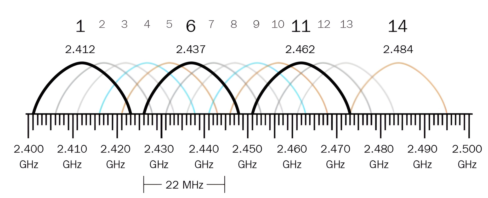

  Figure 10.7 – Non-overlapping channels

It is important to ensure your organization’s access points are not using any channels that are overlapping with other access points within the vicinity. This will create **interference** and affect the performance of the wireless network.

However, the earlier generations of IEEE 802.11 primarily use the 2.4 GHz range. As a result, many organizations and home users who already have an existing wireless network are using the 2.4 GHz range. Therefore, if you were to implement a new wireless router or access point, there is a high possibility that another access point within the same vicinity is using an overlapping channel. This issue is due to the limited number of available channels in the 2.4 GHz range.

> **💡 Tip**
>
> Using a **Wi-Fi analyzer tool**, such as **inSSIDer** from Metageek or the **Wi-Fi Analyzer** app from the Microsoft Store, allows network professionals to:
>
>   * View all nearby wireless networks.
>   * See their operating frequencies and channels, SSIDs, vendors, and much more.
>   * Determine whether your wireless network is using an overlapping channel with another nearby Access Point.

### 🚀 The 5 GHz Band

The **5 GHz** range supports a lot more channels compared to the 2.4 GHz band, with channels ranging from **36 to 165**.

Unlike the 2.4 GHz band, the 5 GHz band allows devices to use channels of 20 MHz, 40 MHz, 80 MHz, and 160 MHz by using a technology known as **channel bonding**. Using channel bonding in the 5 GHz band allows wireless devices to transport more data over the wireless network, hence the 5 GHz band supports more bandwidth compared to the 2.4 GHz band.

### ⚖️ Wireless Band Comparison

The following table shows a comparison between the 2.4 GHz and 5 GHz bands.

  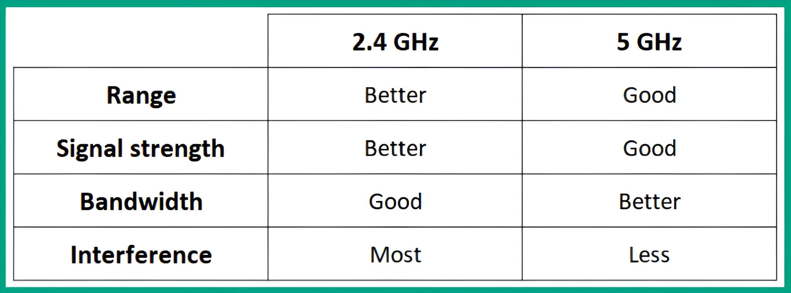

  Figure 10.8 – Wireless band comparison

As shown in the preceding table:

  * The **2.4 GHz band** provides **better signal strength**, allowing the radio frequency signal to travel further away from the wireless router or access point, resulting in **better range**.
  * The **5 GHz band**, on the other hand, operates on a higher frequency and **does not provide the same signal strength or range**. However, the 5 GHz band supports more channels and channel bonding to provide **greater bandwidth** and **less interference**.

---

# 📡 **SSID and Wireless Topologies**

The **Service Set Identifier (SSID)** allows network professionals to create a network name that is 32-bits in length. This name helps users easily identify their preferred wireless network.

When implementing a wireless network infrastructure within a building, office space, or home, it is important to understand the characteristics of the various types of wireless network infrastructure deployments.

The topology of a wireless network can be in **infrastructure**, **ad hoc**, or **mesh** modes.

  * **Infrastructure Mode**: A wireless Access Point (AP) is used as the network intermediary device. It allows wireless clients to connect and share resources.
  * **Ad Hoc Mode**: This mode does not use any wireless intermediary devices. Instead, a wireless device (like a laptop) can directly connect to another laptop to share resources.
  * **Mesh Mode**: All wireless devices establish a connection with each other, hence creating a mesh topology.

### 🏠 Basic Service Set (BSS)

A **Basic Service Set (BSS)** is the most common type of wireless infrastructure. It contains a **single** wireless router or access point, allowing wireless clients within the vicinity to connect to it.

The wireless router or access point is simply the intermediary wireless networking device. It is used to forward WLAN frames between wireless clients and onto the wired network, which is known as a **Distributed System Service (DSS)**.

The following diagram shows a typical wireless network that is configured as a BSS:

  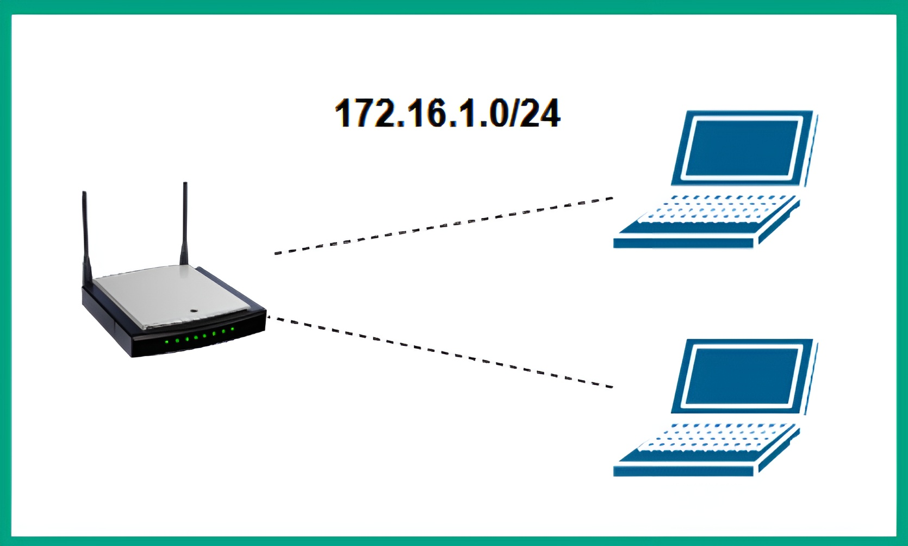

Figure 10.9 – BSS wireless infrastructure

> #### 📝 Important Note
>
> Any wireless network that uses a wireless router or access point as the wireless network intermediary device is commonly referred to as **infrastructure mode**.

### 🏢 Extended Service Set (ESS)

The **Extended Service Set (ESS)** is commonly found within medium-sized to large organizations. It features **multiple access points** connected to the same DSS (wired network).

This wireless network exists when network professionals implement two or more access points that are connected to the same wired network. Each access point is configured with the **same SSID**. This allows a user with a laptop to **roam** between different access points within the office space or building.

Roaming allows a user to automatically connect to another access point with the same SSID when moving out of range from one access point (that has a weaker signal) and closer to another (that is broadcasting a stronger signal) with the same SSID.

The following diagram shows a typical ESS wireless infrastructure:

  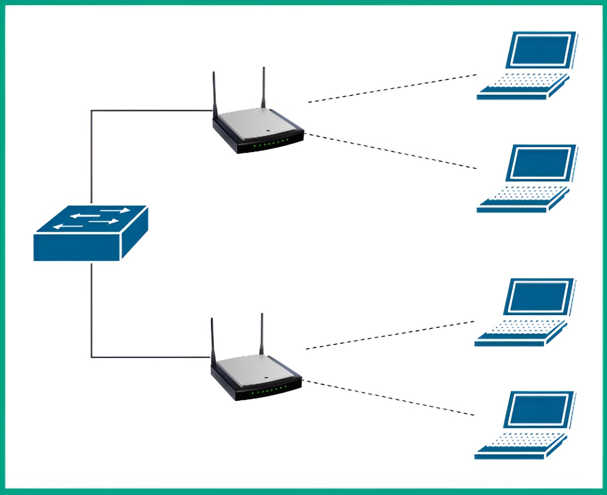

Figure 10.10 – ESS wireless infrastructure

As shown in the preceding diagram, there are two access points that are configured with the same SSID. This allows wireless clients to automatically connect to the access point with the better signal. When a wireless client is disconnecting from one access point and connecting to another, the user will experience a temporary drop in wireless network connectivity until the wireless client re-establishes an association with the new access point.

### 💻 Independent Basic Service Set (IBSS)

An **Independent Basic Service Set (IBSS)** is a wireless network that does **not** use a wireless router or access point. In an IBSS, each wireless client is connected to every other wireless client within the vicinity, creating a wireless mesh network. This type of wireless network allows clients to share their resources directly with another client and is commonly referred to as **ad hoc mode**.

The following diagram shows a typical IBSS wireless network:

  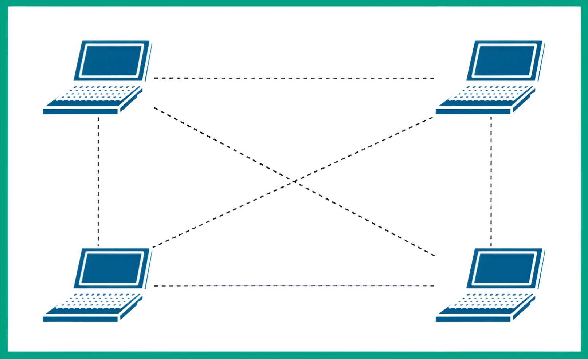

Figure 10.11 – IBSS wireless network

As shown in the preceding diagram, each wireless client, such as a laptop, can be configured to operate as an access point. This allows other wireless clients to connect and share resources with each other without the need for a dedicated wireless router.

---

# 📡 **Antenna Types**

When implementing a wireless infrastructure within an organization, the **placement** of wireless routers and access points is very important. This is to ensure there is proper coverage of the wireless signal for all wireless clients (like laptops and phones) within a building or office space.

If a wireless client is unable to receive an acceptable quality of signal from a wireless router, the transmission speeds for exchanging data will be affected.

Hence, it is important for network professionals to perform a **WLAN survey**. This survey helps to determine the number of access points needed and the specific placement of each access point to ensure there is full coverage for the organization.

There are various types of antennas that are installed on wireless routers and access points. Each type of antenna determines how the signal is focused in a direction.

### 🌎 Omnidirectional Antennas

Omnidirectional antennas **do not focus** the signal in a specific direction. Instead, they emit the signal **all around** the antenna in any direction (like a 360-degree bubble).

**Dipole antennas** are a common example of omnidirectional antennas. These are commonly found within wireless radio devices and mobile cellular towers to send and receive signals in all directions.

The following is a picture of an omnidirectional antenna with an external network adapter:

  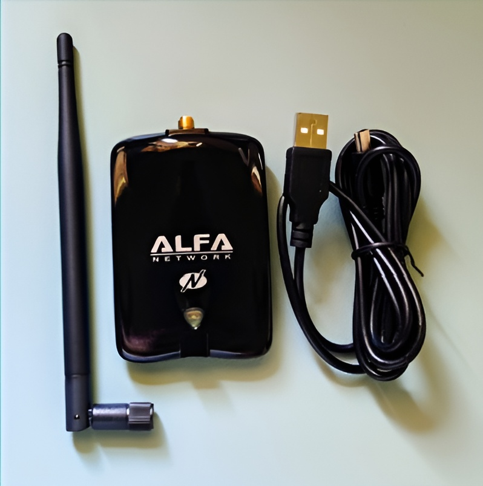

Figure 10.12 – Omnidirectional antenna

### 🎯 Directional Antennas

While omnidirectional antennas work great for providing general signal coverage within a home or office, they are not efficient at focusing a wireless signal in a specific direction.

**Directional antennas** are better at radiating their signal more efficiently in a **single direction** (like a focused beam).

The following are examples of common directional antennas:

  * Yagi antenna
  * Dish antenna
  * Parabolic antenna

Some of the wireless signal may radiate to the sides of the focal point, but a directional antenna still focuses *most* of the signal in a specific direction.

## 🚀 MIMO Concepts

### Single In Single Out (SISO)

Older wireless routers, access points, and wireless network adapters were designed with a **single antenna**. This one antenna was used to both send and receive WLAN frames. This concept was referred to as **Single In Single Out (SISO)**.

The following diagram shows an example of SISO communication between an access point and a client:

  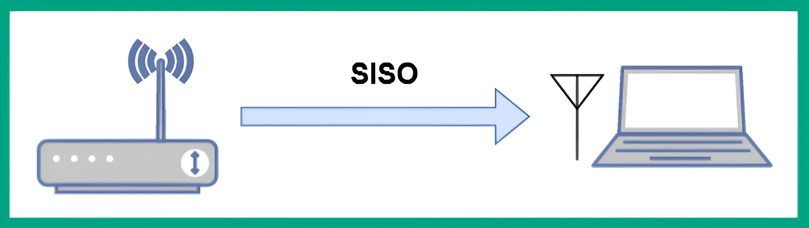

  Figure 10.13 – Observing SISO

As shown in the preceding diagram, both the wireless client and the wireless router are using the same antenna on their devices to send and receive messages. While this allowed devices to communicate, it was not efficient for sending more traffic on the wireless network.

### Multiple In Multiple Out (MIMO)

Wireless device manufacturers began implementing **multiple antennas** on wireless routers, access points, and clients. This allows multiple antennas to send and receive messages **simultaneously**, with the intention of increasing the throughput (speed) of the wireless network. This concept is referred to as **Multiple In Multiple Out (MIMO)**.

The following diagram shows an access point and client using MIMO to exchange messages:

  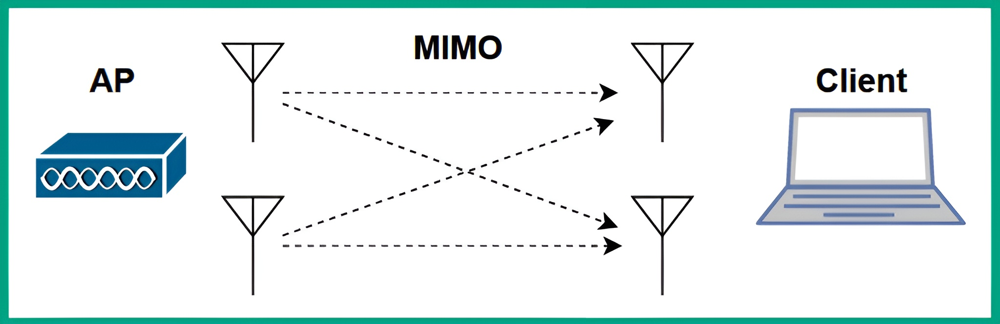

  Figure 10.14 – Observing MIMO

### Single-User MIMO (SU-MIMO)

On a wireless network with multiple wireless clients connected to the same wireless router, the router can only transmit a stream of messages to **one wireless client at a time**. It then talks to the next client, and so on.

Therefore, all wireless clients associated with the same wireless router or access point **do not** receive messages at the same time. This is referred to as **Single-User Multiple In Multiple Out (SU-MIMO)**.

The following diagram shows a representation of SU-MIMO on a wireless network:

  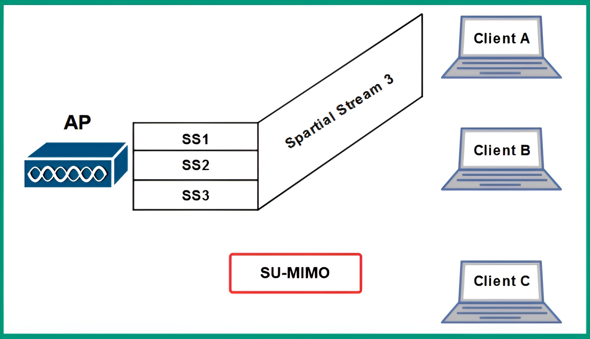

  Figure 10.15 – Observing SU-MIMO

As shown in the preceding diagram, the access point has multiple streams, but it is unable to send the streams to each client at the same time. The access point will forward the stream for each client **one at a time**, ensuring messages are delivered to their destinations as quickly as possible.

### Multi-User MIMO (MU-MIMO)

Wireless networks that use SU-MIMO have the limitation of forwarding a data stream to only one wireless client at a time.

The implementation of **Multi-User Multiple Input Multiple Out (MU-MIMO)** allows a wireless router or access point to forward **all data streams to all wireless clients at the same time**.

The following diagram shows a representation of MU-MIMO on a wireless network:

  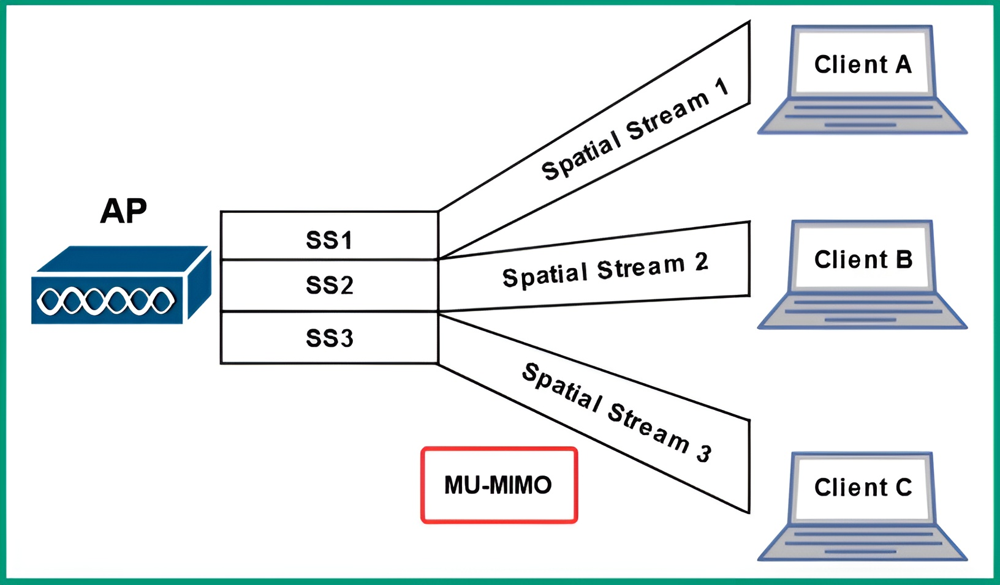

  Figure 10.16 – Observing MU-MIMO

As shown in the preceding diagram, the access point is distributing multiple data streams to each wireless client at the same time.

---

# 🔐 **Delving into Wireless Security**

As an aspiring network professional, it is essential to gain a solid understanding of wireless security. This section covers the concepts and techniques used to improve the security posture of a wireless network within organizations.

Wireless security helps network professionals prevent unauthorized users from accessing resources. It also prevents threat actors, such as hackers, from capturing sensitive data that is exchanged between devices on the wireless network.

As more organizations implement wireless networks to support mobile workforces (using laptops and tablets), hackers are always looking for the "low-hanging fruit." These are the weakest points that can be easily compromised. Wireless networks are a common target because they can be attacked as long as the hacker is within the vicinity of the wireless signal emitting from an access point.

Hence, network professionals must implement proper security solutions and best practices. This reduces the risk of a potential cyber-attack on their systems and network.

## 🛡️ Wireless Encryption Standards

### Wired Equivalent Privacy (WEP)

**Wired Equivalent Privacy (WEP)** was one of the first generations of wireless security standards, implemented on IEEE 802.11b wireless networks. The WEP standard used the **Rivest Cipher 4 (RC4)** encryption algorithm to ensure confidentiality. However, many unresolved security vulnerabilities were found within RC4, allowing threat actors to easily compromise WEP-secured networks.

> #### Key Points of WEP
>
>   * It uses a weak encryption algorithm (RC4).
>   * It uses a small **Initialization Vector (IV)** that is static and does not change. This increases the likelihood of a threat actor determining the IV value.
>   * It uses 64-bit and 128-bit key sizes during the data encryption process.
>   * It uses the RC4 stream cipher for data encryption.
>   * It provides a 24-bit Cyclic Redundancy Checksum (CRC) for integrity checking.

### Wi-Fi Protected Access (WPA)

The **Wi-Fi Protected Access (WPA)** wireless security standard became the successor to WEP. WPA used a 128-bit key to perform data encryption on each frame by using the **RC4** algorithm combined with the **Temporal Key Integrity Protocol (TKIP)**.

TKIP ensures each WLAN frame is encrypted with a unique key before transmission. It inserts a sequence counter within each frame, which prevents a threat actor from performing a replay attack.

While WPA is using RC4 with TKIP, there are security vulnerabilities within both algorithms that allow hackers to easily compromise WPA wireless networks. Additionally, WPA provides a 48-bit CRC with a Message Integrity Check (MIC) for integrity checking for each WLAN frame.

> #### Key Points of WPA
>
>   * It uses a weak encryption algorithm (RC4).
>   * It uses **TKIP** to encrypt each frame with a unique key.
>   * It uses 128-bit keys during the data encryption process.
>   * It provides a 48-bit CRC for data integrity.

### Wi-Fi Protected Access 2 (WPA2)

**Wi-Fi Protected Access 2 (WPA2)** is the successor to WPA. WPA2 uses the **Counter Mode with Cipher Block Chaining Message Authentication Code Protocol (CCMP)**, which is implemented within the **Advanced Encryption Standard (AES)** data encryption algorithm.

CCMP allows AES to encrypt data within 128-bit blocks with a 128-bit key size. AES with CCMP is much stronger and prevents hackers from decrypting messages exchanged over WPA2 wireless networks.

### Wi-Fi Protected Access 3 (WPA3)

**Wi-Fi Protected Access 3 (WPA3)** is currently the strongest and latest wireless security standard. It uses **Simultaneous Authentication of Equals (SAE)** for data encryption.

When WPA3 is implemented on personal networks, it uses a 128-bit key; on enterprise networks, it uses a 192-bit key.

Many new wireless routers and access points support WPA3. However, many wireless clients still only support up to WPA2. WPA3 supports backward compatibility for these clients, but the wireless router will **scale down** its security standard from WPA3 to WPA2 to support them. As a result, the network inherits all the security vulnerabilities of the older WPA2 standard, such as brute force attacks.

## 🔑 Authentication Methods

After configuring the wireless security standard, it is important to configure the authentication method. This defines how the wireless router or access point will validate an authorized client before allowing access to the network.

### Pre-Shared Key (PSK)

**Pre-Shared Key (PSK)** allows a network professional to configure a password or passphrase on the wireless router. This password is then shared with all authorized users.

  * When using PSK, all authorized users know and share the same key.
  * A problem with this method is that if the key is shared with someone who is no longer authorized, that user will still be able to access the network (provided the network professional has not changed the key).

### Enterprise (IEEE 802.1X / AAA)

Enterprise is another authentication method that allows network professionals to implement **IEEE 802.1X** for Network Access Control (NAC). This is done using an **Authentication, Authorization, and Accounting (AAA)** server.

  * **Authentication:** The AAA server allows network professionals to create a unique user account for each authorized user on the centralized server.
  * **Authorization:** The professional can configure authorization security policies on each user account that define the user’s privilege level.
  * **Accounting:** The AAA server can create log messages for each activity performed by an authenticated user, providing accountability.

The following diagram shows an enterprise network topology including an AAA server.

  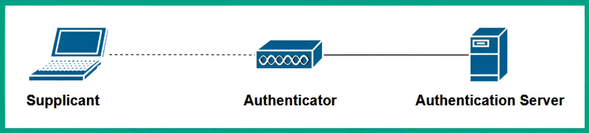

Figure 10.17 – AAA on an enterprise network

As shown in the preceding diagram:

  * The **Supplicant** is the wireless client (e.g., laptop) that wants to join the network.
  * The **Authenticator** is the wireless router or Access Point.
  * The **Authentication Server** is the centralized AAA server.

In this wireless infrastructure, each authorized user is assigned unique user credentials, allowing for better user management.

> #### 📝 Important Note
>
> The authentication server can use either the **Remote Authentication Dial-In User Service (RADIUS)** or **Terminal Access Controller Access Control System+ (TACACS+)** protocol.
>
>   * **RADIUS** is an open authentication protocol that is interoperable with different vendor devices.
>   * **TACACS+** is a Cisco proprietary protocol that works with Cisco devices only.

### Open Authentication

**Open authentication** is the default method on many wireless routers and access points.

  * This method provides **no authentication** and allows *any* wireless device to connect and access resources on the wireless network.
  * Additionally, this method provides **no data encryption** between the client and the router.
  * Many public wireless networks use open authentication to allow anyone in public to access the internet. This authentication method is **not recommended** for organizations.

### Wi-Fi Protected Setup (WPS)

**Wi-Fi Protected Setup (WPS)** is an unsecure authentication method that was designed to eliminate the need to manually configure a password.

  * WPS simply provides an easy method to connect by pressing the physical WPS button on the wireless router and enabling the WPS feature on the client.
  * Both devices will exchange a mutual 8-digit key, allowing the client to be authenticated.
  * While this seems convenient, it is **highly unsecure**. The 8-digit PIN generated by the wireless router can be easily retrieved by hackers. It is recommended to **disable WPS** whenever possible.

### Captive Portal

A **captive portal** is simply a web-based portal (a web page) that prompts a user on a wireless client to provide their user credentials when they connect to a wireless network. Captive portals are commonly implemented by network professionals within hotels and coffee shops.

---