# 📊 Network Performance Metrics

Performance metrics help network professionals within the industry to determine whether their network is operating as expected or if the delivery of network resources is affected. Network professionals use various tools and processes to collect data about the network.

This data is then used for analysis and to generate reports that indicate the actual performance of the network. These statistics are recorded and commonly used to compare the current performance with past results. This comparison helps a network professional determine whether the current performance of the network is within the expected operating state or abnormal.

The following are some common performance metrics that are used to determine whether a networking device is operating as expected or whether there is a potential issue:

  * 🌡️ Temperature
  * 💻 Central Processing Unit (CPU) utilization
  * 🧠 Memory utilization
  * 📈 Bandwidth
  * ⏱️ Latency
  * 📉 Jitter

### 🌡️ Temperature

Networking devices are continuously operating, processing, and forwarding messages to their destinations as quickly as possible over the network. Each day, during peak hours within an organization, all employees are accessing the network, and devices are handling a lot of network traffic every second.

The more load that is being processed by a networking device, the more computing power is utilized to quickly process and forward the messages. This increases the temperature of each device within the organization.

Network professionals commonly implement internal and/or external sensors with devices to closely monitor temperature changes.

  * If the temperature is **too hot** or above normal, it can be an early warning of excessive utilization or a possible hardware issue on the device. Sometimes, if the operating system of a device detects that the temperature is too hot, it will automatically turn off the device to prevent hardware failure.
  * However, if the temperature is **too low**, condensation can appear on the electronic components of the device.

### 💻 Central Processing Unit (CPU) Utilization

Another common performance metric is **CPU utilization** on networking devices, security appliances, and servers. The CPU is simply the brain of the device that performs computational tasks.

When devices such as routers and switches perform a lot of transactions and make forwarding decisions for thousands of messages, CPU usage will gradually increase as more tasks are being performed on the device. As the CPU utilization increases closer to 100%, the device will not be able to handle newer processes or perform additional computation tasks.

Hence, if a network professional notices a networking device is not forwarding traffic as quickly as expected, they should check the CPU utilization to determine whether the computing power of the device is being exhausted; this may be a factor that is causing lower performance of the device.

### 🧠 Memory Utilization

The more memory that is available on a device allows the user to execute and run more applications simultaneously on a host. Networking devices contain built-in memory modules that function as **Random Access Memory (RAM)**, allowing a limited number of applications to utilize the available amount of memory.

Whenever messages are received on a networking device, they are stored within a buffer as the operating system processes each message before forwarding them to their destinations. Additionally, the available memory on a networking device affects the performance of how quickly messages are processed and forwarded to their destination. If there isn’t enough available memory on a networking device, it’s usually an indication of a fatal event that has occurred and requires immediate attention.

The following screenshot shows the CPU and memory utilization of a switch on a network:

  

  Figure 11.1 – CPU and memory utilization

As shown in the preceding screenshot, this network monitoring tool visualizes the CPU and memory utilization of a network switch within an organization.

### 📈 Bandwidth

The network **bandwidth** is simply the total amount of packets that can be transferred from a source device to a destination device within a given time. There are many factors involved when determining the network bandwidth, such as the Ethernet standards of networking cables, interfaces on networking devices, and the ports on end devices.

Observing the bandwidth utilization and the types of traffic on a network helps network professionals collect and analyze the overall performance of the actual network and discover any problems such as congestion, latency, and physical issues, or even whether a security threat exists.

Various techniques are commonly used to collect and analyze network traffic, such as the following:

  * Simple Network Management Protocol (SNMP)
  * NetFlow
  * IP Flow Information Export (IPFIX)

Using these methods to collect network traffic, network professionals can perform protocol analysis to determine whether there are any issues on the network, as well as the source of the issue.

### ⏱️ Latency

**Latency** is simply the measurement of time between a request and response over a network. If users are reporting they are experiencing slow response times between their device and a server, there can be many possible causes.

However, network professionals commonly capture network traffic between the source of the issues (the user’s end) and the destination on the network. Once the traffic is captured, they perform packet analysis to examine the response times between various network segments to isolate the affected area of the network. Once the affected area has been identified, they can further examine the latency and look for any indication of changes within each packet, such as faulty packets or packets that are being retransmitted on the network.

The following screenshot shows a chart from a network monitoring tool indicating the average response time and packet loss on a network switch within an organization:

  

  Figure 11.2 – Observing the response time and packet loss

As shown in the preceding screenshot, network monitoring tools help network professionals easily identify whether their devices are experiencing abnormal response times and packet loss. Furthermore, network monitoring tools can collect and archive data, which allows network professionals to reference historical data for any current issues or measure the performance of the network.

### 📉 Jitter

Furthermore, **jitter** is another common performance metric that is closely monitored by network professionals. Jitter measures the **variation of delay times** of incoming packets on a network.

For instance, on an optimal network, all packets that are received from the same sender should have the same latency. However, jitter increases on the network as users are sending and receiving messages and saturating the network. Voice over IP (VoIP) and Video over IP solutions transport real-time media traffic over the network. Inconsistency between a source and destination can create a bad experience for the end user who is using a VoIP phone or video-conferencing application.

The following screenshot was taken from a network monitoring tool that’s reporting the response time and packet loss on a switch:

  

  Figure 11.3 – Networking monitoring of latency and packet loss

As shown in the preceding screenshot, network monitoring tools provide easy-to-understand visualizations for network professionals to quickly determine whether the device is overwhelmed or not.

---

# 📡 Simple Network Management Protocol (SNMP)

**Simple Network Management Protocol (SNMP)** is a common network protocol that allows network professionals to easily monitor devices within their organization. Network professionals usually configure their networking devices so that they can communicate with an **SNMP Manager** application. This application is either installed on their computer or on a centralized server on the network.

The SNMP Manager allows the network professional to:

  * Easily collect statistical data from devices on the network.
  * Retrieve device statuses.
  * Push configuration changes to network devices.

## 📜 SNMP Versions

There are different versions of SNMP, as follows:

  * **SNMPv1**: Does not support any security such as data encryption or authentication, hence it’s not recommended for use.
  * **SNMPv2**: This version of SNMP is an improvement on how SNMP handles communication between the SNMP Manager and SNMP Agent, but this version does not support data encryption or authentication. Hence, it’s not recommended for use.
  * **SNMPv3**: This version of SNMP is an improvement on prior versions and supports **data encryption, integrity checking, and authentication**.

## 🧩 Components of a Network Management System (NMS)

When working with SNMP, three main components need to work together to create a Network Management System (NMS):

1.  **SNMP Manager**
2.  **SNMP Agent**
3.  **Management Information Base (MIB)**

### 1\. SNMP Manager

The **Manager** is an application that’s installed on the network professional’s computer or centrally on a server. The Manager is responsible for collecting information and making configurations on devices that are running an agent.

  * **SNMP GET Message**: The manager can retrieve information from agents on the network by sending an **SNMP GET** message. This instructs the agent to respond with the requested information.
  * **SNMP SET Message**: The manager sends an **SNMP SET** message to an agent when configuration changes are needed.

### 2\. SNMP Agent

The **SNMP Agent** is configured on a networking device, such as a switch or router. The SNMP agent is the actual component on the networking device that communicates with the SNMP manager application and vice versa.

  * **SNMP TRAP Message**: **Trap** data units are sent *from* the Agent *to* the Manager. They contain data about changes or events that occurred on the device (for example, an interface going down) and only send this information when a threshold has been met. Using traps greatly decreases network management bandwidth.

The following diagram shows a simple representation of these SNMP messages on a network:

  

  Figure 11.4 – SNMP messages

### 3\. Management Information Base (MIB)

The **MIB** is a database that contains the information needed by the agent to find and retrieve data from a device.

Simply put, the process works like this:

1.  A network professional uses the **Manager** to retrieve information.
2.  The **SNMP agent** on the device receives the request.
3.  The agent uses the **MIB** to locate the requested information within the networking device.
4.  The agent responds to the **Manager** with the collected data.

---

# 📜 Network Device Logs

Networking devices, security appliances, servers, and end devices commonly generate **logs**. These are records of every event that has occurred on the device.

Network professionals depend on the logs created by a device to determine the reason for an event. For instance, imagine if an organization experienced a network outage for a few minutes during the night. The networking devices will generate log messages for each event that occurred, including the timestamps and a description of the event.

Network professionals can observe the logs before, during, and after the event from various devices within the affected area of the network. This helps them determine the reason for the outage and the probable causes.

Logs are a great way to ensure proper accountability of events and actions on a network. Without network device logs, it is quite challenging to determine the reasons for events that occurred on a network.

The following screenshot shows various logs from networking devices within an organization:

  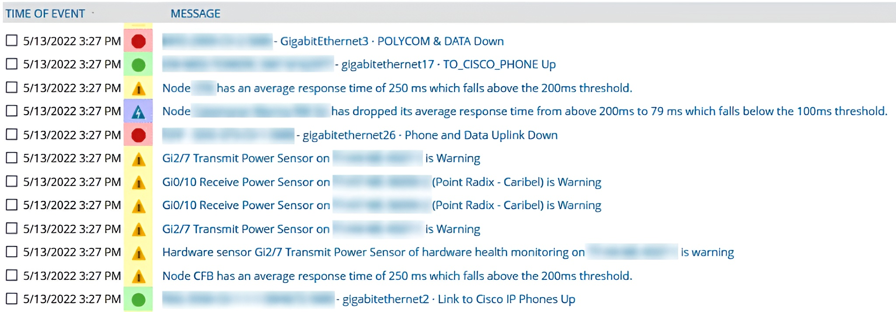

Figure 11.5 – Device logs

As shown in the preceding screenshot, various log messages contain timestamps, severity levels, and descriptions of the events displayed. As an aspiring network professional, it is important to monitor network changes and device logs closely to determine whether there are any issues or potential problems within your organization.

## 📈 Traffic Logs

**Traffic logs** contain information and details about the traffic that flows between devices on a network. They allow network professionals to see a summary of all the traffic for a given time, contain specific details, and are commonly used for post-event analysis.

For instance, network professionals can use network monitoring tools to view the past traffic pattern of a network, allowing you to compare past and present events.

The following screenshot shows a traffic log graph of a network switch over 24 hours:

  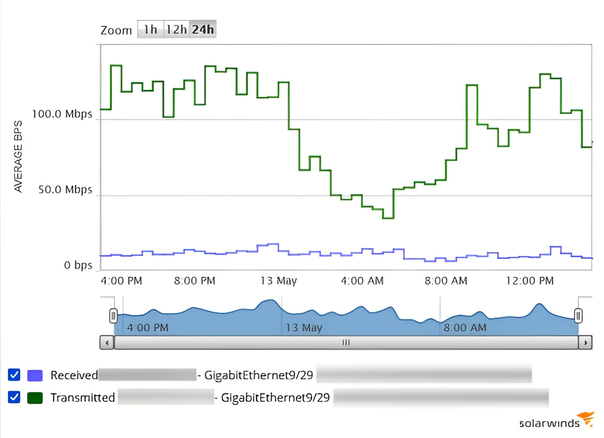

  Figure 11.6 – Traffic log graph

As shown in the preceding screenshot, the graph shows the traffic patterns of a network switch over 24 hours. This allows a network professional to determine which time of day the network segment is mostly utilized and the average bandwidth that is being used on a daily, monthly, or annual basis.

## 🛡️ Audit Logs

**Audit logs** are common for determining specific information about **who, what, and when** an event occurred. For instance, audit logs help network professionals determine who accessed resources and what resources were accessed, the source and destination addresses, the timestamp of the event, and user information.

The following screenshot shows the security audit logs for a Windows 11 operating system:

  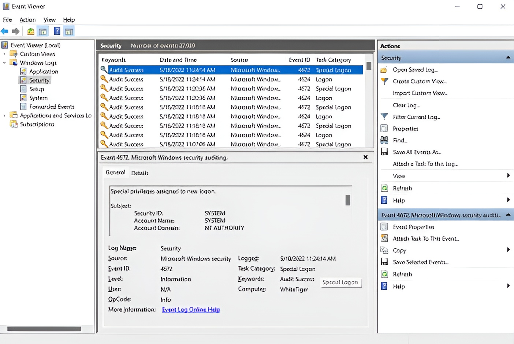

  Figure 11.7 – Audit logs

As shown in the preceding screenshot, the audit logs are created on the device for every successful and unsuccessful logon attempt and special access event.

## 📨 Syslog Protocol

Networking devices, servers, and even end devices generate log messages that contain information and critical details about events that occur. Network professionals use the information found within log messages to identify whether a problem has occurred and what caused the problem.

Since each networking device generates a log message, this means a network professional would need to manually log into a device to view the logs for that device only. This process can be very time-consuming and inefficient.

Many networking devices, servers, and end devices support a common network protocol that allows them to forward their log messages over a network to a **centralized logging server**. This protocol is known as **Syslog**.

The syslog protocol allows devices to generate logs for events that occur on a device. For instance, if an interface on a router has been disabled or enabled, a syslog message is created that contains all the necessary information about the event.

### Syslog Message Format

The following is the default format of a syslog message that is generated by Cisco devices:

`seq no: timestamp: %facility-severity-MNEMONIC: description`

The following is a breakdown of each component of a Syslog message:

  * **seq no**: Represents the sequence number that is assigned to the log message.
  * **timestamp**: Includes the date and time the message was generated by the device. The date and timestamp are taken from the system clock on the host device.
  * **facility**: Represents what the log message is referencing regarding the event that has occurred, such as the source of the problem or protocol.
  * **severity**: Includes a severity code that helps network professionals determine the importance of the event.
  * **MNEMONIC**: Inserts text that is uniquely used to describe the event.
  * **description**: Contains a brief description of the event.

### Syslog Message Example

The following is an example of a Syslog message generated by a Cisco device:

`*Apr 28, 15:53:58.5353: %LINEPROTO-5-UPDOWN: Line protocol on Interface GigabitEthernet0/1, changed state to up`

Here is a breakdown of this example:

  * **`Apr 28, 15:53:58.5353`**: This is the `timestamp`.
  * **`%LINEPROTO`**: This is the `facility`, indicating the event is related to a line protocol.
  * **`-5-`**: This is the `severity` level (Notification).
  * **`UPDOWN`**: This is the `MNEMONIC`, describing the *type* of event.
  * **`Line protocol on Interface GigabitEthernet0/1, changed state to up`**: This is the `description`, providing clear details of the event.

### Syslog Severity Levels

The following table contains the Syslog severity levels, their names, and descriptions:

| Severity Name | Severity Level | Description |
| :--- | :---: | :--- |
| Emergency | 0 | System is unusable |
| Alert | 1 | Immediate action is needed |
| Critical | 2 | Critical condition |
| Error | 3 | Error condition |
| Warning | 4 | Warning condition |
| Notification | 5 | Normal but significant condition |
| Informational | 6 | Informational message |
| Debugging | 7 | Debugging message |

  

  Figure 11.8 – Syslog severity levels

### Syslog Operation

The Syslog protocol uses **UDP service port number 514** by default over a network. Keep in mind that Syslog is used to gather logging information that helps network professionals with monitoring and troubleshooting issues within an organization. Syslog allows network professionals to configure devices so that they can send their log messages to a specific logging destination, such as a **centralized logging server**.

The following screenshot shows a collection of Syslog messages on a centralized logging server:

  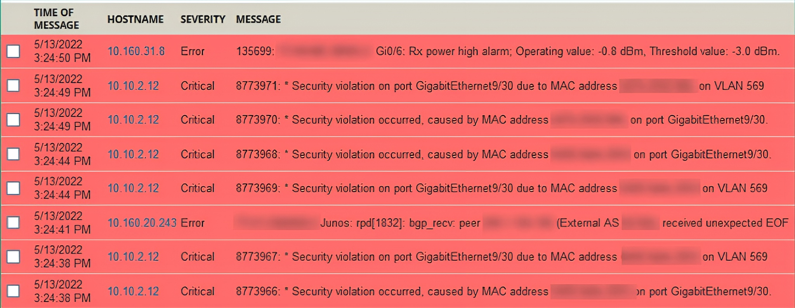

  Figure 11.9 – Log messages

As shown in the preceding screenshot, the centralized logging server collects all the log messages from various devices on the network. It can also perform both **de-duplication** (grouping identical messages) and **correlation** (linking related events). This helps network professionals easily determine the sequence of events that occurred on the network.

Having completed this section, you have learned about the importance of monitoring a network and using various metrics to measure network performance. In the next section, you will understand how to identify interface issues on devices.

---

# 🖥️ Understanding Interface Issues

Network professionals can log into a networking device, such as a switch or router, and check the status of each physical and logical interface on the device. By checking the interface’s status, network professionals can quickly determine whether an interface has been misconfigured or is experiencing a physical issue. This may result in connectivity issues between the sender and receiver devices on the network.

In the following subsections, you will explore various status types that are used to identify a network-related issue on a device.

## 📊 Checking the Link State (Up/Down)

If the link state is **up**, it is an indication that the interface of a device is active and can both send and receive messages.

### On Cisco IOS

The `show interfaces` command on Cisco IOS switches and routers allows network professionals to determine the status of an interface, as shown here:

  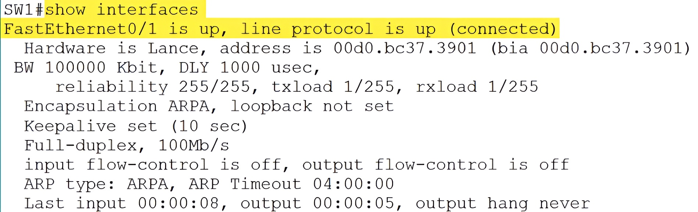

  Figure 11.10 – Verifying the link’s status

As shown in the preceding screenshot, **FastEthernet0/1** has an **up/up** status. This indicates the interface can send and receive messages, and a network cable is physically connected.

Additionally, the `show ip interface brief` command allows network professionals to obtain a summary of all interfaces on Cisco IOS switches and routers.

The following screenshot shows the output of the `show ip interface brief` command on a Cisco router:

  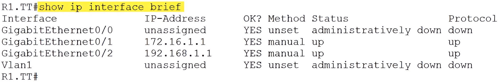

  Figure 11.11 – Checking all the interfaces on a Cisco router

As shown in the preceding screenshot, a network professional can determine whether an interface is assigned an IP address and check the physical (`Status`) and logical (`Protocol`) status of the interface on the Cisco router.

### On Windows OS

Furthermore, on a Windows operating system, the `netsh interface ipv4 show interface` and `netsh interface ipv6 show interface` commands allow you to see the status of all the interfaces on the device.

The following screenshot shows the IPv4 interface statuses on a Windows 11 computer:

  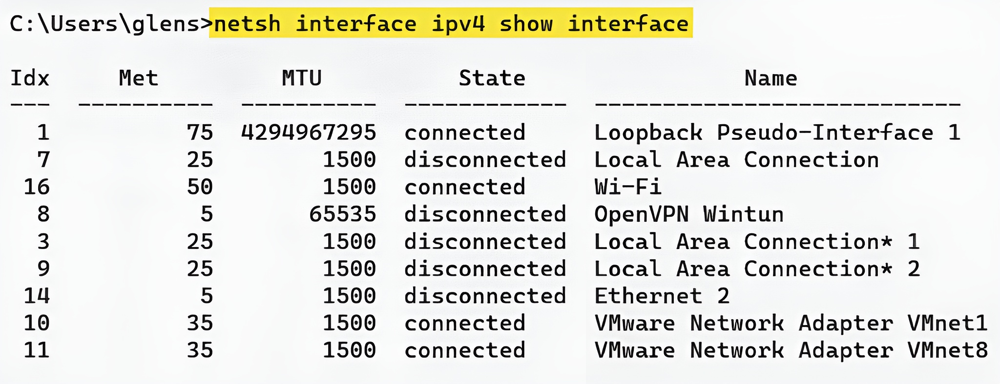

  Figure 11.12 – Checking IPv4 interface statuses

The following screenshot shows the IPv6 interface statuses on a Windows 11 computer:

  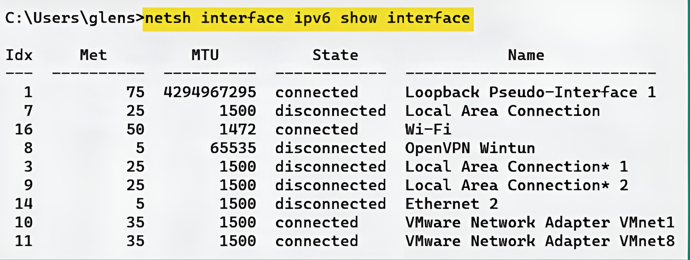

  Figure 11.13 – Checking IPv6 interface statuses

### On Linux OS

On the Linux operating system, the `ip link show` command allows you to see the statuses of all interfaces on the device, as shown here:

  

  Figure 11.14 – Checking interface statuses on Linux

The following screenshot shows the output of the `ip addr` command:

  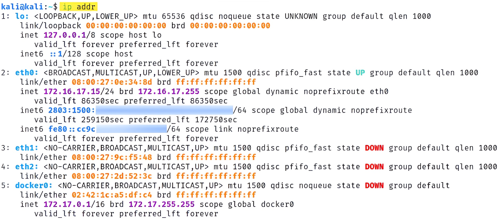

  Figure 11.15 – Checking IP addresses

As shown in the preceding screenshot, a network professional can determine the status of all the interfaces on systems running Linux-based operating systems.

## 🏎️ Checking the Speed

The speed of an interface indicates how quickly a device can send and receive messages on that same interface. There are various types of interfaces on a networking device:

  * **Ethernet**: Operates up to 10 Mbps
  * **FastEthernet**: Operates up to 100 Mbps
  * **GigabitEthernet**: Operates up to 1,000 Mbps

It is important to ensure the speed configurations match on devices that are connected.

### On Cisco IOS

The following screenshot shows the current operating speed on the interface of a Cisco switch:

  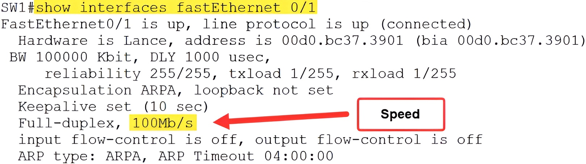

  Figure 11.16 – Verifying the speed of an interface

### On Windows OS

However, on a Windows operating system, to verify the speed of the local interfaces, you must open **Device Manager**, right-click on the interface, and select the **Properties | Advanced** tab, as shown here:

  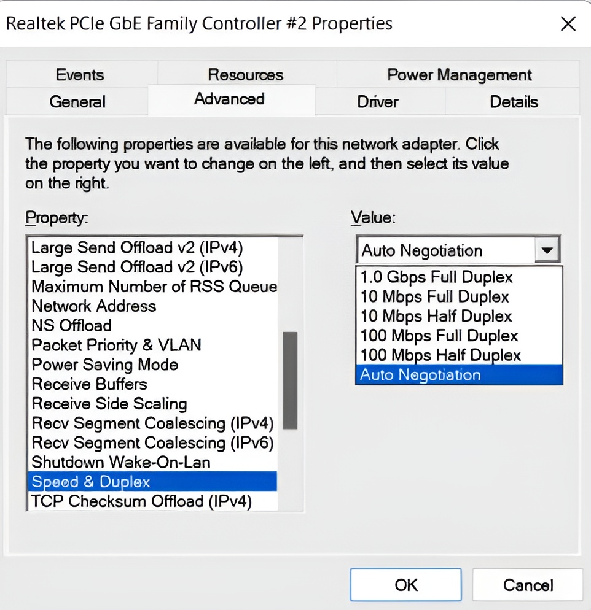

  Figure 11.17 – Verifying the speed on Windows

As shown in the preceding screenshot, a network professional can manually configure the speed and duplex settings on the interface of the device.

## 🔄 Checking the Duplex

**Duplex** is referred to as the common method where two devices are able to exchange messages. The duplex of an interface is usually set as **Auto** by default, but a network professional can manually configure the interface to operate in **full** or **half** duplex.

### On Windows OS

To configure the duplex mode on a Windows operating system, open **Device Manager**, right-click on the interface, and select the **Properties | Advanced** tab, as shown here:

  

  Figure 11.18 – Checking the duplex settings

### On Cisco IOS

On Cisco devices, the `show interface status` and `show interfaces` commands verify the current state of the duplex on the interface, as shown here:

  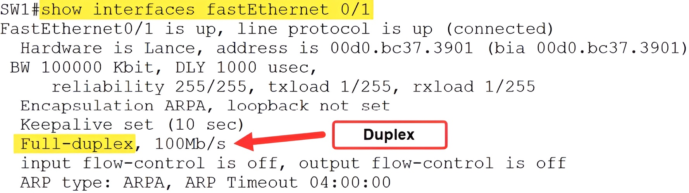

  Figure 11.19 – Verifying the duplex status on a Cisco switch

As shown in the preceding screenshot, network professionals can easily verify the current duplex status of an interface on Cisco switches on a network.

## ⏳ Checking the Uptime/Downtime

Checking the device's **uptime** can help networking professionals determine whether the device loses power at a certain time. If a device loses power unexpectedly, this should raise concerns for the network professionals.

### On Cisco IOS

On Cisco devices, the `show version` command provides the device’s uptime, as shown here:

  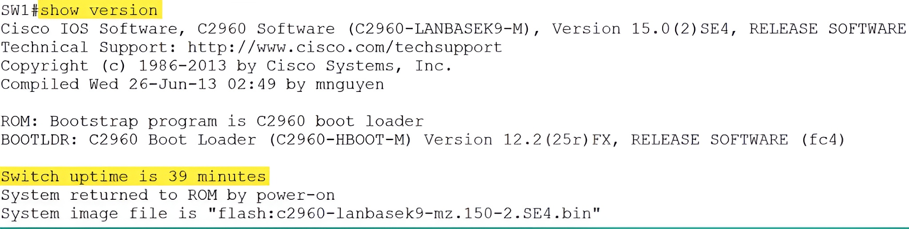

  Figure 11.20 – Checking the uptime

As shown in the preceding screenshot, the uptime reveals that the network switch has been running/powered on for the past 39 minutes. If a power outage occurs or the device loses power, the uptime will be reset. Therefore, network professionals can use the uptime on a networking device to determine whether a network outage was due to power loss within their organization.

## 📉 Interface Errors or Alerts

What if network professionals configure the networking devices with the proper configurations but still experience **packet loss** and **high latency**? What could be the cause of this?

Faulty network cables and interfaces are the most common causes of physical issues on a network. However, before changing the network cable or reassigning an interface, it’s important to understand the types of errors and alerts that are created by a networking device.

The following screenshot shows the interface statistics of a Cisco switch:

  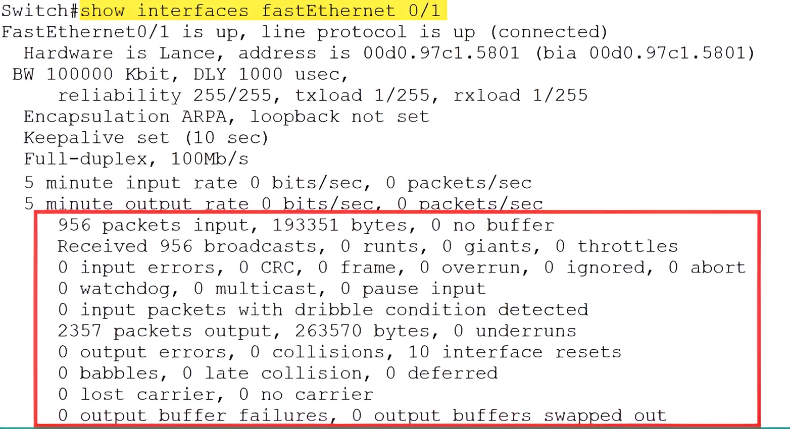

  Figure 11.21 – Interface statistics

As shown in the preceding screenshot, there is a lot of statistical information within the lower section of the output. This includes the number of packets that have entered the interface and the number of broadcast messages, along with a lot of details that are important to network professionals.

The following list describes each interface error type:

  * **Input errors**: The input errors field indicates the total number of errors that were identified on the interface. These errors include the sum of the frame, giants, no buffer, runts, Cyclic Redundancy Check (CRC), overrun, and any ignored counts.
  * **Runts**: Runts are simply any packets that are discarded by the device because they are **less than 64 bytes** in size. These are sometimes caused due to a network collision between two devices.
  * **Giants**: Giants are any packets that are discarded because they are **greater than 1,518 bytes** in size. Giants are usually caused by communication issues on the network.
  * **CRC (Cyclic Redundancy Check)**: CRC errors are created when the checksum value within the trailer of a frame does not match the checksum generated by the receiver. If a mismatch in the checksum occurs, the integrity of the message is compromised. Additionally, CRC errors are often caused by a faulty network cable or interface.
  * **Output errors**: Output errors are simply the total amount of all errors that prevent the transmission of any datagram from leaving the interface of the device.
  * **Collisions**: Collisions are the total number of messages that were retransmitted because an Ethernet collision had occurred.
  * **Late collisions**: Late collisions are any collisions that were detected after the first 512 bytes of the frame were transmitted.

### Encapsulation Errors

Additionally, there are **encapsulation errors**. These are caused by inconsistent configurations between switches, such as a mismatch in the trunking encapsulation protocol (e.g., **IEEE 802.1Q** on one switch and **Inter-Switch Link (ISL)** on the other).

ISL is a legacy Cisco proprietary trunking encapsulation protocol that allows Cisco switches to create a logical trunk link between themselves. However, ISL is not commonly implemented in Cisco environments, and IEEE 802.1Q is currently being used as the preferred encapsulation protocol for trunk links between switches.

Hence, it’s important to ensure that if two switches are interconnected, the encapsulation protocol is the same between both devices.

Having completed this section, you have learned about various types of interface errors, their possible causes, and how to resolve them. In the next section, you will discover how environmental factors can affect the performance of network devices.

# 🌡️ Environmental Factors and Sensors

Environmental factors can affect the performance of network devices and servers within an organization. Network professionals commonly configure and implement both software- and hardware-based sensors to detect **temperature**, **humidity**, and **electrical power** changes on devices.

  * **Temperature**: If the temperature of a device is **too hot**, the operating system will automatically shut down to prevent physical damage to the hardware components. Hence, networking devices and security appliances need proper cooling to ensure they continue to operate as expected.
  * **Humidity**: The humidity of the server room or network closet needs to be closely monitored.
      * If the humidity is **too low**, static discharges can occur, which can damage hardware components.
      * However, if the humidity is **too high**, there will be a lot of water vapor in the air. This creates condensation, which is bad for electrical and electronic components.

Overall, a **heating, ventilation, and air conditioning (HVAC)** system is usually implemented to maintain and control the airflow and temperature within data centers, server rooms, and network closets to ensure devices are properly cooled.

The following are additional sensors that are commonly implemented:

  * **Electrical sensors**: Monitors a device’s circuit load (power).
  * **Flood monitor**: Monitors whether there’s water in the room.
  * **NetFlow data**: This is a standard for collecting network statistics to determine the performance of the network. NetFlow uses a probe and a collector, where the probe watches network communication and the summary is sent to the collector.

Having completed this section, you have learned about the importance of monitoring environmental factors within a network to ensure its optimal performance within an organization.

---