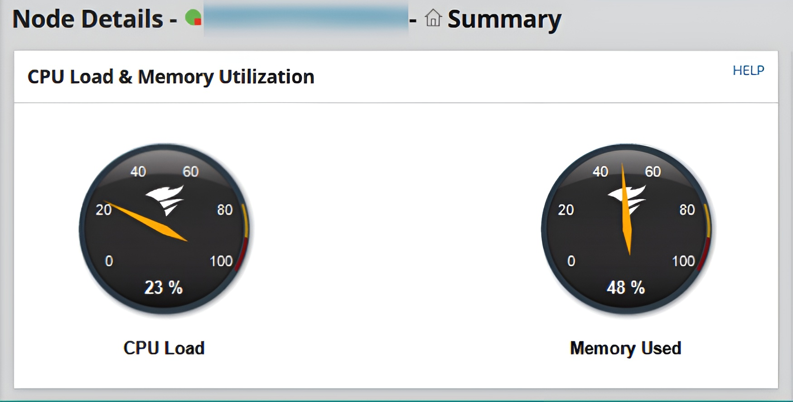
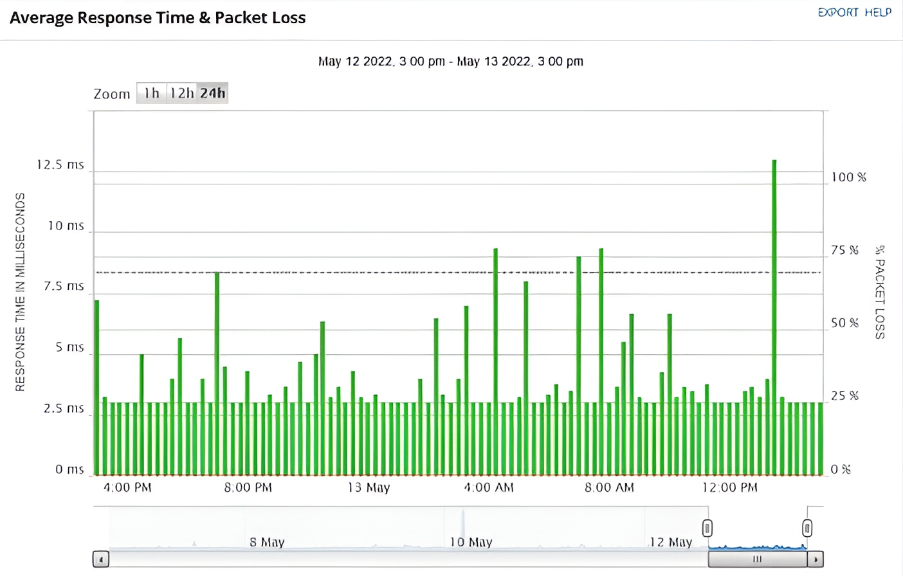
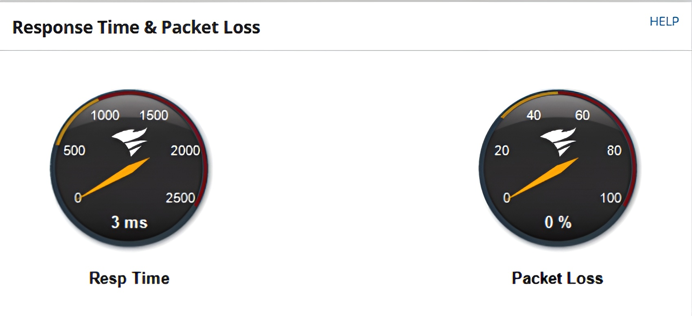

# 📊 Network Performance Metrics

Performance metrics help network professionals within the industry to determine whether their network is operating as expected or if the delivery of network resources is affected. Network professionals use various tools and processes to collect data about the network.

This data is then used for analysis and to generate reports that indicate the actual performance of the network. These statistics are recorded and commonly used to compare the current performance with past results. This comparison helps a network professional determine whether the current performance of the network is within the expected operating state or abnormal.

The following are some common performance metrics that are used to determine whether a networking device is operating as expected or whether there is a potential issue:

  * 🌡️ Temperature
  * 💻 Central Processing Unit (CPU) utilization
  * 🧠 Memory utilization
  * 📈 Bandwidth
  * ⏱️ Latency
  * 📉 Jitter

### 🌡️ Temperature

Networking devices are continuously operating, processing, and forwarding messages to their destinations as quickly as possible over the network. Each day, during peak hours within an organization, all employees are accessing the network, and devices are handling a lot of network traffic every second.

The more load that is being processed by a networking device, the more computing power is utilized to quickly process and forward the messages. This increases the temperature of each device within the organization.

Network professionals commonly implement internal and/or external sensors with devices to closely monitor temperature changes.

  * If the temperature is **too hot** or above normal, it can be an early warning of excessive utilization or a possible hardware issue on the device. Sometimes, if the operating system of a device detects that the temperature is too hot, it will automatically turn off the device to prevent hardware failure.
  * However, if the temperature is **too low**, condensation can appear on the electronic components of the device.

### 💻 Central Processing Unit (CPU) Utilization

Another common performance metric is **CPU utilization** on networking devices, security appliances, and servers. The CPU is simply the brain of the device that performs computational tasks.

When devices such as routers and switches perform a lot of transactions and make forwarding decisions for thousands of messages, CPU usage will gradually increase as more tasks are being performed on the device. As the CPU utilization increases closer to 100%, the device will not be able to handle newer processes or perform additional computation tasks.

Hence, if a network professional notices a networking device is not forwarding traffic as quickly as expected, they should check the CPU utilization to determine whether the computing power of the device is being exhausted; this may be a factor that is causing lower performance of the device.

### 🧠 Memory Utilization

The more memory that is available on a device allows the user to execute and run more applications simultaneously on a host. Networking devices contain built-in memory modules that function as **Random Access Memory (RAM)**, allowing a limited number of applications to utilize the available amount of memory.

Whenever messages are received on a networking device, they are stored within a buffer as the operating system processes each message before forwarding them to their destinations. Additionally, the available memory on a networking device affects the performance of how quickly messages are processed and forwarded to their destination. If there isn’t enough available memory on a networking device, it’s usually an indication of a fatal event that has occurred and requires immediate attention.

The following screenshot shows the CPU and memory utilization of a switch on a network:

  

  Figure 11.1 – CPU and memory utilization

As shown in the preceding screenshot, this network monitoring tool visualizes the CPU and memory utilization of a network switch within an organization.

### 📈 Bandwidth

The network **bandwidth** is simply the total amount of packets that can be transferred from a source device to a destination device within a given time. There are many factors involved when determining the network bandwidth, such as the Ethernet standards of networking cables, interfaces on networking devices, and the ports on end devices.

Observing the bandwidth utilization and the types of traffic on a network helps network professionals collect and analyze the overall performance of the actual network and discover any problems such as congestion, latency, and physical issues, or even whether a security threat exists.

Various techniques are commonly used to collect and analyze network traffic, such as the following:

  * Simple Network Management Protocol (SNMP)
  * NetFlow
  * IP Flow Information Export (IPFIX)

Using these methods to collect network traffic, network professionals can perform protocol analysis to determine whether there are any issues on the network, as well as the source of the issue.

### ⏱️ Latency

**Latency** is simply the measurement of time between a request and response over a network. If users are reporting they are experiencing slow response times between their device and a server, there can be many possible causes.

However, network professionals commonly capture network traffic between the source of the issues (the user’s end) and the destination on the network. Once the traffic is captured, they perform packet analysis to examine the response times between various network segments to isolate the affected area of the network. Once the affected area has been identified, they can further examine the latency and look for any indication of changes within each packet, such as faulty packets or packets that are being retransmitted on the network.

The following screenshot shows a chart from a network monitoring tool indicating the average response time and packet loss on a network switch within an organization:

  

  Figure 11.2 – Observing the response time and packet loss

As shown in the preceding screenshot, network monitoring tools help network professionals easily identify whether their devices are experiencing abnormal response times and packet loss. Furthermore, network monitoring tools can collect and archive data, which allows network professionals to reference historical data for any current issues or measure the performance of the network.

### 📉 Jitter

Furthermore, **jitter** is another common performance metric that is closely monitored by network professionals. Jitter measures the **variation of delay times** of incoming packets on a network.

For instance, on an optimal network, all packets that are received from the same sender should have the same latency. However, jitter increases on the network as users are sending and receiving messages and saturating the network. Voice over IP (VoIP) and Video over IP solutions transport real-time media traffic over the network. Inconsistency between a source and destination can create a bad experience for the end user who is using a VoIP phone or video-conferencing application.

The following screenshot was taken from a network monitoring tool that’s reporting the response time and packet loss on a switch:

  

  Figure 11.3 – Networking monitoring of latency and packet loss

As shown in the preceding screenshot, network monitoring tools provide easy-to-understand visualizations for network professionals to quickly determine whether the device is overwhelmed or not.

---