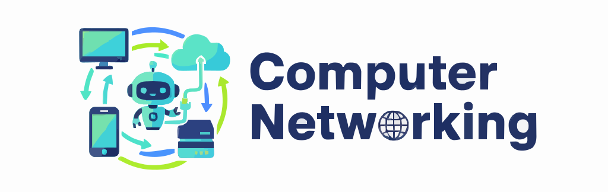

<h1 align="center">
  
</h1>

<p align="center">
  <i>Your complete guide to mastering modern networking, data center architecture, security, and troubleshooting.</i>
</p>

<p align="center">
  
  
  
  
</p>

---

## 📘 About the Project

> 🚀 This repository provides a complete guide to modern networking, data center architecture, security, and troubleshooting. The curriculum is structured to build your knowledge from fundamental concepts to advanced operations and security implementation.

## 📚 Table of Contents

- [📘 About the Project](#-about-the-project)
- [📚 Table of Contents](#-table-of-contents)
- [🧠 What You Will Learn](#-what-you-will-learn)
- [✔️ Prerequisites](#️-prerequisites)
- [🤝 Contributing](#-contributing)
- [📄 License](#-license)

## 🧠 What You Will Learn

| 📌 | Topic | Description |
| :--- | :--- | :--- |
| 🌐 1 | [Network Protocols & Services](./01-network-protocols-and-services/) | Core protocols (TCP/IP, HTTP, DNS) and services (DHCP, NTP). |
| 🏢 2 | [Data Center & Cloud](./02-network-architecture/) | Modern architecture (Spine/Leaf, SDN) and cloud computing models. |
| 🔌 3 | [Networking Devices](./03-networking-devices/)| Hardware fundamentals: routers, switches, firewalls, and APs. |
| 🔄 4 | [Routing & Switching](./04-routing-and-switching/) | Deeper concepts like dynamic routing, VLANs, and STP. |
| 📡 5 | [Wireless Technologies](./05-wireless-technologies/) | Standards, security (WPA3), and concepts (MIMO, SSIDs). |
| 📊 6 | [Network Availability](./06-network-availability/) | Monitoring (SNMP), performance metrics, and interface diagnostics. |
| 📋 7 | [Organizational Policies](./07-organizational-policies/) | Governance, change management, and security procedures (AUP, BYOD). |
| ♻️ 8 | [High Availability & DR](./08-high-availability-DR/) | Redundancy (FHRP), recovery sites, and business continuity. |
| 🛡️ 9 | [Network Security Concepts](./09-network-security-concepts/) | The CIA Triad, Zero Trust, RBAC, and risk management. |
| 💥 10 | [Cyberattacks & Threats](./10-cyberattacks-threats/) | DoS, On-Path attacks, social engineering, and wireless exploits. |
| 🔒 11 | [Implementing Security](./11-implementing-security/) | Hardening techniques, remote access (VPNs), and physical security. |
| 🔧 12 | [Network Troubleshooting](./12-network-troubleshooting/) | Methodology, tools (ping, tracert), and common issues. |

## ✔️ Prerequisites

- 🧠 **Basic IT Knowledge:** A fundamental understanding of computers and operating systems.
- 💡 **Curiosity:** A strong desire to learn how digital systems connect and communicate.

## 🤝 Contributing

We love contributions! 🙌
Whether you're fixing typos, improving documentation, or adding new content—you're welcome!

1.  **Fork** this repository.
2.  Create your feature branch:

    ```bash
    git checkout -b feature/my-new-topic
    ```

3.  Commit and push your changes.
4.  Open a Pull Request (PR).

Please follow good commit hygiene and keep PRs clean. For major features, please open an issue first to discuss.

## 📄 License

This repository is licensed under the **MIT License**.
See the [LICENSE](./LICENSE) file for more details.

---
